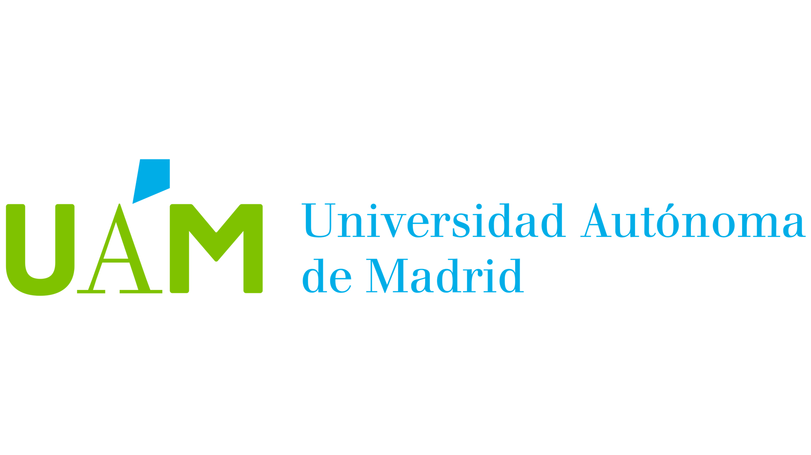

name:bio
class: nord-dark, center


background-image: linear-gradient(150deg,rgba(46, 52, 64, 10%),rgba(46, 52, 64, 90%),rgba(46, 52, 64, 50%),rgba(46, 52, 64, 10%)), url(images/eDNA_concept.png)

background-size: cover


# .huge[*Natural Samplers of eDNA*]

## *and their applications for Biodiversity studies*


```{css, echo=F}
.small { font-size: 70% }
.huge  { font-size: 130% }
```


.footnote[.huge[

</br>
</br>
</br>
**Ramón Gallego Simón**
]]

```{r setup, include=FALSE, message=F, echo=FALSE}
options(htmltools.dir.version = FALSE)
 library (leaflet)
library(tidyverse)
library(here)
 library(kableExtra)
library(DT)
# htmltools::tags$script(src = "https://cdn.plot.ly/plotly-latest.min.js")
# library(plotly)
```

```{css echo=FALSE}
.highlight-last-item > ul > li, 
.highlight-last-item > ol > li {
  opacity: 0.5;
}
.highlight-last-item > ul > li:last-of-type,
.highlight-last-item > ol > li:last-of-type {
  opacity: 1;
}

.bold-last-item > ul > li:last-of-type,
.bold-last-item > ol > li:last-of-type {
  font-weight: bold;
}
```

---
name: Intro 
class: nord-light
layout: true
## .center[Introductions]

---

### .fancy[Ramón Gallego]
</br>
.pull-left[
```{r, echo = F}
knitr::include_graphics("images/PNW.jpg")
```
]

.pull-right[
```{r, echo = F}
knitr::include_graphics("images/RGS.JPG")
```
]

---
layout: false
class: middle, nord-dark
background-image: linear-gradient(150deg,rgba(46, 52, 64, 60%),rgba(46, 52, 64, 60%),rgba(46, 52, 64, 60%),rgba(46, 52, 64, 20%)),  url("images/Madridmequema.jpg") 
background-position: center
background-size: cover


## .center[Ramón Gallego Simón]

.leftmost-column[

```{r, echo = F, out.height='25%'}
knitr::include_graphics("images/Cabo_De_Gata.jpg")
```
*BSc and MSc in Madrid, Spain*

```{r, echo = F, out.height='25%'}

#TODO: Text box
```


]

--

.center-column[
.center[
```{r, echo = F, out.height='25%'}
knitr::include_graphics("images/Auckland.jpg")

```

*PhD in Auckland, Aotearoa New Zealand*

```{r,  echo = F,out.height='25%',out.extra='style="background-color: #9ecff7; padding:5px; display: inline-block;.Nord-dark-damp-img"'}
knitr::include_graphics("images/uoa-logo-2015-reverse.png")
#knitr::include_graphics("images/NIWA_Logo2018.png")
#TODO: Text box
```
]
]
--
.rightmost-column[

```{r, echo = F}
knitr::include_graphics("images/PNW.jpg")
```
*To a Postdoc in Seattle, WA*

```{r,  echo = F, out.extra='style="background-color: #9ecff7; padding:5px; display: inline-block;"'}
knitr::include_graphics("images/UW_trans.png")
knitr::include_graphics("images/NOAA-fisheries-logo.jpg")

```

]

---
layout:true 
background-size: cover
class: nord-dark
background-image: linear-gradient(150deg,rgba(46, 52, 64, 10%),rgba(46, 52, 64, 90%),rgba(46, 52, 64, 50%),rgba(46, 52, 64, 10%)), url(images/eDNA_concept.png)
---

.content-box-yellow[
##.nord1[.center[.bold[eDNA]]]]
</br>

--

.content-box-purple[

.huge[.nord1[.bold[Used in two main ways ]]]

]

--
</br>
.nested-box[
.content-box-green[


  .huge[.nord1[.bold[Following the traces of a species of interest]]]
  

]
]
</br>
--
</br>

.nested-box[
.content-box-green[


  .huge[.nord1[.bold[Assessing the composition of a biological community]]]
  

]
]
</br>
---

name: How to sample
class: nord-dark
background-size: cover
background-image: url(images_AZTI/workflow.png)

.content-box-yellow[
##.nord1[.center[.bold[eDNA]]]]


.content-box-purple[

.huge[.nord1[.bold[From species wandering to ggplot ]]]

]


.column3[.footnote[.content-box-nord1[image credit: .nord12[Gled Guri] https://munin.uit.no/handle/10037/33440]]]
---
name: Focus in the first step
class: nord-light
background-size: 90%
background-position: top
background-image: url(images_AZTI/Shedding.png)

.content-box-purple[

.huge[.nord1[.bold[Focus in the obtention of eDNA ]]]

]

---
name: Is the diversity a function of volume

<iframe 
  width="800" height="450"
  src="https://www.youtube.com/embed/neuSRbexOic?start=73&end=93&mute=1"
  frameborder="0" 
  allow="autoplay; encrypted-media" 
  allowfullscreen>
</iframe>
---

name: eDNA comes from here and now
class: nord-light

 .content-box-green[

.huge[.nord1[.bold[Default: DNA comes from here and now ]]]

]

<iframe src="https://ramongallego.github.io/Teaching_eDNA_for_Biodiversity/images_AZTI/plotly_dna.html" width="100%" height="500px"></iframe>


---
name: It could be softer

 .content-box-green[

.huge[.nord1[.bold[With sponges- a wider sampler? ]]]

]

<iframe src="images_AZTI/plotly_sponge.html" width="100%" height="500px"></iframe>


---

name: Intros
class: nord-light, center, middle

### .fancy[*The North Atlantic Sponge Grounds*]

```{r,echo=F, out.width='90%',out.height='90%', fig.align='center'}

```
.footnote[.content-box-nord1[image credit: .nord12[Ocean Fisheries Canada DFO] ]]

---

name: The Deep Sea Benthos
background-image: linear-gradient(150deg,rgba(46, 52, 64, 10%),rgba(46, 52, 64, 20%),rgba(46, 52, 64, 20%),rgba(46, 52, 64, 10%)), url(images_AZTI/deep_sea.jpg)
background-position: top
background-size: cover
class: nord-light

## .nord4[The Deep Sea Benthos]


</br>

.content-box-purple[

 * .huge[.nord1[.bold[60% of the Earth surface]]]

]


 .content-box-purple[

 * .huge[.nord1[.bold[Great Gaps in Biodiversity knowledge]]]

]


  .content-box-purple[

 * .huge[.nord1[.bold[Urgency to know to face two challenges:]]]

]

 
--

.nested-box[
.content-box-green[


  * .huge[.nord1[.bold[ Increasing human pressure ]]]
  

]
]

--
 
 .nested-box[
.content-box-green[


  * .huge[.nord1[.bold[ Global Warming ]]]
  

]
]

---
name: Type of Benthic habitats
background-image:  url(images_AZTI/deep_sea.jpg)
background-position: top
background-size: cover
class: nord-light

## .nord4[The Deep Sea Benthos]

--

### .nord4[More than mud]

---
name: Type of Benthic habitats
background-image:  url(images_AZTI/othercosystems.png)
background-position: top
background-size: cover
class: nord-light

## .nord4[The Deep Sea Benthos]


### .nord4[More than mud]

---
name: Sponge Grounds
background-image:  url(images_AZTI/SpGround_full.png)
background-position: center
background-size: contain
class: nord-dark


---
name: Sponge Grounds
background-image:  url(images_AZTI/sponge_ground.png)
background-position: bottom
background-size: contain
class: nord-dark

## .nord4[Sponge Grounds]

--

.content-box-purple[

 * .huge[.nord1[.bold[Broad distribution]]]

]
---
name: Sponge Ground distribution
background-image:  url(images_AZTI/Slide10.png)
background-position: bottom
background-size: contain
class: nord-dark

## .nord4[Sponge Grounds]

---
name: Sponge Grounds
background-image:  url(images_AZTI/sponge_ground_transparent.png)
background-position: bottom
background-size: contain
class: nord-dark

## .nord4[Sponge Grounds]


--

.content-box-purple[

* .huge[.nord1[Broad distribution]]
 
 * .huge[.nord1[.bold[Enriched Habitat]]]

]

--
</br>

.center[

]

---
name: Sponge Grounds
background-image:  url(images_AZTI/sponge_ground.png)
background-position: bottom
background-size: contain
class: nord-dark

## .nord4[Sponge Grounds]


.content-box-purple[

 * .huge[.nord1[Broad distribution]]
 
 * .huge[.nord1[Enriched Habitat]]
 
 * .huge[.nord1[.bold[Threatened]]]

]

---
name: How to investigate
background-image:  url(images_AZTI/Slide11.png)
background-position: bottom
background-size: contain
class: nord-dark

## .nord4[Sponge Grounds]
</br>

.content-box-yellow[
.huge[.nord1[.bold[How to research the diversity they hold]]]

]

---
name: Can we use eDNA
background-image:  linear-gradient(150deg,rgba(46, 52, 64, 10%),rgba(46, 52, 64, 20%),rgba(46, 52, 64, 20%),rgba(46, 52, 64, 10%)), url(images_AZTI/eDNA_concept.png)
background-position: bottom
background-size: contain
class: nord-dark

# .nord4[eDNA]

--

.pull-left[
.content-box-yellow[
* .huge[.nord1[.bold[.center[Easier way to capture DNA]]]]

* .huge[.nord1[.bold[.center[Will get DNA from potentially all taxa]]]]
]
]

--
.pull-right[
.content-box-purple[
* .huge[.nord1[.bold[.center[Relatively low volumes]]]]

* .huge[.nord1[.bold[.center[Here and now]]]]
]
]

---
name: Can we use nsDNA
background-image:  linear-gradient(150deg,rgba(46, 52, 64, 10%),rgba(46, 52, 64, 20%),rgba(46, 52, 64, 20%),rgba(46, 52, 64, 10%)), url(images_AZTI/eDNA_concept.png)
background-position: bottom
background-size: contain
class: nord-dark

# .nord4[eDNA]


---
name: Use the sponge

class: nord-dark

<video width=1200 height=800 controls>

<source src="images_AZTI/transition1.mp4" type="video/mp4">
</video>

---
name: Can we use nsDNA

class: nord-dark


.content-box-yellow[
.center[##.nord1[.center[nsDNA ]]]]
</br>
</br>

.left-column[


]


.right-column[

.content-box-green[

* .huge[.nord1[.bold[.center[DNA extraction from sponge tissue]]]]


* .huge[.nord1[.bold[.center[Contains DNA from the sponge and everything it eats 
]]]]


* .huge[.nord1[.bold[.center[Represents 100s or 1000s of L of seawater 
]]]]

]

]

---
name: It works on Fish
background-image: url(images_AZTI/Slide12.png)
background-position: top
background-size: contain
class: nord-dark

.content-box-yellow[
.center[##.nord1[.center[nsDNA ]]]]


</br>
</br>
</br>
</br>

.content-box-purple[

.huge[.nord1[.bold[.center[Using Fish-specific primers ]]]]
]
.center[

]
---

name: Can it work community-wide
background-image:  linear-gradient(150deg,rgba(46, 52, 64, 10%),rgba(46, 52, 64, 20%),rgba(46, 52, 64, 20%),rgba(46, 52, 64, 10%)), url(images_AZTI/sponge_ground_transparent.png)
background-position: left
background-size: contain
class: nord-dark
.content-box-yellow[
  .center[##.nord1[.center[nsDNA]]]]
</br>

.content-box-purple[

.huge[.nord1[.bold[.center[Can it work  whole communities? ]]]]
]


---
name: Our Paper
background-size: cover
class: nord-dark
background-image: url(images_AZTI/Slide13.png)

---

background-image:  linear-gradient(150deg,rgba(46, 52, 64, 10%),rgba(46, 52, 64, 20%),rgba(46, 52, 64, 20%),rgba(46, 52, 64, 10%)), url(images_AZTI/sponge_ground_transparent.png)
background-position: left
background-size: contain
class: nord-dark


</br>
</br>

.content-box-blue[
```{r dataTABLE12, echo = F, warning=FALSE ,message=FALSE, out.height='70%', out.width='70%'}

dataset <- read_csv(here("data_AZTI","final_metadata.csv"))

dataset |> 
  group_by(Species, Biogeographic_region) |> 
  summarise (nsamples = as.character(n())) |> 

  pivot_wider(names_from = Biogeographic_region, values_from = nsamples ,values_fill = "-") -> tableready

tableready |> 
    kable() %>%
    kable_styling(full_width = F) %>%
       column_spec(1, italic  = T) |> 
  column_spec(2:5, width = "10em") |> 
  scroll_box(width = "600px")


```
]
---
background-image: url(images_AZTI/mapa1.png)
background-position: center
background-size: contain
class: nord-dark

---
background-image: url(images_AZTI/mapa2.png)
background-position: center
background-size: contain
class: nord-dark

---
background-image: url(images_AZTI/mapa3.png)
background-position: center
background-size: contain
class: nord-dark

<!-- --- -->

<!-- class: nord-dark -->
<!-- name: Research plan -->

<!-- ##.center[.fancy[.title[Experimental design]]] -->
<!-- ```{r, message = F, echo = F, out.width= '90%'} -->


<!-- leaflet(data = read_csv(here("data","final_metadata.csv"))) %>%  -->
<!--   addTiles() |> -->
<!--   # addProviderTiles(providers$CartoDB) %>% -->
<!--   setView(lat = 60, lng = -3.5, zoom = 5) %>%  -->
<!--   addMarkers(label = ~Species,  -->
<!--              labelOptions = labelOptions(interactive = FALSE, clickable = NULL, noHide = NULL, -->
<!--                                          permanent = FALSE, className = "", direction = "auto", -->
<!--                                          offset = c(1, 1), opacity = 1, textsize = "20px", -->
<!--                                          textOnly = FALSE, style = NULL, sticky = TRUE, ), -->
<!--              popup = ~as.character(Depth) -->
<!--   ) -->

<!-- ``` -->

---

background-image:  linear-gradient(150deg,rgba(46, 52, 64, 10%),rgba(46, 52, 64, 20%),rgba(46, 52, 64, 20%),rgba(46, 52, 64, 10%)), url(images_AZTI/sponge_ground_transparent.png)
background-size: cover
class: nord-dark
name: Research plan
##.center[.fancy[.title[Experimental design]]]

.content-box-purple[

.huge[.nord1[.bold[.center[Amplifying COI with Leray primers]]]]
]

--

</br>

.content-box-purple[

.huge[.nord1[.bold[.center[Sequencing 97 samples in a MiSeq]]]]
]

--
</br>
.content-box-purple[

.huge[.nord1[.bold[.center[Denoising with DADA2]]]]
]

--
</br>
.content-box-purple[

.huge[.nord1[.bold[.center[Second clustering with swarm]]]]
]

--
</br>
.content-box-purple[

.huge[.nord1[.bold[.center[BLAST and LCA for taxonomical assignment]]]]
]
--
</br>
.content-box-purple[

.huge[.nord1[.bold[.center[Further curation by taxonomic experts]]]]
]

---
background-image:  linear-gradient(150deg,rgba(46, 52, 64, 10%),rgba(46, 52, 64, 20%),rgba(46, 52, 64, 20%),rgba(46, 52, 64, 10%)), url(images_AZTI/sponge_ground_transparent.png)
background-size: cover
class: nord-dark
name: results

##.center[.fancy[.title[Results]]]


.content-box-purple[

.huge[.nord1[.bold[.center[14.26M raw reads from 97 samples]]]]
]

--
</br>
.content-box-purple[

.huge[.nord1[.bold[.center[After QC, ~ 9M reads from 11,198 OTUs ]]]]
]

--

</br>
.content-box-purple[

.huge[.nord1[.bold[.center[Assigned taxonomy: 7.6M reads, 2155 OTUs  ]]]]
]
--
.content-box-nord-light[

]


---
background-image:  linear-gradient(150deg,rgba(46, 52, 64, 10%),rgba(46, 52, 64, 20%),rgba(46, 52, 64, 20%),rgba(46, 52, 64, 10%)), url(images_AZTI/sponge_ground_transparent.png)
background-size: cover
class: nord-dark
name: results

##.center[.fancy[.title[nsDNA Results ]]]

.content-box-purple[

.huge[.nord1[.bold[.center[**Only** 1.8M reads from 590 species]]]]
]

--
.content-box-green[

.huge[.nord1[.bold[.center[Leray primers target Metazoa, most reads and species belong to: Chordata, Cnidaria, Echinodermata and Porifera   ]]]]
]

--
.content-box-purple[
```{r, message = F, echo = F, out.width= '90%'}

read_csv(here("data_AZTI", "TalkCISA2023_summary.csv")) -> summary_CISA

colnames(summary_CISA) <- gsub("\\...*", "", colnames(summary_CISA))
kbl(summary_CISA, align = "c") %>%
  kable_classic(full_width = F, html_font = "Cambria") %>%
  add_header_above(c("","All together " =  5 , "Phakellia ventilabrum " = 3 ,"Geodia hentscheli" = 3,  "Geodia barretti" = 3, "Geodia parva" = 3), italic = T, bold = T) |> 
  scroll_box(width = "800px")
```
]
---

background-image:  linear-gradient(150deg,rgba(46, 52, 64, 10%),rgba(46, 52, 64, 20%),rgba(46, 52, 64, 20%),rgba(46, 52, 64, 10%)), url(images_AZTI/echinodermata.png)
background-size: contain
background-position: bottom
class: nord-dark
name: results

##.pull-left[.fancy[.title[Echinoderms ]]]
.pull-right[
.content-box-purple[

.huge[.nord1[.bold[.center[78 OTUs, 43 species, 117k reads]]]]
]
]


---

background-image:  linear-gradient(150deg,rgba(46, 52, 64, 10%),rgba(46, 52, 64, 20%),rgba(46, 52, 64, 20%),rgba(46, 52, 64, 10%)), url(images_AZTI/Cnidarians.png)
background-size: contain
background-position: bottom
class: nord-dark
name: results

##.pull-left[.fancy[.title[Cnidarians ]]]
.pull-right[
.content-box-purple[.huge[.nord1[.bold[.center[166 OTUs, 86 species, 83k reads]]]]
]
]


---

background-image:  linear-gradient(150deg,rgba(46, 52, 64, 10%),rgba(46, 52, 64, 20%),rgba(46, 52, 64, 20%),rgba(46, 52, 64, 10%)), url(images_AZTI/porifera.png)
background-size: contain
background-position: bottom
class: nord-dark
name: results

##.pull-left[.fancy[.title[Porifera (no host) ]]]
.pull-right[
.content-box-purple[.huge[.nord1[.bold[.center[189 OTUs, 87 species, 68k reads]]]]
]
]


---

background-image:   url(images_AZTI/cordata_all.png)
background-size: contain
background-position: bottom
class: nord-light
name: results

##.pull-left[.fancy[.title[Chordata ]]]
.pull-right[
.content-box-purple[.huge[.nord1[.bold[.center[160 OTUs, 77 species, 710k reads]]]]
]
]
---

background-image:   url(images_AZTI/sponge_ground.png)
background-size: cover
class: nord-light
name: Conclusions

##.center[.fancy[.title[.nord4[A few thoughts ]]]]

--

</br>
.content-box-purple[

.huge[.nord1[.bold[.center[A good way to describe diversity]]]]

]
.content-box-nord-light[

]
---

background-image:   url(images_AZTI/sponge_ground.png)
background-size: cover
class: nord-light
name: Conclusions

##.center[.fancy[.title[.nord4[A few thoughts ]]]]

</br>
.content-box-purple[

.huge[.nord1[.bold[.center[ _Phakelia_ much better at this]]]]

]

--

.center[
.content-box-yellow[
.huge[.nord1[.bold[.center[Depth related?]]]]
]
.content-box-nord-light[


]

]

---

background-image:   url(images_AZTI/sponge_ground.png)
background-size: cover
class: nord-light
name: Conclusions

##.center[.fancy[.title[.nord4[A few thoughts ]]]]

</br>
.content-box-purple[

.huge[.nord1[.bold[.center[ _Phakelia_ much better at this]]]]

]
.center[
.content-box-yellow[
.huge[.nord1[.bold[.center[Microbiome of _Geodia_ interfering?]]]]
]
.content-box-nord-light[

]
]

---

background-image:   url(images_AZTI/sponge_ground.png)
background-size: cover
class: nord-light
name: Conclusions

##.center[.fancy[.title[.nord4[A few thoughts ]]]]

</br>
.content-box-purple[

.huge[.nord1[.bold[.center[ _Phakelia_ much better at this]]]]

]
.center[
.content-box-yellow[
.huge[.nord1[.bold[.center[Primer Affinity?]]]]
]
]

---

background-image:   url(images_AZTI/Thanks.png)
background-size: contain
background-position: bottom
class: nord-light
name: results

#.center[.fancy[.title[Funding]]]

---
background-image:   url(images_AZTI/sponge_ground_transparent.png)
background-size: cover
background-position: bottom
class: nord-light
name: results

#.center[.fancy[.title[.nord4[Thanks!]]]]
.content-box-yellow[
.huge[.nord1[.bold[
 Ana Riesgo
 </br>
 
 Belen Arias
 </br>
 Stefano Mariani and team
 </br>
 Crew and sampling team
 
]]]
]