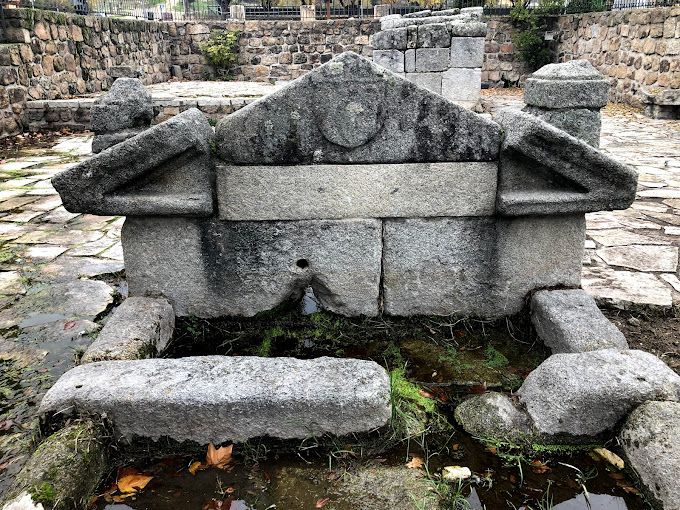
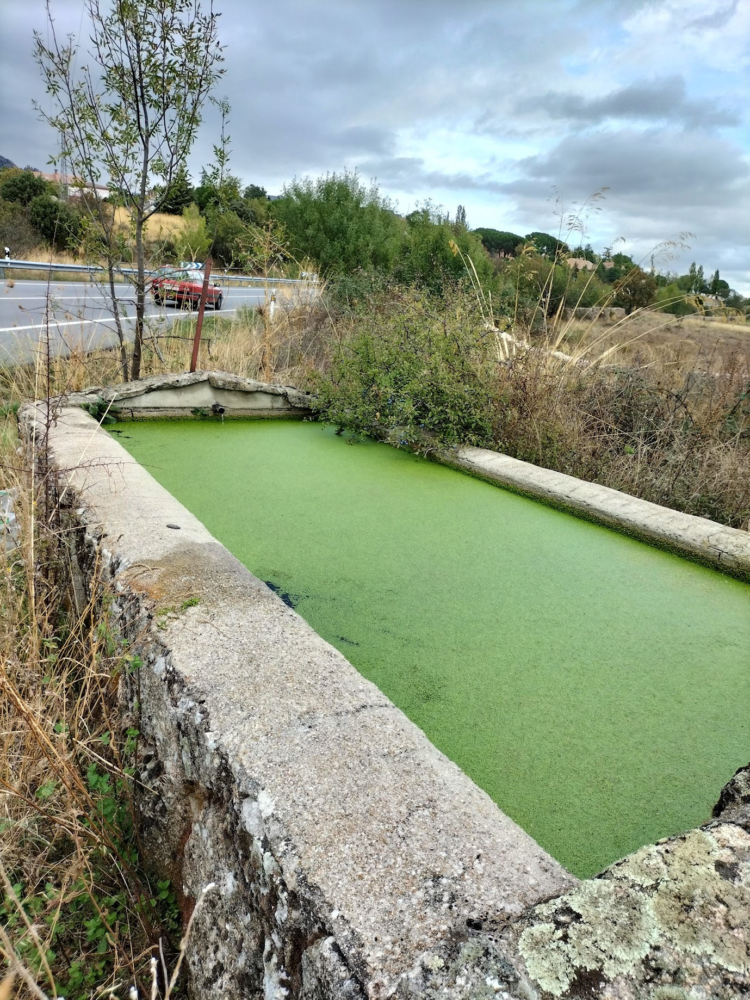

```{r setup, include=FALSE}
knitr::opts_chunk$set(echo = TRUE)
```

El primer tipo de analysis que hacemos es siempre de tipo exploratorio. Una primera cosa que queremos comprobar es sobre los datos en si. Cuantas secuencias por muestra, cuantas de ellas tienen un resultado util en BLAST

```{r libraries, warning=F, message=F}

library(tidyverse)
library(here)
library(eDNAfuns)
library(vegan)
library(kableExtra)

```

## Profundidad de la secuenciación

Una primera medida nos la dio el numero de secuencias que pasaron el control de calidad inicial de la secuenciación. En el primer cutadapt contamos las lineas de cada archivo, y en formato fastq hay 4 líneas por secuencia. 

```
$ wc -l pipeline_output/demult_20241209_1113/demult_*fq
5159360 pipeline_output/demult_20241209_1113/demult_Euk_1209_R.fq 
7332792 pipeline_output/demult_20241209_1113/demult_Euk_18S_A.fq
2637012 pipeline_output/demult_20241209_1113/demult_unknown.fq
15129164 total 
```
Así que nuestra secuenciación produjo `r scales::label_number(scale = 1e-6, accuracy = 0.1, suffix = "M")(15129164/4)` secuencias de calidad suficiente. 

```{r, message=F, warning=F}
demult <- read_csv(here("Data", "blast_2024_12_09", "demult_success.csv"))
amplicons <- read_csv(here("Data", "blast_2024_12_09", "demult_amplicons.csv"))
centroid_table <- read_csv(here("Data", "blast_2024_12_09", "centroid_table.csv"))
taxa_good_id <- read_csv(here("Data", "blast_2024_12_09", "taxa_table.csv"))
not_ided <- read_csv(here("Data", "blast_2024_12_09", "unknown_taxa.csv"))

metadata <- read_csv(here("metadata_GTABE.csv")) |> 
  select(Site, barcode = Barcode, everything())
```

De esas secuencias, conseguimos demultiplexar `r scales::label_number(scale = 1e-6, accuracy = 0.1, suffix = "M")(sum(demult$total))` secuencias con  su producto de pcr correctamente, que agrupamos en `r length(unique(centroid_table$Centroid)) ` clusteres al 85% de similitud. 

De estos clusteres, `r length(unique(not_ided$Centroid)) ` no tuvieron ningun match en nuestra asignación taxonómica, y nuestro dataset final contiene `r scales::label_number(scale = 1e-3, accuracy = 0.1, suffix = "k")(sum(taxa_good_id$nReads))` secuencias agrupadas en `r length(unique(taxa_good_id$consensus)) ` taxa.

```{r}
taxa_good_id |> 
  group_by(barcode) |>
  tally(wt = nReads, name = "IDed") |> 
  inner_join(not_ided |> group_by(barcode) |> tally(wt = nReads, name = "NotIDed")) |> 
  pivot_longer(-barcode, names_to = "Identification", values_to = "nReads") |> 
  inner_join(metadata) |> 
  ggplot(aes(x= Sample, y =nReads, fill = Identification))+
  geom_col()+
  facet_wrap(~Site,scales = "free_x", nrow = 1) #+
  # theme(axis.text.x = element_text(angle = 45))


```
Otra cosa que debemos hacer es comprobar que nuestras réplicas de PCR son similares entre sí: nos sirve como control de calidad, al saber que nuestro proceso ha respetado la realidad de la muestra biológica. Lo podemos comprobar a dos niveles: centroides de las OTUs y con el subset de datos con información taxonómica

```{r}
centroid_table |> 
  eDNAindex(Sample_column = barcode, OTU_column = Centroid, Counts_column = nReads) |> 
  tibble_to_matrix(taxon = Centroid, Abundance = Normalized.reads, sample.name = barcode, transformation = "none") |> 
  monoMDS() -> centroid_nmds

centroid_nmds$points |> 
  as.data.frame() |> 
  rownames_to_column("barcode") |> 
  inner_join(metadata) |> 
  ggplot(aes(x = MDS1, y = MDS2, color = Site)) +
  geom_point()+
  coord_equal()

```
Y lo mismo con las cosas identificadas taxonomicamente

```{r}
taxa_good_id |> 
  eDNAindex(Sample_column = barcode, OTU_column = consensus, Counts_column = nReads) |> 
  tibble_to_matrix(taxon = consensus, Abundance = Normalized.reads, sample.name = barcode, transformation = "none") |> 
  monoMDS() -> taxa_nmds

taxa_nmds$points |> 
  as.data.frame() |> 
  rownames_to_column("barcode") |> 
  inner_join(metadata) |> 
  ggplot(aes(x = MDS1, y = MDS2, color = Site)) +
  geom_point()+
  coord_equal()
```
Asi que al menos estas cosas se parecen entre ellas :). Probablemente la muestra de Bustarviejo que aparece en la parte de abjo del MDS sea la que tenga tan pocas secuencias que ni siquiera sea representativa.

En este caso no tenemos una pregunta biológica/ecológica mas allá de la caracterización de los sitios. Con el tiempo estableceremos una serie temporal que estudiantes de años venideros podrán usar en este mismo Máster.

Ahora vamos a usar esta información para describir cada uno de los sitios en los que hemos muestreado (hemos, hemos... la verdad es que fue Belén la que muestreó). Belén nos describe aquí los sitios

### Bustarviejo: 

 Es un arroyo que sale de la bocamina principal de una antigua mina de plata en el término municipal, pero fuera de la población. El agua salía de la bocamina a pH 4, con niveles no altísimos, pero apreciables, de metales (hierro, níquel, cobre, y un poco de plomo y plata), y bastante arsénico, que se detecta en realidad más abajo, cuando caen los niveles de Fe.
 En el arroyo, según baja, salen bastantes juncos y ciperáceas. Sin embargo, los briófitos se ven dañados. Al principio no hay casi ninguno, y luego salen comunidades de 1-2 especies. Eso sí, salen unas euglenas de escándalo, junto con otras algas indicadoras de metales pesados, como Ulothrix y Microspora.
 

 
```{r, message=F}
taxa_good_id |> 
  inner_join(metadata) |> 
  filter (Site == "Bustarviejo") |> 
  filter (Sample!= "Site_01_a_rep3") |> 
  group_by(consensus ) |> 
  summarise(prevalence = n()/5, nR = sum(nReads)) |> 
  arrange (desc(consensus)) |> 
  separate(consensus, into = c("kingdom", "phylum", "class", "order", "family", "genus", "species"), sep = "%") |> 
  kable() |> 
  kable_styling(bootstrap_options = "striped", fixed_thead = T, ) |> 
  collapse_rows(columns = 1:2, valign = "top") |> 
  scroll_box(height = "500px")
  
```
 
 
### Cantera de Cerceda:

La antigua cantera está cerca de El Boalo. Está rellena de agua, y suele dar buena "cosecha algal". Está pegada a una urbanización (Las Praderas), y por ahí van los lugareños a pasear el perro. También los ves en la cantera merendando e incluso pescando. En una de las fotos, de hecho, se ve un pescador con su caña. 


```{r, message=F}
taxa_good_id |> 
  inner_join(metadata) |> 
  filter (Site == "Cantera_Cerceda") |> 
  group_by(consensus ) |> 
  summarise(prevalence = n()/6, nR = sum(nReads)) |> 
  arrange (desc(consensus)) |> 
  separate(consensus, into = c("kingdom", "phylum", "class", "order", "family", "genus", "species"), sep = "%") |> 
  kable() |> 
  kable_styling(bootstrap_options = "striped", fixed_thead = T, ) |> 
  collapse_rows(columns = 1:2, valign = "top") |> 
  scroll_box(height = "500px")
  
```

# Fuente de las Ermitas: Manzanares el Real
Parece que es del siglo XVI, restaurada varias veces, la última en 2021 (creo). Hay una fuente y un depósito conectados por un reguerillo.Está en la carretera que atraviesa el pueblo, en pleno casco, junto a una gasolinera.

```{r}
taxa_good_id |> 
  inner_join(metadata) |> 
  filter (Site == "Fuente de las Ermitas") |> 
  group_by(consensus ) |> 
  summarise(prevalence = n()/6, nR = sum(nReads)) |> 
  arrange (desc(consensus)) |> 
  separate(consensus, into = c("kingdom", "phylum", "class", "order", "family", "genus", "species"), sep = "%") |> 
  kable() |> 
  kable_styling(bootstrap_options = "striped", fixed_thead = T, ) |> 
  collapse_rows(columns = 1:2, valign = "top") |> 
  scroll_box(height = "500px")
```

# Pilón: Manzanares el Real

El otro pilón de Manzanares está en una vía pecuaria. En realidad, lo ves junto a la carretera, y el tránsito es constante, hay que jugarse un poco la vida para cruzar. Todo eso verde que se ve en el agua es la lenteja de agua (Lemna sp.), que estaba cubriendo toda la superficie. Aun así, salieron alguitas interesantes. Suele haber bastantes caracoles también.



```{r}
taxa_good_id |> 
  inner_join(metadata) |> 
  filter (Site == "Pilon Manzanares") |> 
  group_by(consensus ) |> 
  summarise(prevalence = n()/6, nR = sum(nReads)) |> 
  arrange (desc(consensus)) |> 
  separate(consensus, into = c("kingdom", "phylum", "class", "order", "family", "genus", "species"), sep = "%") |> 
  kable() |> 
  kable_styling(bootstrap_options = "striped", fixed_thead = T, ) |> 
  collapse_rows(columns = 1:2, valign = "top") |> 
  scroll_box(height = "500px")
```