name:bio
class: nord-dark, center


background-image: linear-gradient(150deg,rgba(46, 52, 64, 10%),rgba(46, 52, 64, 90%),rgba(46, 52, 64, 50%),rgba(46, 52, 64, 10%)), url(images/eDNA_concept.png)

background-size: cover


# .huge[*ADN ambiental (eDNA)*]

## *y sus aplicaciones en estudios de Biodiversidad*

## *(y más alla)*

```{css, echo=F}
.small { font-size: 70% }
.huge  { font-size: 120% }
```


.pull-left[
.footnote[.huge[

</br>
</br>
</br>
**Ramón Gallego Simón**
]]
]
.pull-right[
.footnote[
```{r, echo = F, out.width='50%'}
knitr::include_graphics("images/Qr2025.png")
```
]
]

```{r setup, include=FALSE, message=F, echo=FALSE}
options(htmltools.dir.version = FALSE)
library(leaflet)
library(tidyverse)
library(here)
library(kableExtra)
library(DT)
```

```{css echo=FALSE}
.highlight-last-item > ul > li, 
.highlight-last-item > ol > li {
  opacity: 0.5;
}
.highlight-last-item > ul > li:last-of-type,
.highlight-last-item > ol > li:last-of-type {
  opacity: 1;
}

.bold-last-item > ul > li:last-of-type,
.bold-last-item > ol > li:last-of-type {
  font-weight: bold;
}
```

---
name: Intro 
class: nord-light
layout: true
## .center[Introductions]

---

### .fancy[Ramón Gallego]
</br>
.pull-left[
```{r, echo = F}
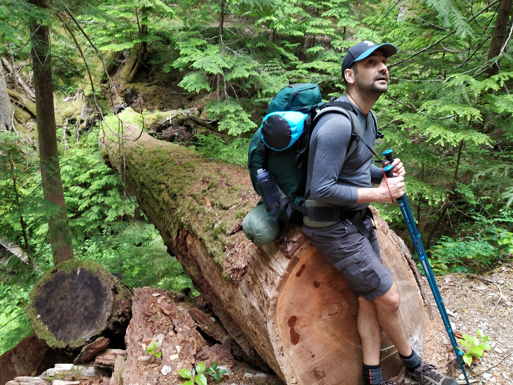
```
]

.pull-right[
```{r, echo = F}
knitr::include_graphics("images/RGS.JPG")
```
]

---
layout: false
class: middle, nord-dark
background-image: linear-gradient(150deg,rgba(46, 52, 64, 60%),rgba(46, 52, 64, 60%),rgba(46, 52, 64, 60%),rgba(46, 52, 64, 20%)),  url("images/Madridmequema.jpg") 
background-position: center
background-size: cover


## .center[Ramón Gallego Simón]

.leftmost-column[

```{r, echo = F, out.height='25%'}

```
*BSc and MSc in Madrid, Spain*

```{r, echo = F, out.height='25%'}
knitr::include_graphics("images/UAM.white.png")
#TODO: Text box
```


]

--

.center-column[
.center[
```{r, echo = F, out.height='25%'}
knitr::include_graphics("images/Auckland.jpg")

```

*PhD in Auckland, Aotearoa New Zealand*

```{r,  echo = F,out.height='25%',out.extra='style="background-color: #9ecff7; padding:5px; display: inline-block;.Nord-dark-damp-img"'}
knitr::include_graphics("images/uoa-logo-2015-reverse.png")
#knitr::include_graphics("images/NIWA_Logo2018.png")
#TODO: Text box
```
]
]
--
.rightmost-column[

```{r, echo = F}

```
*To a Postdoc in Seattle, WA*

```{r,  echo = F, out.extra='style="background-color: #9ecff7; padding:5px; display: inline-block;"'}
knitr::include_graphics("images/UW_trans.png")


```

]

---
layout:true 
background-size: cover
class: nord-dark
background-image: linear-gradient(150deg,rgba(46, 52, 64, 10%),rgba(46, 52, 64, 90%),rgba(46, 52, 64, 50%),rgba(46, 52, 64, 10%)), url(images/eDNA_concept.png)
---

.content-box-yellow[
.center[##.nord1[.center[eDNA ]]]]
</br>


.content-box-purple[

 * .huge[.nord1[.bold[¿Qué es? ¿Para qué podemos usarlo?]]]

]

--
.content-box-purple[

 * .huge[.nord1[.bold[eDNA como medida cuantitativa]]]

]

--

.content-box-purple[

 * .huge[.nord1[.bold[Cambios ambientales, en las comunidades y eDNA]]]

]

--

.content-box-purple[

 * .huge[.nord1[.bold[Análisis de dieta]]]

]

--

.content-box-purple[

 * .huge[.nord1[.bold[nsDNA]]]

]

--

.content-box-purple[

 * .huge[.nord1[.bold[Detección de especies de interés]]]

]

--

.content-box-purple[

 * .huge[.nord1[.bold[Mitogenomas como barcodes]]]

]

---

.content-box-yellow[
.center[##.nord1[.center[Ancient DNA ]]]]
</br>


.content-box-purple[

 * .huge[.nord1[.bold[Movimientos migratorios]]]

]

--

.content-box-purple[

 * .huge[.nord1[.bold[Evolución / Conectividad]]]

]

--

.content-box-purple[

 * .huge[.nord1[.bold[Patógenos a lo largo de la historia]]]

]

--

.content-box-purple[

 * .huge[.nord1[.bold[Sediment cores y paleoecologia]]]

]


---

name: Intro to qPCR assays
class: inverse, center, middle
layout: false
background-image: linear-gradient(150deg, rgba(0, 0, 0, 100%), rgba(0, 0, 0, 50%), rgba(0, 0, 0, 20%)), url(images/OA_fondo.JPG)

## .nord4[¿Qué es el eDNA?]


---

name: Intros
class: nord-light, center, middle

### .fancy[*environmental DNA*]


.huge[ *DNA that can be extracted from environmental samples (such as soil, water or air), without first isolating any target organisms*, Taberlet et al. 2012]

---
background-size: cover
class: nord-dark
background-image: linear-gradient(150deg,rgba(46, 52, 64, 10%),rgba(46, 52, 64, 90%),rgba(46, 52, 64, 50%),rgba(46, 52, 64, 10%)), url(images/eDNA_concept.png)
layout: true
---

name: How to sample
class: nord-dark, center, middle


## .nord4[¿Cómo muestrear eDNA?]


---

name: Soil
class: nord-light
layout: true
background-size: cover

background-image: linear-gradient(to bottom, rgba(255, 255, 255, 0.7), rgba(255, 255, 255, 0)),url("images/eDNA_concept.png") 

## .center[.nord1[Métodos de muestreo]]


---

name: Soil

## .nord1[.bold[  Suelo ]]


```{r,echo=F, out.width='90%',out.height='90%', fig.align='center'}
knitr::include_graphics("images/Tiara_TNC.jpg")
```


---

## .nord1[.bold[  Suelo ]]


```{r,echo=F, out.width='90%',out.height='90%', fig.align='center'}
knitr::include_graphics("images/Tiara_UCLA.jpg")
```


---

name: Freshwater

## .nord1[.bold[  Ríos ]]


```{r,echo=F, out.width='90%',out.height='90%', fig.align='center'}
knitr::include_graphics("images/Freshwater.jpeg")
```


---

name: Freshwater

## .nord1[.bold[  Aguas costeras ]]


```{r,echo=F, out.width='80%',out.height='80%', fig.align='center'}
knitr::include_graphics("images/procB2.png")


knitr::include_graphics("images/eDNA_16x9.jpg")
```
---

name: Freshwater

## .nord1[.bold[  Aguas abiertas ]]


```{r,echo=F, out.width='80%',out.height='80%', fig.align='center'}
knitr::include_graphics("images/ProcB_hake.png")
knitr::include_graphics("images/CTD.jpg")

```


---

name: Freshwater

## .nord1[.bold[  ¡Aire! ]]


```{r,echo=F, out.width='80%',out.height='80%', fig.align='center'}
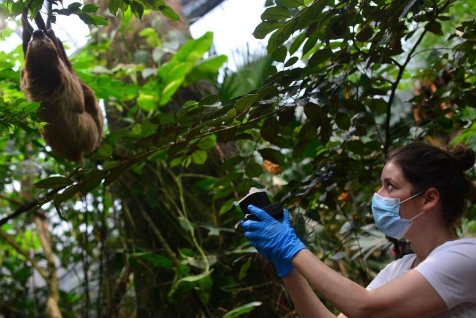
knitr::include_graphics("images/air.eDNA.png")
```


---

name: Esponjas

## .nord1[.bold[  ¡Animales! ]]


```{r,echo=F, out.width='80%',out.height='80%', fig.align='center'}


```


---

name: Miel

.center[ # Animales!]

```{r,echo=F, out.width='80%',out.height='80%', fig.align='center'}


```

---
background-size: cover
class: nord-dark
background-image:  linear-gradient(150deg,rgba(46, 52, 64, 10%),rgba(46, 52, 64, 90%),rgba(46, 52, 64, 50%),rgba(46, 52, 64, 10%)), url(images/eDNA_concept.png)
layout: true
---


name: Intro to qPCR assays
class: inverse, center, middle
layout: false
background-image: linear-gradient(150deg, rgba(0, 0, 0, 100%), rgba(0, 0, 0, 50%), rgba(0, 0, 0, 20%)), url(images/OA_fondo.JPG)

## .nord4[¿Qué podemos pedirle al eDNA?]


---
layout: true
background-size: cover
class: nord-dark
background-image:  url(images/single_species.jpg)
---
name: modos de obtenerla
.content-box-purple[
.nord1[
## Single-species assays

]]
---
name: modos de obtenerla
class: nord-light
### .fancy[*environmental DNA*]


.content-box-purple[
.nord1[
## Single-species assays

  -   ### *qPCR*
  -   ### *ddPCR*
  -   ### *CRISPR-Cas9*
]]


---
name: tipos de informacion
class: nord-dark
### .fancy[*environmental DNA*]

.content-box-purple[
.center[##.nord1[Cuantificación ]]
</br>
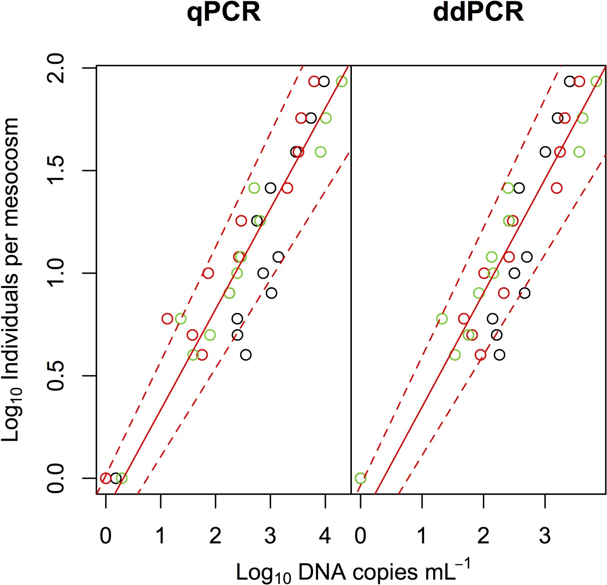


]
---
name: tipos de informacion
class: nord-dark
background-image:  url(images/ddpcr_vs_qpcr.webp)
background-size: contain

.content-box-purple[
.center[##.nord1[Cuantificación ]]]

---
background-size: cover
class: nord-dark
background-image:  url(images/eDNA_concept.png)
---
layout: true
background-size: cover
class: nord-dark
background-image:  url(images/peces.jpg)
---
.content-box-purple[
.nord1[
## Multiple species assays

]]
---


name: tipos de informacion
class: nord-dark
### .fancy[*environmental DNA*]

.content-box-yellow[
.center[##.nord1[Composición] ]]

.content-box-purple[

```{r dataTABLE, echo = F, warning=FALSE ,message=FALSE}

convert.names<- function(x){paste0("Sample", 1:length(x))}
read_csv(here("Data", "ASV_table_all_together.csv")) %>%  
  left_join(read_csv(here("Data", "Annotated.hashes.csv"))) %>% 
  unite(family, genus, species, sep = "|", col = "taxa") %>% 
  filter(taxa !="NA|NA|NA") %>% 
 
  group_by(taxa) %>% tally %>% arrange(desc(n)) %>% slice(1:10) %>% 
  pull(taxa) -> keepers 
  read_csv(here("Data", "ASV_table_all_together.csv")) %>%  
  left_join(read_csv(here("Data", "Annotated.hashes.csv"))) %>% 
   unite(family, genus, species, sep = "|", col = "taxa", remove = F) %>%
    mutate(label = case_when(is.na(species) ~  paste0(genus, " sp."),
                                                   TRUE            ~ species)) %>% 
  
    filter(Miseq_run ==1,  taxa %in% keepers) %>% 
    mutate(sample = fct_relabel(sample, convert.names)) %>% 
    arrange(sample) %>% 
    pivot_wider(id_cols = label, names_from = sample, values_from = nReads, values_fill = list (nReads = 0), values_fn = list(nReads= sum)) %>% 
    rename (Taxa = label) -> data
  
  data %>% 
    select(1:7) -> nice.table 
  
  nice.table %>% 
    kable() %>%
    kable_styling(full_width = T,
                  bootstrap_options = "hover") %>%
       column_spec(1, italic  = T) %>%
       column_spec(2:6, width = '1in') %>%
 scroll_box( height = "600px")
```

]

---
name: modos de obtenerla
class: nord-dark
### .fancy[*environmental DNA*]

.content-box-purple[
.nord1[

## Multi-species assays

  - ###*metabarcoding*
]]

--
.content-box-purple[
.nord1[


  - ###*metagenomics*
]]


---
name: Intro to qPCR assays
class: inverse, center, middle
layout: false
background-image: linear-gradient(150deg, rgba(0, 0, 0, 100%), rgba(0, 0, 0, 50%), rgba(0, 0, 0, 20%)), url(images/OA_fondo.JPG)

# .nord4[Quantitative assays: qPCR]

---
name: qPCR_template
class: nord-light, typo-selection
background-image: linear-gradient(150deg, rgba(0, 0, 0, 100%), rgba(0, 0, 0, 50%), rgba(0, 0, 0, 20%)), url(images/OA_fondo.JPG)
background-size: cover
layout: true

### .center.nord9.bold[Quantitative assays: qPCR]

---
name: qPCR_1

.content-box-purple[
.nord1[

## ¿Qué es?

  -   ### * $$Fluorescence  \sim [DNA]$$* 
  

  ]]
---
name: qPCR_concept
background-image:  url(images/qpcr_principle.png)
background-size: 90% 90%
background-position: 50% 90%
  
---
name: qPCR_Fluor
background-image:  url(images/qpcr_curves-1.jpg)
background-size: 90% 90%
background-position: 50% 90%
---
name: qPCR_2

.content-box-purple[
.nord1[

## ¿Qué es?

.huge[

$$Fluorescencia  \sim [DNA]$$


$$Fluorescencia_{ st} -> [DNA]_{st}$$ 
 
    
$$Fluorescencia _{ muestra} -> [DNA]_{muestra}$$ 
  ]
]]
---
name: qPCR_Fluor
background-image:  url(images/standards.qpcr.png)
background-size: 90% 90%
background-position: 50% 90%

---
name: qPCR_Fluor
background-image:  url(images/Standardandlinear.PNG)
background-size: 90% 90%
background-position: 50% 90%

  
---
name: qPCR_2

.content-box-purple[
.nord1[

## ¿Qué es?

$$Fluorescencia  \sim [DNA]$$


$$Fluorescencia_{ st} -> [DNA]_{st}$$ 


  -   #### *Un proceso muy utilizado, pero con procesos aleatorios y con variación*
]]

---
name: qPCR_Fluor
background-image:  url(images/Long_qPCR_Process.PNG)
background-size: 90% 90%
background-position: 50% 90%


---
name: design

.content-box-purple[
.nord1[

### ¿Cómo diseñar un experimento qPCR?

]]

--
.content-box-purple[
.nord1[

### Dos elementos a tener en cuenta:
- Especificidad (cubre el error de tipo I )

El experimento detecta sólo la especie objetivo y no especies próximas


]]

---
name: qPCrdesign
background-image:  url(images/qPCR_design.png)
background-size: 90% 90%
background-position: 50% 90%

---
name: qPCrdesign
background-image:  url(images/qPCR_design_with_probe.png)
background-size: 90% 90%
background-position: 50% 90%

---
name: qPCrdesign
background-image:  url(images/qPCR_design_with_2probes.png)
background-size: 90% 90%
background-position: 50% 90%
---

.content-box-purple[
.nord1[

### ¿Cómo diseñar un experimento qPCR?

]]

--
.content-box-purple[
.nord1[
### Dos elementos a tener en cuenta:
- Especificidad (cubre el error de tipo I )
- Sensibilidad (cubre el error de tipo II):

El experimento detecta todas las variantes de la especie objetivo

]]

---

name: qPCrdesign
background-image:  url(images/Haplotype_diversity.jpg)
background-size: 70% 70%
background-position: 50% 90%
---
name: Sardines
background-image:  url(images/Sardines.png)
background-size: contain
background-position: center
---
name: Sardines_hapl
background-image:  url(images/Sardine_haplotypes.png)
background-size: contain
background-position: center
---
name: qPCR_1

</br>
.content-box-purple[
.nord1[

##  ¿Cuándo usarlo?

  -   ### *Cuando añade precisión*

  -   ### *Cuando reduce costes*

  -   ### *Cuando la biología de la especie hace*
      ### *muy difícil otros métodos*

  -   ### *Cuando añade información*

]]
---


name: qPCR_4

</br>
.content-box-purple[
.nord1[

##  ¿Cómo usarlo?

  -   ### *Curva estándar y estimación puntual* 

  -   ### *Occupancy modelling*

  -   ### *Integrar todos los procesos y *
      ### *Estimar parámetros con Bayesian models*

]]
---
name: Cmaenas1
background-image:  url(images/GreenCRAB_pic.png)
background-size: 50% 50%
background-position: right

</br>
.huge[ El caso del Cangrejo verde _Carcinus maenas_]
.pull-left[
.nord1[


  -   ### Gran potencial como invasora

  -   ### Amenaza para pesquerías 
  
  -   ### Establecida en partes de la costa Oeste de EEUU

]]
---
name: Cmaenas2
background-image:  url(images/invasive-crab-range-map-and-key.png)
background-size: contain

.huge[ El caso del Cangrejo verde _Carcinus maenas_]
---
name: Cmaenas3
background-image:  url(images/invasion_front.png)
background-size: 60% 
background-position: bottom

.huge[ El caso del Cangrejo verde _Carcinus maenas_]

---
name: Cmaenas3
background-image:  url(images/model_performance.png)
background-size: 90% 


.huge[ El caso del Cangrejo verde _Carcinus maenas_]
---
name: Cmaenas4
background-image:  url(images/eDNA_benefit.png)
background-size: 90% 


.huge[ El caso del Cangrejo verde _Carcinus maenas_]

---
layout: false
name: Hake survey 
class: nord-dark, center, middle

# *Hake survey*

--

### Integrated ecosystem acoustic and trawl survey


---
name: Hake
class: nord-light
background-image: url(images/900x600-pacific-whiting-noaa.jpeg)
background-position: right
background-size: 50% 50%


# .huge.center[*Hake*]
 .center[_Merluccius productus_]
</br>
.pull-left[ 

 - *semi-pelagic fish*

  - bottom during the day, up the water column during the night

- *Largest fishery on the West Coast by volume*

  -  440,942 t in 2017

]


---

name: Hake survey 1
class: nord-light
background-image: url(images/station.plot.png)
background-position: 0% 0%
background-size: 30% 100%

# .right[*Hake survey*]


.pull-right[
.center-right[
- Run every two years

- Covers onshore/offshore transects

- Estimates Hake abundance, age classes, maturity

- Uses acoustic signal  + trawl

- In 2019 started an eDNA program

- Sampling spans ~ 2 months
]]
---
name: Acoustivs
class: nord-light
background-image: url(images/station.plot.png)
background-position: 0% 0%
background-size: 30% 100%

## .right[*Acoustics Component*]


.pull-right[

- Distinct backscatter pattern

- Fish ID corroborated with trawls

- Stock biomass

- Age-class & maturity information

```{r,echo=F,  out.width = '100%',fig.align='center'}
knitr::include_graphics("images/Hake_scatter.jpg")
```


]
---
name: eDNA sampling
class: nord-light
background-image: url(images/station.plot.png)
background-position: 0% 0%
background-size: 25% 100%

# .right[*eDNA Component*]

.leftmost-column[]
.center-column[

- 1930 eDNA samples 

- From 36 longitudinal transects

- ~ 6 stops per transect

- ~ 5 depths per stop
]

.rightmost-column[
- 2 Niskins bottles per depth (2.5L per Niskin = 1 eDNA sample)

- \>350 samples from Flow-through system

- All working from sunset to sunrise

]
```{r,echo=F,  out.width = '70%',fig.align='right'}
knitr::include_graphics("images/filter_crew2.png")
```

---
name: paper out

class:nord-light


## *eDNA can be used for stock assessment*

```{r,echo=F,  out.width = '100%',fig.align='center'}
knitr::include_graphics("images/ProcB_hake.png")
```


---
name: qPCR results1
class: nord-light


## *eDNA variance is similar to that of Acoustics*

```{r,echo=F,  out.width = '100%',fig.align='center'}
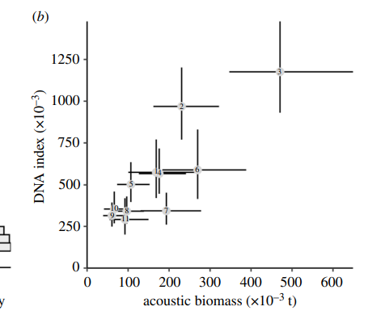
```


---
name: qPCR results2
class: nord-light


## *eDNA offers comparable results to those of Acoustics*

```{r,echo=F,  out.width = '100%',fig.align='center'}
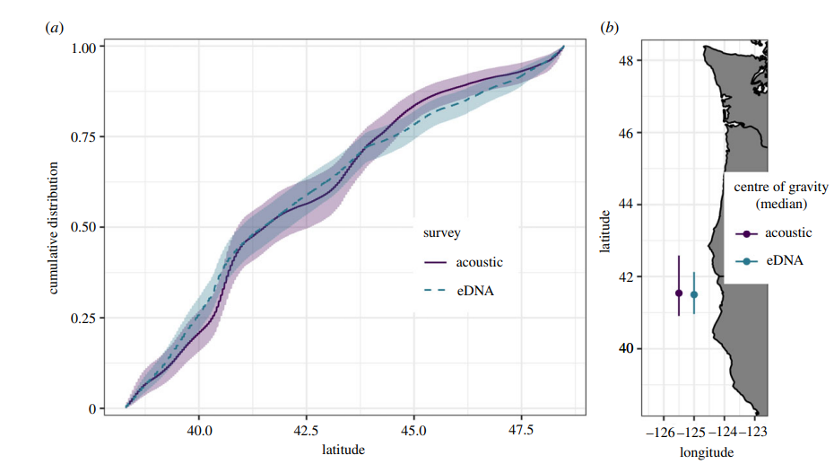
```


---

name: Intro to metabarcoding
class: inverse, center, middle
layout: false
background-image: linear-gradient(150deg, rgba(0, 0, 0, 100%), rgba(0, 0, 0, 50%), rgba(0, 0, 0, 20%)), url(images/OA_fondo.JPG)


# .nord4[Estudios cualitativos: metabarcoding]

---


name: What for
class: nord-dark, center, middle
layout: false


## .nord4[**eDNA and marine ecology**]


---

name: Template
layout: true
class: inverse, center, middle
background-image: linear-gradient(150deg, rgba(0, 0, 0, 100%), rgba(0, 0, 0, 50%), rgba(0, 0, 0, 20%)), url(images/OA_fondo.JPG)
background-size: cover

---
name: Gaining popularity
.center[ ## eDNA is gaining popularity]


---

name: Types of publications I

     ### It works!                    


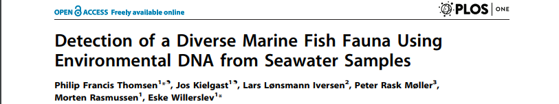
</br>
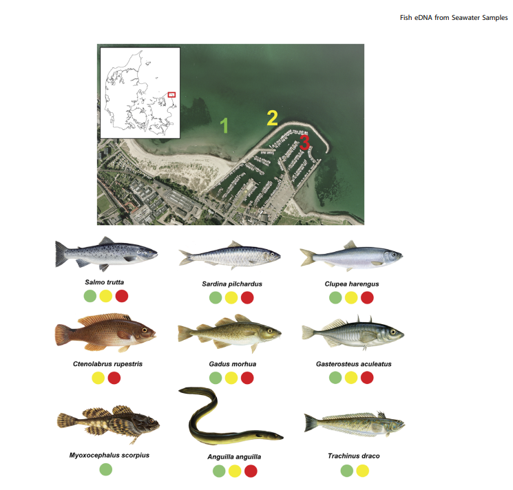

---

name: Types of publications II
 
### Different views


---

name: Types of publications III

### Ecological research


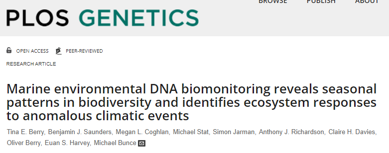
</br>
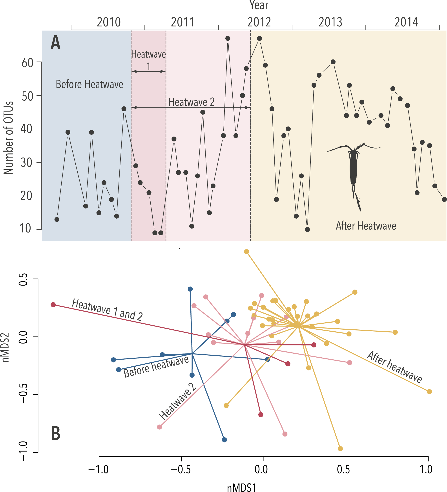


---
name: metabarcoding template
class: nord-light, typo-selection
background-image: linear-gradient(150deg, rgba(0, 0, 0, 100%), rgba(0, 0, 0, 50%), rgba(0, 0, 0, 20%)), url(images/OA_fondo.JPG)
background-size: cover
layout: true

### .center.nord9.bold[Identity assays: metabarcoding]


---
name: metabarcoding_1

.content-box-purple[
.nord1[

## ¿Qué es?

  -   ### Secuenciación masiva y en paralelo
  
  

  ]]
  
---
name: parallel seq
background-image:  url(images/Seqbysyn2.png)
background-size: 90% 90%
background-position: 50% 90%

---
name: parallel seq
background-image:  url(images/Seqbysyn.png)
background-size: 90% 90%
background-position: 50% 90%

---
name: metabarcoding_2

.content-box-purple[
.nord1[

## ¿Qué es?

  -    *Secuenciación masiva y en paralelo*
  
  - ###  De un fragmento homólogo
  
    - ### Universalidad
    - ### Especificidad
    - ### Tamaño
  
  

  ]]
---
name: primer_design1
background-image:  url(images/aligned.png)
background-size: 90% 90%
background-position: 50% 90%

---
name: primerloc
background-image:  url(images/primerloc.png)
background-size: 90% 90%
background-position: 50% 90%

---
name: primer_candidates
background-image:  url(images/thermus_16s_2ndry.jpeg)
background-size: contain
background-position: 50% 90%

---
name: primer_candidates
background-image:  url(images/COI.png)
background-size: contain
background-position: 50% 50%
---
name: right sized
background-image:  url(images/amplified.png)
background-size: 90% 90%
background-position: 50% 90%

---
name: useful
background-image:  url(images/identify.png)
background-size: 90% 90%
background-position: 50% 90%

---
name: metabarcoding_3

.content-box-purple[
.nord1[
.center[
##  ¿Cómo diseñar un experimento
##  de metabarcoding?
]

  
  

  ]]

---
name: qPCR_Fluor
background-image:  url(images/Long_qPCR_Process.PNG)
background-size: 90% 90%
background-position: 50% 90%
---
name: metabarcoding_3

.content-box-purple[
.nord1[

.center[
##  ¿Cómo diseñar un experimento
##  de metabarcoding?
]

  -   ### Variación en el ambiente
  
  

  ]]


---


name: qPCR_Fluor
background-image:  url(images/Biol.rep.png)
background-size: 90% 90%
background-position: 50% 90%

---
name: metabarcoding_3

.content-box-purple[
.nord1[

.center[
##  ¿Cómo diseñar un experimento
##  de metabarcoding?
]

  -   ### Variación en el ambiente
  
  -  ### Variación en la PCR
  
  

  ]]


---
name: metabarcode
background-image:  url(images/visual.anova.png)
background-size: 80% 90%
background-position: 50% 90%

---
name: metabarcoding_3

.content-box-purple[
.nord1[

.center[
##  ¿Cúando usar metabarcoding?

  
]

 - ### Información sobre una comunidad
  
  - Cambios en relación al cambio ambiental
  
  - Monitoreo continuo
  
  - Censo  de especies presentes
  
  

  ]] 
---  


name: metabarcoding_3

.content-box-purple[
.nord1[

##  ¿Cómo usar metabarcoding?

  
  

  ]]
  
---

name: Intro to OA
class: inverse, center, middle
layout: false
background-image: linear-gradient(150deg, rgba(0, 0, 0, 100%), rgba(0, 0, 0, 50%), rgba(0, 0, 0, 20%)), url(images/OA_fondo.JPG)


# .nord4[eDNA for Ocean Acidification and warming]  
  
---
name: template_OA
class: nord-light, typo-selection
background-image: linear-gradient(150deg, rgba(0, 0, 0, 100%), rgba(0, 0, 0, 50%), rgba(0, 0, 0, 20%)), url(images/OA_fondo.JPG)
background-size: cover
layout: true

### .center.nord9.bold[Ocean acidification and Warming]

---
</br>


.center[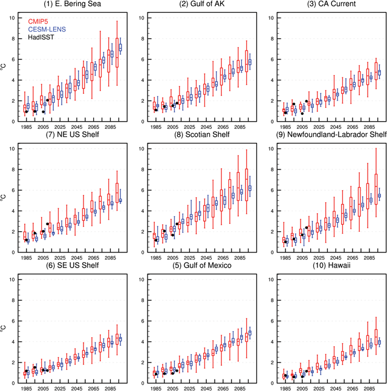]


---
</br>
</br>
.center[]
---
class: nord-dark
## .center[.fancy[Afecta a muchas especies ]
</br>

.pull-left[

]


.pull-right[
]
]


???
With global warming and increased pCO2 levels, there is little doubt that future marine communities will have to face a warmer, more acidic ocean
---
class: nord-dark
name: A lot of info on many spp

 

--


--


--


???

Those effects are not happenning in a vacuum, but likely with Temp
And in different directions
---
class: nord-dark
Name: Ecosystem-wide: not so much

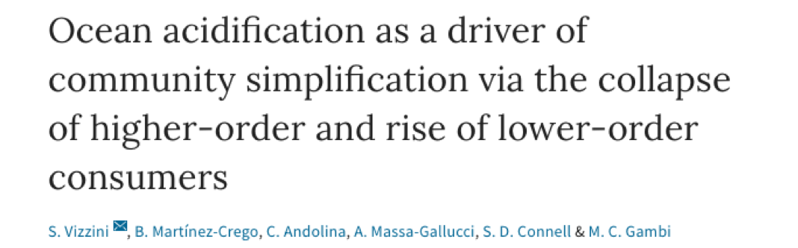


.pull-left[

]
---
name: WHy Hood Canal
class: middle, nord-dark
###.center[.fancy[.title[Why the Puget Sound?]]]

Naturally occuring High *p*CO<sub>2</sub>  levels offer a view of not far-fetched conditions


---
class: nord-dark
name: Research plan

##.center[.fancy[.title[Diseño experimental]]]

.pull-left[

```{r, message = F, echo = F, out.width= '90%'}


leaflet(data = read_csv(here("Data","site.info.csv"))) %>%
  addTiles() %>%
  setView(lat = 47.5, lng = -122.5, zoom = 7) %>%
  addMarkers(label = ~Site,
             labelOptions = labelOptions(interactive = FALSE, clickable = NULL, noHide = NULL,
  permanent = FALSE, className = "", direction = "auto",
  offset = c(1, 1), opacity = 1, textsize = "20px",
  textOnly = FALSE, style = NULL,
  sticky = TRUE)
  )
```
]

--

.pull-right[
.content-box-yellow[
.nord9[
- Seasonal and temporal scale

- Add Biological replication

- Add technical replication
]]
.center[

]


]

---
class: nord-dark
name: Process1

background-image:  url(images/eDNA_16x9.jpg)
background-size: contain
background-position: 50% 50%


---

class: nord-dark
name: Filter 2
background-image:  url(images/Mon_filtrando.jpg)
background-size: contain
background-position: 50% 50%


---

class: nord-dark
name: PCR and seq


.content-box-purple[

 * .huge[.nord1[.bold[ocho estaciones]]]

]

---
class: nord-dark

</br>

```{r, message = F, echo = F, out.width= '90%'}


leaflet(data = read_csv(here("Data","site.info.csv"))) %>%
  addTiles() %>%
  setView(lat = 48, lng = -122.5, zoom = 8) %>%
  addMarkers(label = ~Site,
             labelOptions = labelOptions(interactive = FALSE, clickable = NULL, noHide = NULL,
  permanent = FALSE, className = "", direction = "auto",
  offset = c(1, 1), opacity = 1, textsize = "20px",
  textOnly = FALSE, style = NULL,
  sticky = TRUE)
  )
```

---
class: nord-dark
name: PCR and seq

.content-box-purple[

 * .huge[.nord1[.bold[ocho estaciones]]]

]

.content-box-purple[

 * .huge[.nord1[.bold[muestreadas cada mes durante 1.5 años]]]

]

--
.content-box-purple[

 * .huge[.nord1[.bold[Cada sitio*mes : 3 biol.reps]]]

]

---

background-image:  url(images/Biol.rep.png)
background-size: contain
background-position: 50% 50%


---
.content-box-purple[

 * .huge[.nord1[.bold[ocho estaciones]]]

]

.content-box-purple[

 * .huge[.nord1[.bold[muestreadas cada mes durante 1.5 años]]]

]


.content-box-purple[

 * .huge[.nord1[.bold[Cada sitio*mes : 3 biol.reps]]]

]
--
.content-box-purple[

 * .huge[.nord1[.bold[cada muestra 3 tech reps]]]

]
--

.content-box-purple[

 * .huge[.nord1[.bold[Amplificadas COI]]]

]
---


class: nord-light
name: Pipelines

</br> 
.center.nord9.bold[Processing of sequence data]
</br> 
.pull-left.oc-bg-black.opacity-40.nord-light.bold[

* ####  .bold[A demultiplexing and clustering pipeline]

.center[]

.center[[github.com/ramongallego](https://github.com/ramongallego?tab=repositories) 
]
 
 * A locus-specific classification tree with curated sequences 
 


]


.pull-right.oc-bg-black.opacity-10.nord-light.bold[
 * QC and decontamination steps
 

 .center[]
 
 

 
* High confidence in presence and identity 
 
 
 
 ]


---

.content-box-blue[
```{r dataTABLE1, echo = F, warning=FALSE ,message=FALSE, out.height='70%', out.width='70%'}
convert.names<- function(x){paste0("Sample", 1:length(x))}
read_csv(here("Data", "ASV_table_all_together.csv")) %>%  
  left_join(read_csv(here("Data", "Annotated.hashes.csv"))) %>% 
  unite(family, genus, species, sep = "|", col = "taxa") %>% 
  filter(taxa !="NA|NA|NA") %>% 
 
  group_by(taxa) %>% tally %>% arrange(desc(n)) %>% slice(1:10) %>% 
  pull(taxa) -> keepers 
  read_csv(here("Data", "ASV_table_all_together.csv")) %>%  
  left_join(read_csv(here("Data", "Annotated.hashes.csv"))) %>% 
   unite(family, genus, species, sep = "|", col = "taxa", remove = F) %>%
    mutate(label = case_when(is.na(species) ~  paste0(genus, " sp."),
                                                   TRUE            ~ species)) %>% 
  
    filter(Miseq_run ==1,  taxa %in% keepers) %>% 
    mutate(sample = fct_relabel(sample, convert.names)) %>% 
    arrange(sample) %>% 
    pivot_wider(id_cols = label, names_from = sample, values_from = nReads, values_fill = list (nReads = 0), values_fn = list(nReads= sum)) %>% 
    rename (Taxa = label) %>%
    select(1:7)  %>%
    kable() %>%
    kable_styling(full_width = T) %>%
       column_spec(1, italic  = T) %>%
       column_spec(2:6, width = '1in') -> nice.table 

   


```
]
---


.content-box-blue[
```{r, echo = F, warning=FALSE ,message=FALSE, out.height='70%', out.width='70%'}
nice.table %>% 
  column_spec(2, width = '1in', background = "yellow") %>%
  row_spec(1,background = "yellow")
```

]


---


name: Intro to cuant
class: inverse, center, middle
layout: false

# .nord4[eDNA metabarcoding and quantification]

---

class: nord-dark,  typo-selection
background-image: linear-gradient(150deg, rgba(0, 0, 0, 100%), rgba(0, 0, 0, 50%), rgba(0, 0, 0, 20%)),url(images/eDNA_concept.png)
background-size: cover
layout: true
### .center[eDNA metabarcoding and quantification]

---

class: nord-dark, middle, center
name: PCR paper front


???

How to interpret the number of occurrences of a sequence in a sample?  

---
class: nord-dark, typo, typo-selection


.left-column[


 ### .nord4.bold[Differential Primer Affinity]

 ### .nord4.bold[Strong effect on] .nord13.bold[diversity]
]

--

.right-column[ 
 
```{r,echo=F, fig.align='right'}
knitr::include_graphics("images/PCR_div.png")

```


]

---

class: nord-dark


## .center[ We can get .bold[quantitative] information from metabarcoding]


.center[

]

---

name: template_OA
class: nord-light, typo-selection
background-image: linear-gradient(150deg, rgba(0, 0, 0, 100%), rgba(0, 0, 0, 50%), rgba(0, 0, 0, 20%)), url(images/OA_fondo.JPG)
background-size: cover
layout: true

### .center.nord9.bold[Ocean acidification and Warming]

---
name: Shiny app
class: nord-dark


### .center[.nord12[Pregunta 1]: ¿Podemos detectar las fluctuaciones en presencia y abundancia de las especies de interés? ]

</br>


<video width="640" height="480" controls>
<source src="images/Shiny.mov" type="video/mp4">
</video>


---
class: nord-dark
name: using both PA and eDNAindex
layout: true
background-image: linear-gradient(150deg, rgba(0, 0, 0, 100%), rgba(0, 0, 0, 50%), rgba(0, 0, 0, 20%)),url(images/OA_fondo.JPG)
background-size: cover
---

### .center[.nord12[Pregunta 2]: ¿Hay distintas comunidades asociadas con <br> Temperatura y pH?]

---
class: nord-light
### .nord12[Pregunta 2]: Community changes

.center.huge[Similitud entre muestras en base a su composicion]

---
class: nord-light
layout: false
### .nord12[Pregunta 2]: Community changes

.center.huge[Similitud entre muestras en base a su composicion]

```{r, echo = F, warning=FALSE ,message=FALSE, out.height='70%', out.width='70%'}
t(data[,2:11]) %>%
  vegan::vegdist(upper = F, diag = T) %>%
  round(digits = 3) %>%
  as.matrix()-> dist.table
dist.table[upper.tri(dist.table)] <- ""
dist.table %>% 
  as.data.frame() %>% 
  kable() %>%
    kable_paper(full_width = T) %>%
  kable_styling(bootstrap_options = "striped") %>%
       column_spec(1, italic  = T) %>%
       column_spec(2:6, width = '1in') %>%
  column_spec(2, width = '1in', background = "yellow")
```

---

### .nord12[Pregunta 2]: Community changes
.center[

]
---
### .nord12[Pregunta 2]: Community changes
.center[

]
---
### .nord12[Pregunta 2]: Community changes
.center[
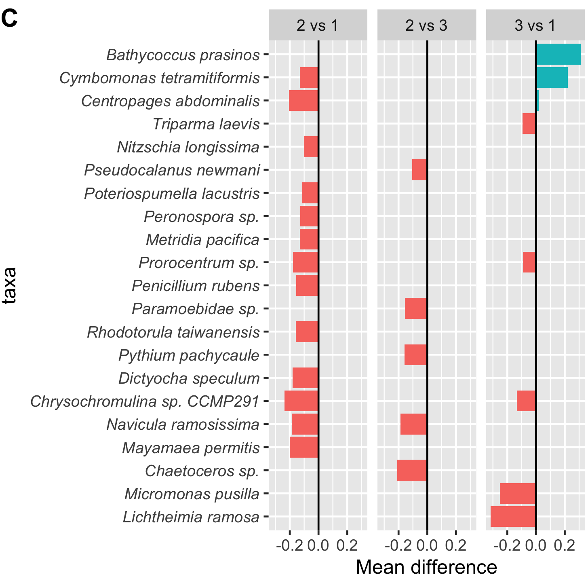
]
---

class: nord-dark
name: layout2
layout: true
background-image: linear-gradient(150deg, rgba(0, 0, 0, 100%), rgba(0, 0, 0, 50%), rgba(0, 0, 0, 20%)),url(images/OA_fondo.JPG)
background-size: cover

---

### .nord12[Pregunta 3]: ¿Qué pinta tiene el futuro Puget Sound para las especies de interés?

</br>
##.fancy[Modelos de presencia de cada taxon:]
</br>
* .huge.bold[Usamos una regresión logística (presencia/ausencia)]
</br>

* .huge.bold[Ajustado independiente en cada .nord13[área y estación]]
</br>
* .huge.bold[y con temperatura y pH como variables explicativas]
</br>
---

name: Projections to 2095
### .nord12.bold[Q3] - Estimando las condiciones en el Puget Sound (RCP8.5)


.left-column[

*  .bold[Usando la estimación de Khangaonkar et al, 2019]

*  .bold[La predicción muestra algunos valores .nord13[ extremos] ]

* .bold[La mayoría de los valores .nord13[se ven en el escenario actual]]

]

.right-column[
]


???

Taking advantage from recently published models for the inner sea
---


## Cada especie responde de un modo distinto


---


## Cambios de diversidad en varios grupos


---

name: Intro to puffin
class: inverse, center, middle
layout: false

# .nord4[Diet composition in the Tufted Puffin]

---

layout: true
class: nord-light,  typo-selection
background-image: linear-gradient(150deg, rgba(0, 0, 0, 100%), rgba(0, 0, 0, 50%), rgba(0, 0, 0, 20%)),url(images/Puffin_Eating.jpeg)
background-size: cover
###  .center.nord9.bold[*Diet composition in the Tufted Puffin*]
---

## .huge[.nord5[.center[.huge[*Bonus track*]]]]

.center[
.content-box-blue[

.huge[.nord1[*Diet composition in the Tufted Puffin*]]  
]
]

.left-column[
.content-box-yellow[

- Using longer reads
- Adaptive sampling vs blocker
- Useful when non-target >>> target
]
]

.right-column[


.footnote[ .nord5[.bold[Credit: @USFWSAlaska ]]]
]

---

--- 

## .nord5[.center[*Why should we care*]]

.center[
.content-box-blue[

.huge[.nord1[*Target DNA outweighted by host DNA*]]  
]]


.left-column[
.content-box-yellow[

- Microbiome
- Infection
- Taxomical proximity
- Mitochondrial vs bacteria
]

--

]

.right-column[

.content-box-white[]


]


---

## .nord5[.center[*Standard operation*]]

.pull-left[
.content-box-yellow[
  - Using fecal and soil samples from nests (and zoo)
  - Short fragment targets:
      - Vertebrates
      - Invertebrates
      - Crustaceans
  - PCR with a Puffin specific blocker
  - Sequence on Illumina
]

]

--

.pull-right[
.content-box-yellow[

- Pooling information from three overlapping primers
- Effect of Puffin blocker on other similar species
  
]
]

---

layout: false
class: nord-light,  typo-selection
background-image: url(images/Zoo_samples.png)
background-size: contain


---


background-image: url(images/Field_samples.png)
background-size: contain


---


layout: true
class: nord-light,  typo-selection
background-image: linear-gradient(150deg, rgba(0, 0, 0, 100%), rgba(0, 0, 0, 50%), rgba(0, 0, 0, 20%)),url(images/Puffin_Eating.jpeg)
background-size: cover
###  .center.nord9.bold[*Diet composition in the Tufted Puffin*]
---

### .nord5[.center[*Nanopore Approach*]]

.pull-left[
.content-box-yellow[
  - Using fecal samples the zoo
  - PCR 12S - 16S ~ 2000 bp
  - Sequence on Nanopore
  - Blocking Puffin sequences 
  - Adaptive Sampling on a Mk1b + MinIT
]
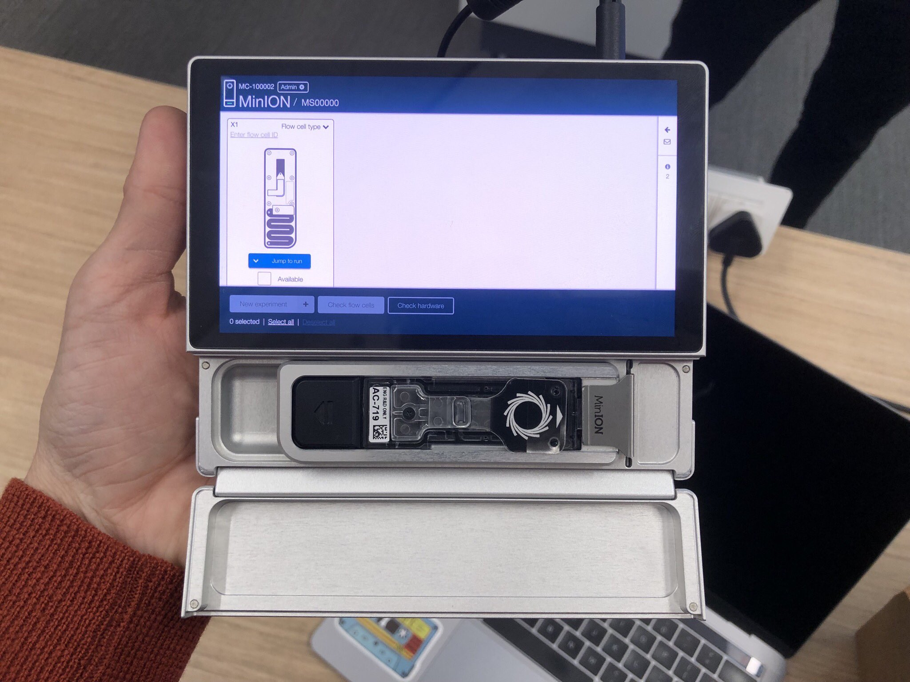
]

.pull-right[


]
---

### .nord5[.center[*Nanopore Approach*]]

.pull-left[
.content-box-yellow[
  - Using fecal samples from the zoo
  - PCR 12S - 16S ~ 2000 bp
  - Sequence on Nanopore
  - Blocking Puffin sequences 
  - Adaptive Sampling on a Mk1b + MinIT
]

]


.pull-right[


.content-box-purple[

- Run for ~ 4 hours
- Flowcell 10
- \> 150k reads
- Run `decona` with Medaka + Racon
]
]

---

### .nord5[.center[*Preliminary results*]]
.left-column[
.content-box-yellow[

Zoo Puffn's diet a healthy mixture of:
- Capelin
- squid
- krill
- herring
- Silverside

]

]

--

.right-column[

.content-box-purple[

.huge[`decona` found 4 contigs that we could match to:]
- 97.67% `pident` with *Mallotus villosus* (Capelin) (~2k bp)
- 99.90% `pident` with *Menidia menidia* (Atlantic Silverside)(~ 2k bp)
- 96% `pident` with *Fratercula arctica* (Atlantic Puffin) (~1.3k bp)
- 96% `pident` with *Pinguinus impennis* (Great Auk, extinct) (~1.3k bp)
]

]
---

## .nord5[.center[*Preliminary results*]]

.left-column[
.content-box-yellow[

Zoo Puffn's diet a healthy mixture of:
- Capelin
- squid
- krill
- herring
- Silverside

]

]


.right-column[

.content-box-purple[

.huge[`decona` found 4 contigs that we could match to:]
- 97.67% `pident` with *Mallotus villosus* (Capelin) (~2k bp)
- 99.90% `pident` with *Menidia menidia* (Atlantic Silverside)(~ 2k bp)
 .content-box-red[ 
 
- 96% `pident` with *Fratercula arctica* (Atlantic Puffin) (~1.3k bp)
- 96% `pident` with *Pinguinus impennis* (Great Auk, extinct) (~1.3k bp)

]]

]

---

.content-box-purple[
.huge[**Both *short* sequences are...**]


.huge[** Forward and Reverse from the same sequence**]
]
---


name: Intro to nsDNA
class: inverse, center, middle
layout: false
background-image: linear-gradient(150deg, rgba(0, 0, 0, 100%), rgba(0, 0, 0, 50%), rgba(0, 0, 0, 20%)), url(images/OA_fondo.JPG)

# .nord4[muestreadores naturales de eDNA]

---
name: The Deep Sea Benthos
background-image: linear-gradient(150deg,rgba(46, 52, 64, 10%),rgba(46, 52, 64, 20%),rgba(46, 52, 64, 20%),rgba(46, 52, 64, 10%)), url(images/deep_sea.jpg)
background-position: top
background-size: cover
class: nord-light

## .nord4[The Deep Sea Benthos]


</br>


.content-box-purple[

 * .huge[.nord1[.bold[60% of the Earth surface]]]

]


 .content-box-purple[

 * .huge[.nord1[.bold[Great Gaps in Biodiversity knowledge]]]

]


  .content-box-purple[

 * .huge[.nord1[.bold[Urgency to know to face two challenges:]]]

]

 
--


.content-box-purple[

 * .huge[.nord1[.bold[ Increasing human pressure ]]]]
 
.content-box-purple[ * .huge[.nord1[.bold[Global Warming]]]

]


---
name: Type of Benthic habitats
background-image:  url(images/deep_sea.jpg)
background-position: top
background-size: cover
class: nord-light

## .nord4[The Deep Sea Benthos]

--

### .nord4[More than mud]

---
name: Type of Benthic habitats
background-image:  url(images/othercosystems.png)
background-position: top
background-size: cover
class: nord-light

## .nord4[The Deep Sea Benthos]


### .nord4[More than mud]

---
name: Sponge Grounds
background-image:  url(images/SpGround_full.png)
background-position: center
background-size: contain
class: nord-dark


---
name: Sponge Grounds
background-image:  url(images/sponge_ground.png)
background-position: bottom
background-size: contain
class: nord-dark

## .nord4[Sponge Grounds]

--

.content-box-purple[

 * .huge[.nord1[.bold[Broad distribution]]]

]
---
name: Sponge Ground distribution
background-image:  url(images/Slide10.png)
background-position: bottom
background-size: contain
class: nord-dark

## .nord4[Sponge Grounds]

---
name: Sponge Grounds
background-image:  url(images/sponge_ground_transparent.png)
background-position: bottom
background-size: contain
class: nord-dark

## .nord4[Sponge Grounds]


--

.content-box-purple[

 * .nord1[Broad distribution]
 
 * .huge[.nord1[.bold[Enriched Habitat]]]

]

--
</br>

.center[

]

---
name: Sponge Grounds
background-image:  url(images/sponge_ground.png)
background-position: bottom
background-size: contain
class: nord-dark

## .nord4[Sponge Grounds]


.content-box-purple[

 * .nord1[Broad distribution]
 
 * .nord1[Enriched Habitat]
 
 * .huge[.nord1[.bold[Threatened]]]

]

---
name: How to investigate
background-image:  url(images/Slide11.png)
background-position: bottom
background-size: contain
class: nord-dark

## .nord4[Sponge Grounds]
</br>

.content-box-yellow[
.huge[.nord1[.bold[How to research the diversity they hold]]]

]

---
name: Can we use eDNA
background-image:  linear-gradient(150deg,rgba(46, 52, 64, 10%),rgba(46, 52, 64, 20%),rgba(46, 52, 64, 20%),rgba(46, 52, 64, 10%)), url(images/eDNA_concept.png)
background-position: bottom
background-size: contain
class: nord-dark

# .nord4[eDNA]

--

.pull-left[
.content-box-yellow[
* .huge[.nord1[.bold[.center[Easier way to capture DNA]]]]

* .huge[.nord1[.bold[.center[Will get DNA from potentially all taxa]]]]
]
]

--
.pull-right[
.content-box-purple[
* .huge[.nord1[.bold[.center[Relatively low volumes]]]]

* .huge[.nord1[.bold[.center[Here and now]]]]
]
]

---
name: Can we use nsDNA
background-image:  linear-gradient(150deg,rgba(46, 52, 64, 10%),rgba(46, 52, 64, 20%),rgba(46, 52, 64, 20%),rgba(46, 52, 64, 10%)), url(images/eDNA_concept.png)
background-position: bottom
background-size: contain
class: nord-dark

# .nord4[eDNA]


---
name: Use the sponge

class: nord-dark

<video width=1200 height=800 controls>

<source src="images/transition1.mp4" type="video/mp4">
</video>

---
name: Can we use nsDNA
background-image:  linear-gradient(150deg,rgba(46, 52, 64, 10%),rgba(46, 52, 64, 20%),rgba(46, 52, 64, 20%),rgba(46, 52, 64, 10%)), url(images/sponge_icon.png)
background-position: 10%
background-size: 300px 300px
class: nord-dark


.content-box-yellow[
.center[##.nord1[.center[nsDNA ]]]]
</br>
</br>

.pull-right[

.content-box-purple[

* .huge[.nord1[.bold[.center[DNA extraction from sponge tissue]]]]


* .huge[.nord1[.bold[.center[Contains DNA from the sponge and everything it eats 
]]]]


* .huge[.nord1[.bold[.center[Represents 100s or 1000s of L of seawater 
]]]]

]

]

---
name: It works on Fish
background-image: url(images/Slide12.png)
background-position: top
background-size: contain
class: nord-dark

.content-box-yellow[
.center[##.nord1[.center[nsDNA ]]]]


</br>
</br>
</br>
</br>

.content-box-purple[

.huge[.nord1[.bold[.center[Using Fish-specific primers ]]]]
]
.center[

]
---

name: Can it work community-wide
background-image:  linear-gradient(150deg,rgba(46, 52, 64, 10%),rgba(46, 52, 64, 20%),rgba(46, 52, 64, 20%),rgba(46, 52, 64, 10%)), url(images/sponge_ground_transparent.png)
background-position: left
background-size: contain
class: nord-dark
.content-box-yellow[
  .center[##.nord1[.center[nsDNA]]]]
</br>

.content-box-purple[

.huge[.nord1[.bold[.center[Can it work  whole communities? ]]]]
]


---
name: Our Paper
background-size: cover
class: nord-dark
background-image: url(images/Slide13.png)

---

background-image:  linear-gradient(150deg,rgba(46, 52, 64, 10%),rgba(46, 52, 64, 20%),rgba(46, 52, 64, 20%),rgba(46, 52, 64, 10%)), url(images/sponge_ground_transparent.png)
background-position: left
background-size: contain
class: nord-dark


</br>
</br>

.content-box-blue[
```{r dataTABLE12, echo = F, warning=FALSE ,message=FALSE, out.height='70%', out.width='70%'}

dataset <- read_csv(here("data_CISA","final_metadata.csv"))

dataset |> 
  group_by(Species, Biogeographic_region) |> 
  summarise (nsamples = as.character(n())) |> 

  pivot_wider(names_from = Biogeographic_region, values_from = nsamples ,values_fill = "-") -> tableready

tableready |> 
    kable() %>%
    kable_styling(full_width = F) %>%
       column_spec(1, italic  = T) |> 
  column_spec(2:5, width = "10em") |> 
  scroll_box(width = "600px")


```
]
---
background-image: url(images/mapa1.png)
background-position: center
background-size: contain
class: nord-dark

---
background-image: url(images/mapa2.png)
background-position: center
background-size: contain
class: nord-dark

---
background-image: url(images/mapa3.png)
background-position: center
background-size: contain
class: nord-dark

<!-- --- -->

<!-- class: nord-dark -->
<!-- name: Research plan -->

<!-- ##.center[.fancy[.title[Experimental design]]] -->
<!-- ```{r, message = F, echo = F, out.width= '90%'} -->


<!-- leaflet(data = read_csv(here("data","final_metadata.csv"))) %>%  -->
<!--   addTiles() |> -->
<!--   # addProviderTiles(providers$CartoDB) %>% -->
<!--   setView(lat = 60, lng = -3.5, zoom = 5) %>%  -->
<!--   addMarkers(label = ~Species,  -->
<!--              labelOptions = labelOptions(interactive = FALSE, clickable = NULL, noHide = NULL, -->
<!--                                          permanent = FALSE, className = "", direction = "auto", -->
<!--                                          offset = c(1, 1), opacity = 1, textsize = "20px", -->
<!--                                          textOnly = FALSE, style = NULL, sticky = TRUE, ), -->
<!--              popup = ~as.character(Depth) -->
<!--   ) -->

<!-- ``` -->

---

background-image:  linear-gradient(150deg,rgba(46, 52, 64, 10%),rgba(46, 52, 64, 20%),rgba(46, 52, 64, 20%),rgba(46, 52, 64, 10%)), url(images/sponge_ground_transparent.png)
background-size: cover
class: nord-dark
name: Research plan
##.center[.fancy[.title[Experimental design]]]

.content-box-purple[

.huge[.nord1[.bold[.center[Amplifying COI with Leray primers]]]]
]

--

</br>

.content-box-purple[

.huge[.nord1[.bold[.center[Sequencing 97 samples in a MiSeq]]]]
]

--
</br>
.content-box-purple[

.huge[.nord1[.bold[.center[Denoising with DADA2]]]]
]

--
</br>
.content-box-purple[

.huge[.nord1[.bold[.center[Second clustering with swarm]]]]
]

--
</br>
.content-box-purple[

.huge[.nord1[.bold[.center[BLAST and LCA for taxonomical assignment]]]]
]
--
</br>
.content-box-purple[

.huge[.nord1[.bold[.center[Further curation by taxonomic experts]]]]
]

---
background-image:  linear-gradient(150deg,rgba(46, 52, 64, 10%),rgba(46, 52, 64, 20%),rgba(46, 52, 64, 20%),rgba(46, 52, 64, 10%)), url(images/sponge_ground_transparent.png)
background-size: cover
class: nord-dark
name: results

##.center[.fancy[.title[Results]]]


.content-box-purple[

.huge[.nord1[.bold[.center[14.26M raw reads from 97 samples]]]]
]

--
</br>
.content-box-purple[

.huge[.nord1[.bold[.center[After QC, ~ 9M reads from 11,198 ASVs ]]]]
]

--

</br>
.content-box-purple[

.huge[.nord1[.bold[.center[Assigned taxonomy: 7.6M reads, 2155 ASVs  ]]]]
]
--
.content-box-nord-light[

]


---
background-image:  linear-gradient(150deg,rgba(46, 52, 64, 10%),rgba(46, 52, 64, 20%),rgba(46, 52, 64, 20%),rgba(46, 52, 64, 10%)), url(images/sponge_ground_transparent.png)
background-size: cover
class: nord-dark
name: results

##.center[.fancy[.title[nsDNA Results ]]]

.content-box-purple[

.huge[.nord1[.bold[.center[**Only** 1.8M reads from 590 species]]]]
]

--
.content-box-purple[

.huge[.nord1[.bold[.center[Leray primers target Metazoa, most reads and species belong to: Chordata, Cnidaria, Echinodermata and Porifera   ]]]]
]

--
.content-box-purple[
```{r, message = F, echo = F, out.width= '90%'}

read_csv(here("data_CISA", "TalkCISA2023_summary.csv")) -> summary_CISA

colnames(summary_CISA) <- gsub("\\...*", "", colnames(summary_CISA))
kbl(summary_CISA, align = "c") %>%
  kable_classic(full_width = F, html_font = "Cambria") %>%
  add_header_above(c("","All together " =  5 , "Phakellia ventilabrum " = 3 ,"Geodia hentscheli" = 3,  "Geodia barretti" = 3, "Geodia parva" = 3), italic = T, bold = T) |> 
  scroll_box(width = "800px")
```
]
---

background-image:  linear-gradient(150deg,rgba(46, 52, 64, 10%),rgba(46, 52, 64, 20%),rgba(46, 52, 64, 20%),rgba(46, 52, 64, 10%)), url(images/sponge_ground_transparent.png)
background-size: cover
class: nord-dark
name: results

##.center[.fancy[.title[Echinoderms ]]]

.content-box-purple[

.huge[.nord1[.bold[.center[78 ASVs, 43 species, 117k reads]]]]
]


---

background-image:  linear-gradient(150deg,rgba(46, 52, 64, 10%),rgba(46, 52, 64, 20%),rgba(46, 52, 64, 20%),rgba(46, 52, 64, 10%)), url(images/sponge_ground_transparent.png)
background-size: cover
class: nord-dark
name: results

##.center[.fancy[.title[Cnidarians ]]]

.content-box-purple[

.huge[.nord1[.bold[.center[166 ASVs, 86 species, 83k reads]]]]
]


---

background-image:  linear-gradient(150deg,rgba(46, 52, 64, 10%),rgba(46, 52, 64, 20%),rgba(46, 52, 64, 20%),rgba(46, 52, 64, 10%)), url(images/sponge_ground_transparent.png)
background-size: cover
class: nord-dark
name: results

##.center[.fancy[.title[Porifera (no host) ]]]

.content-box-purple[

.huge[.nord1[.bold[.center[189 ASVs, 87 species, 68k reads]]]]
]


---

background-image:   url(images/cordata_all.png)
background-size: contain
class: nord-light
name: results

##.center[.fancy[.title[Chordata ]]]

---

background-image:   url(images/sponge_ground.png)
background-size: cover
class: nord-light
name: Conclusions

##.center[.fancy[.title[.nord4[A few thoughts ]]]]

--

</br>
.content-box-purple[

.huge[.nord1[.bold[.center[A good way to describe diversity]]]]

]
.content-box-nord-light[

]
---

background-image:   url(images/sponge_ground.png)
background-size: cover
class: nord-light
name: Conclusions

##.center[.fancy[.title[.nord4[A few thoughts ]]]]

</br>
.content-box-purple[

.huge[.nord1[.bold[.center[ _Phakelia_ much better at this]]]]

]
.center[
.content-box-yellow[
.huge[.nord1[.bold[.center[Depth related?]]]]
]
.content-box-nord-light[


]

]

---

background-image:   url(images/sponge_ground.png)
background-size: cover
class: nord-light
name: Conclusions

##.center[.fancy[.title[.nord4[A few thoughts ]]]]

</br>
.content-box-purple[

.huge[.nord1[.bold[.center[ _Phakelia_ much better at this]]]]

]
.center[
.content-box-yellow[
.huge[.nord1[.bold[.center[Microbiome of _Geodia_ interfering?]]]]
]
.content-box-nord-light[

]
]


---
name: Intro to deteccion
class: inverse, center, middle
layout: false
background-image: linear-gradient(150deg, rgba(0, 0, 0, 100%), rgba(0, 0, 0, 50%), rgba(0, 0, 0, 20%)), url(images/OA_fondo.JPG)

# .nord4[Detección de especies de interés]

---

layout: true
class: nord-light,  typo-selection
background-image: linear-gradient(150deg, rgba(0, 0, 0, 100%), rgba(0, 0, 0, 50%), rgba(0, 0, 0, 20%)),url(images/OA_fondo.JPG)
background-size: cover

###  .center.nord9.bold[*Detección de especies con eDNA*]

---
name: species 

.content-box-purple[
.nord1[

## Casos posibles

  -   ### Detección de especies objetivo
  
  

  ]]
--
.content-box-purple[
.nord1[

.huge[ - Diseñar primers que amplifiquen y distingan]


]]

--
.content-box-purple[
.nord1[

.huge[ - Secuenciar]


]]
---
name: metabarcode
background-image:  url(images/detecting_fish1.png)
background-size: contain
background-position: 50% 50%

---
name: metabarcode
background-image:  url(images/detecting_fish2.png)
background-size: contain
background-position: 50% 50%

---
name: metabarcode
background-image:  url(images/detecting_fish3.png)
background-size: contain
background-position: 50% 50%

---
name: species 

.content-box-purple[
.nord1[

## Casos posibles

  -   ### Detección de especies objetivo
  
  

  ]]
--
.content-box-purple[
.nord1[

.huge[ - Diseñar qPCR assay]


]]

--
.content-box-purple[
.nord1[

.huge[ - Interpretar]


]]

---
name: metabarcode
background-image:  url(images/greencrab.png)
background-size: contain
background-position: 50% 50%

---
name: species 

.content-box-purple[
.nord1[

## Ambiciones

  -   ### Secuencia ahora, pregunta luego
  
  

  ]]
---
name: Intro to mitoge


layout:false
class: nord-light,  middle, typo-selection
background-image: linear-gradient(150deg, rgba(0, 0, 0, 100%), rgba(0, 0, 0, 50%), rgba(0, 0, 0, 20%)),url(images/OA_fondo.JPG)
background-size: cover
### .huge[.nord5[.center[ .bold[Building mitochondrial references ]]]]
### .nord5[.center[ .bold[for species identification ]]]


---

layout: true
class: nord-light,  typo-selection
background-image: linear-gradient(150deg, rgba(0, 0, 0, 100%), rgba(0, 0, 0, 50%), rgba(0, 0, 0, 20%)),url(images/OA_fondo.JPG)
background-size: cover
###  .center.nord9.bold[*Mitogenomas: go big or go home*]


---
### .huge[.nord5[.center[ .bold[Building mitochondrial reference databases ]]]]
.huge[.nord5[.center[.huge[*A team effort*]]]]

.pull-left[
.content-box-yellow[

- Led by *Ana Ramón-Laca*

- Made possible by support from PIs *Krista Nichols* at NOAA and *Ryan Kelly* at UW

- No point on having a guest room

]


]

.pull-right[


]


---
name: reasons


### .huge[.nord5[.center[ .bold[*Motivation*]]]]

.pull-left[

</br>
</br>

.content-box-yellow[


- Obtaining full mitogenomes affordabl-ish

- PCR-free method

- Without requiring to pool 100s of specimens

- Obtaining whole-length fragments

]
]

--

.pull-right[

</br>
</br>

.content-box-purple[

* .bold[WE DON'T HAVE THE BARCODES]
]
]

---
name: Myctophids
background-image: url(images/All.coveragev2.png)
background-size: contain


# .bold[Myctophids]

---

name: Approaches


### .huge[.nord5[.center[ .bold[*Mitochondrial enrichment*]]]]

.pull-left[
.content-box-blue[


- Mitochondrial enrichment at different levels:
   - Tissue with higher mitochondrial content
]


]

.pull-right[

.content-box-blue[


]
]

---

.huge[.nord5[.center[.huge[*Mitochondrial enrichment*]]]]

.pull-left[
.content-box-blue[


- Mitochondrial enrichment at different levels:
   - Tissue with higher mitochondrial content
   - DNA Isolation techniques
   
]


]

.pull-right[

.content-box-blue[


]
]

---

.huge[.nord5[.center[.huge[*Mitochondrial enrichment*]]]]

.pull-left[
.content-box-blue[


- Mitochondrial enrichment at different levels:
   - Tissue with higher mitochondrial content
   - DNA Isolation techniques
   - Enrichment:
      - Exonuclease targetting linear DNA
      - De-phosphorilation and cutting with CRISPR-CAS9
   
]


]

.pull-right[

.content-box-blue[


]
]

---
.huge[.nord5[.center[.huge[*Mitochondrial enrichment*]]]]

.pull-left[
.content-box-blue[


- Mitochondrial enrichment at different levels:
   - Tissue with higher mitochondrial content
   - DNA Isolation techniques
- Enrichment:
      - Exonuclease targetting linear DNA
      - De-phosphorilation and cutting with CRISPR-CAS9
- Sequencing enrichment:
  - Adaptive sampling with reference mitogenomes
   
]


]


.pull-right[

.content-box-blue[


]
]
---
layout: true
class: nord-light,  typo-selection
background-image: linear-gradient(150deg, rgba(0, 0, 0, 100%), rgba(0, 0, 0, 50%), rgba(0, 0, 0, 20%)),url(images/OA_fondo.JPG)
background-size: cover
## .nord5[.center[*General Workflow*]]

---


.left-column[
</br>
.content-box-blue[

  * Run on a FlowCell 9.4
  * Run for ~ 8 hrs
  * Basecalling using SUP
  * Map to reference with minimap2

]]

.right-column[

]


---
layout: true
class: nord-light,  typo-selection
background-image: linear-gradient(150deg, rgba(0, 0, 0, 100%), rgba(0, 0, 0, 50%), rgba(0, 0, 0, 20%)),url(images/OA_fondo.JPG)
background-size: cover

---

name: results1


## .nord5[.center[*Great Enrichment and sequencing depth*]]


---

## .nord5[.center[*Great Coverage all across mitogenome*]]

.pull-left[
.content-box-yellow[

 With *Exonuclease*, Coverage is really uniform
]
]
.pull-right[
.content-box-yellow[
 With *CRISPR-CAS9*, coverage varies around cutting regions]
]


---
background-image: url(images/Depletion.png)
background-size: contain

## .nord1[.center[*Exonuclease*]]

---
background-image: url(images/nCATS.png)
background-size: contain

## .nord1[.center[*CRISPR-CAS9*]]


---

.content-box-yellow[
- .huge[.nord1[*All methods heavily dependent on extraction Quality and fragment length*]]]


.content-box-purple[
</br>

.content-box-yellow[

- With *CRISPR-CAS9*, coverage varies around cutting regions


```{r, results='asis', echo =F}
tabl <- "
|     | CAS9      | gDNA depletion|
              |-----|:---------:|:-------------:|
              |  Min| 1,117X    |       647X	  |
              |  Max| 14,299X   |        	875X  |
              |  Ave| 8,971X    |  805X         |
              |  Mean seq-length| 4000bp|5700bp |
              |  Total Reads| 78k | 623k        |
              |  On Target| 36k   | 2309        |"
cat(tabl)
```


]


]]

---
background-image: url(images/mitogenomes.one.per.spp.annotated.above.and.below.png)
background-size: contain

## Five Species sequenced

---

.content-box-yellow[
## .bold[Myctophids show some genetic rearrangements]
]
</br>
--

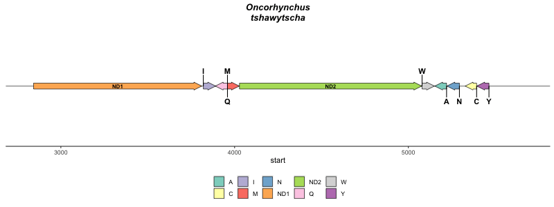
---

name: Intro to aDNA
class: inverse, center, middle
layout: false
background-image: url(images/moa-bones-news.jpg)
background-size: cover
# .nord6[aDNA ]
## .nord5[una ventana al pasado]

---
name: aDNA_template
class: nord-dark, typo-selection
background-image: linear-gradient(150deg, rgba(0, 0, 0, 100%), rgba(0, 0, 0, 50%), rgba(0, 0, 0, 20%)), url(images/moa-bones-news.jpg)
background-size: cover
layout: true

### .center.nord9.bold[ancientDNA]

---

.content-box-yellow[
.center[##.nord1[.center[Menú del día ]]]]
</br>


.content-box-purple[

 * .huge[.nord1[.bold[Movimientos migratorios]]]

]


.content-box-purple[

 * .huge[.nord1[.bold[Evolución / Conectividad]]]

]


.content-box-purple[

 * .huge[.nord1[.bold[Patógenos a lo largo de la historia]]]

]


.content-box-purple[

 * .huge[.nord1[.bold[Sediment cores y paleoecologia]]]

]


---
class: center, middle


.huge[.nord6[  *Ultrashort and degraded DNA fragments that are preserved in subfossil material, including hard tissues, such as bones, teeth and shells, and soft tissues, such as mummified skin and hair, as well as sediments.*, Orlando et al. 2021]]

---
name: aDNA - caracteristicas


.content-box-yellow[
.center[##.nord1[Características ]]]

  * .bold[.huge[Fragmentación del ADN]]

  * .bold[.huge[Substitución de bases]]
---
background-image: url(images/aDNA_damages.png)
background-size: contain

---


.content-box-yellow[
.center[##.nord1[Características ]]]

* .bold[.huge[Fragmentación del ADN]]

* .bold[.huge[Substitución de bases]]


.bold[.huge[Ambas aumentan con el tiempo y en función del medio]]

--

.bold[.huge[Son una barrera para la interpretación de los resultados]]

--

.bold[.huge[Pero ayudan a distinguir aDNA del resto de DNA en la muestra]]


---
name: Where is it


.content-box-yellow[
.center[##.nord1[¿Dónde encontrarlo? ]]]

 - .bold[.huge[Especímenes en museos]]

--

 - .bold[.huge[Animales en permafrost]]
 
--
 
 - .bold[.huge[Yacimientos arquelógicos]]
 
--

 - .bold[.huge[Sediment cores]]
 
--

 - .bold[.huge[Placa dental, conchas]]

---
name: Evolution

.content-box-yellow[
.center[##.nord1[¿Cómo son los fragmentos? ¿Edad?]]]

.huge[Empezó con fragmentos de < 300 bp]

De un animal en un museo desde hace 150 años

--

.huge[Genomas completos de hace más de 0.5M años]

--

.huge[Identificación de parásitos, flora microbiana, patógenos]


---

name: What to study

.content-box-yellow[
.center[##.nord1[¿Cúando usarlo?]]]

- .huge[Evolutionary questions: Neandertal - Sapiens]

--

- .huge[Ecological questions:]

      - Response to Climate Change

      - Previous Genetic Diversity

--

- .huge[Antropology ]

--


---

name: How to study

.content-box-yellow[
.center[##.nord1[¿Cómo usarlo?]]]

 .huge[Extracción de aDNA: Medidas para no contaminar]

--

-   .bold[Presión de aire positiva]

-   .bold[UV]

-   .bold[Separación física del resto del proceso ]

      - ACAD en Australia - un edificio independiente

      - Puede bastar con habitación independiente con ventilación propia

--

.huge[.bold[Extracción implica destrucción del espécimen ]]

---
name: How to study

.content-box-yellow[
.center[##.nord1[¿Cómo usarlo?]]]

- .huge[Secuenciación aDNA]

--
-   .bold[Remediacion de las C -> U] - método .bold[USER] 

--
-   .bold[Ligación de adaptadores y sequenciación] - muy caro

--
-   .bold[Captura de sequencias con miles de sondas] - varios métodos, específicas 

   - .bold[hyRad, myBATES]

--
-   .bold[Amplificación de fragmentos cortos] - recuperación de comunidades

???

 Método USER es opcional, y sólo funciona si no hay metilación: se puede estiamr la metilación premortem

Secuenciar sin selección es muy pooco efectivo, porque hay más ADN moderno que no antigua

Sondas: seleccionar es sesgar. Se puede comprar sondas comerciales para especies modelo, o generarlas con secuencias obtenidas en especies presentes y cercanas 

Tomás Marques Bonet - 
Carles Lalezuela

---
name: secuenciacion slide
---
background-image: linear-gradient(150deg, rgba(0, 0, 0, 100%), rgba(0, 0, 0, 50%), rgba(0, 0, 0, 20%)),url(images/OA_fondo.JPG)
background-size: cover
class: middle, nord-dark
layout: false

# .huge[**Thanks!**]


.footnote[Slides available at 
```{r, echo = F, out.width='50%'}
knitr::include_graphics("images/Qr2025.png")
```


Slides created via the R package [**xaringan**](https://github.com/yihui/xaringan).
]

---
name: Jobs to do

class: nord-dark, center


background-image: linear-gradient(150deg,rgba(46, 52, 64, 10%),rgba(46, 52, 64, 90%),rgba(46, 52, 64, 50%),rgba(46, 52, 64, 10%)), url(images/eDNA_concept.png)

background-size: cover

.content-box-yellow[
.center[##.nord1[.center[Jobs to do]]]]
</br>

.pull-left[
.content-box-green[

 #### .huge[.nord1[.bold[Field Biologist]]]

]]

.pull-right[

.content-box-green[

* #### .nord1[.bold[ Detail planning ]]

* #### .nord1[.bold[ Experimental design ]]

* #### .nord1[.bold[ Contamination awareness ]]
]
]
</br>

--

.pull-left[
.content-box-green[

 #### .huge[.nord1[.bold[Wet-lab Biologist]]]

]]

.pull-right[

.content-box-green[

* #### .nord1[.bold[ Technology understanding ]]

* #### .nord1[.bold[ Automation ]]

* #### .nord1[.bold[ Contamination awareness ]]
]
]

--

.pull-left[
.content-box-green[

 #### .huge[.nord1[.bold[Bioinformatics]]]

]]

.pull-right[

.content-box-green[

* #### .nord1[.bold[ Entender el proceso ]]

* #### .nord1[.bold[ Reproducibilidad ]]

* #### .nord1[.bold[ Contamination awareness ]]
]
]


