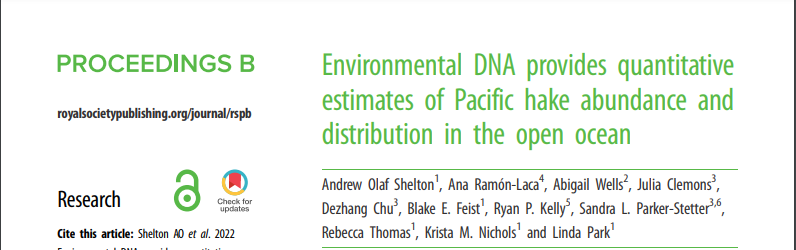

name:bio
class: nord-dark, center


background-image: linear-gradient(150deg,rgba(46, 52, 64, 10%),rgba(46, 52, 64, 90%),rgba(46, 52, 64, 50%),rgba(46, 52, 64, 10%)), url(images/eDNA_concept.png)

background-size: cover


# .huge[*ADN ambiental (eDNA)*]

## *y sus aplicaciones en ecosistemas marinos*

## *(y más alla)*

```{css, echo=F}
.small { font-size: 70% }
.huge  { font-size: 120% }
```


.footnote[.huge[

</br>
</br>
</br>
**Ramón Gallego Simón**
]]

```{r setup, include=FALSE, message=F, echo=FALSE}
options(htmltools.dir.version = FALSE)
library (leaflet)
library(tidyverse)
library(here)
library(kableExtra)
library(DT)
```

```{css echo=FALSE}
.highlight-last-item > ul > li, 
.highlight-last-item > ol > li {
  opacity: 0.5;
}
.highlight-last-item > ul > li:last-of-type,
.highlight-last-item > ol > li:last-of-type {
  opacity: 1;
}

.bold-last-item > ul > li:last-of-type,
.bold-last-item > ol > li:last-of-type {
  font-weight: bold;
}
```

---
name: Intro 
class: nord-light
layout: true
## .center[Introductions]

---

### .fancy[Ramón Gallego]
</br>
.pull-left[
```{r, echo = F}
knitr::include_graphics("images/PNW.jpg")
```
]

.pull-right[
```{r, echo = F}
knitr::include_graphics("images/RGS.JPG")
```
]

---
layout:true 
background-size: cover
class: nord-dark
background-image: linear-gradient(150deg,rgba(46, 52, 64, 10%),rgba(46, 52, 64, 90%),rgba(46, 52, 64, 50%),rgba(46, 52, 64, 10%)), url(images/eDNA_concept.png)
---

.content-box-yellow[
.center[##.nord1[.center[Menú del día ]]]]
</br>


.content-box-purple[

 * .huge[.nord1[.bold[eDNA]]]

]

--
.content-box-purple[

 * .huge[.nord1[.bold[Cambios ambientales, en las comunidades y eDNA]]]

]

--

.content-box-purple[

 * .huge[.nord1[.bold[eDNA como medida cuantitativa]]]

]

--

.content-box-purple[

 * .huge[.nord1[.bold[Mitogenomas como barcodes]]]

]

--

.content-box-purple[

 * .huge[.nord1[.bold[Analisis de dieta]]]

]


---

class: center, middle

### .fancy[*environmental DNA*]


.huge[ *DNA that can be extracted from environmental samples (such as soil, water or air), without first isolating any target organisms*, Taberlet et al. 2012]


---
name: tipos de informacion
class: nord-dark
### .fancy[*environmental DNA*]

.content-box-yellow[
.center[##.nord1[Cuantificación ]]]

.content-box-purple[
```{r,echo=F, out.width='70%',out.height='70%', fig.align='center'}
knitr::include_graphics("images/pone.0122763.g003.png")
```

]
---
name: tipos de informacion
class: nord-dark
### .fancy[*environmental DNA*]

.content-box-yellow[
.center[##.nord1[Composición] ]]

.content-box-purple[

```{r dataTABLE, echo = F, warning=FALSE ,message=FALSE}

convert.names<- function(x){paste0("Sample", 1:length(x))}
read_csv(here("Data", "ASV_table_all_together.csv")) %>%  
  left_join(read_csv(here("Data", "Annotated.hashes.csv"))) %>% 
  unite(family, genus, species, sep = "|", col = "taxa") %>% 
  filter(taxa !="NA|NA|NA") %>% 
 
  group_by(taxa) %>% tally %>% arrange(desc(n)) %>% slice(1:10) %>% 
  pull(taxa) -> keepers 
  read_csv(here("Data", "ASV_table_all_together.csv")) %>%  
  left_join(read_csv(here("Data", "Annotated.hashes.csv"))) %>% 
   unite(family, genus, species, sep = "|", col = "taxa", remove = F) %>%
    mutate(label = case_when(is.na(species) ~  paste0(genus, " sp."),
                                                   TRUE            ~ species)) %>% 
  
    filter(Miseq_run ==1,  taxa %in% keepers) %>% 
    mutate(sample = fct_relabel(sample, convert.names)) %>% 
    arrange(sample) %>% 
    pivot_wider(id_cols = label, names_from = sample, values_from = nReads, values_fill = list (nReads = 0), values_fn = list(nReads= sum)) %>% 
    rename (Taxa = label) -> data
  data %>% 
    select(1:7) %>% 
    kable() %>% 
    kable_styling(full_width = T, 
                  bootstrap_options = "hover") %>% 
       column_spec(1, italic  = T) %>% 
       column_spec(2:6, width = '1in') -> nice.table
   

nice.table %>% 
 scroll_box( height = "600px")
```

]

---
name: modos de obtenerla
class: nord-dark
### .fancy[*environmental DNA*]


.content-box-purple[
.nord1[
## Single-species assays

  -   ### *qPCR*
  -   ### *ddPCR* 
]]

--


.content-box-purple[
.nord1[

## Multi-species assays

  - ###*metabarcoding*
]]


---

name: How to sample
class: nord-dark, center, middle
layout: false

## .nord4[¿Cómo muestrear eDNA?]


---

name: Soil
class: nord-light
layout: true

## .nord1[Metodos de muestreo]

---

name: Soil

.center[ # Suelo]

.content-box-purple[
```{r,echo=F, out.width='80%',out.height='80%', fig.align='center'}
knitr::include_graphics("images/Tiara_TNC.jpg")
```

]

---

.center[ # Suelo]

.content-box-purple[
```{r,echo=F, out.width='80%',out.height='80%', fig.align='center'}
knitr::include_graphics("images/Tiara_UCLA.jpg")
```

]

---

name: Freshwater

.center[ # Rios]

.content-box-purple[
```{r,echo=F, out.width='80%',out.height='80%', fig.align='center'}
knitr::include_graphics("images/Freshwater.jpeg")
```

]

---

name: Freshwater

.center[ # Aguas Costeras]

.content-box-purple[
```{r,echo=F, out.width='80%',out.height='80%', fig.align='center'}
knitr::include_graphics("images/eDNA_16x9.jpg")
knitr::include_graphics("images/procB2.png")
```

]

---

name: Freshwater

.center[ ## Aguas Abiertas]

.content-box-purple[
```{r,echo=F, out.width='80%',out.height='80%', fig.align='center'}
knitr::include_graphics("images/CTD.jpg")


```

]

---

name: Freshwater

.center[ # Aire]

.content-box-purple[
```{r,echo=F, out.width='80%',out.height='80%', fig.align='center'}
knitr::include_graphics("images/eDNA_air.jpg")

```

]


---

name: Intro to OA_eDNA
class: inverse, center, middle
layout: false

# .nord4[Cambios en comunidades costeras con calentamiento y acidificación de los océanos]

---

name: template_OA
class: nord-light, typo-selection
background-image: linear-gradient(150deg, rgba(0, 0, 0, 100%), rgba(0, 0, 0, 50%), rgba(0, 0, 0, 20%)), url(images/OA_fondo.JPG)
background-size: cover
layout: true

### .center.nord9.bold[Ocean acidification and Warming]

---
</br>


.center[]


---
</br>
</br>
.center[]
---
class: nord-dark
## .center[.fancy[Afecta a muchas especies ]
</br>

.pull-left[

]


.pull-right[
]
]


???
With global warming and increased pCO2 levels, there is little doubt that future marine communities will have to face a warmer, more acidic ocean
---
class: nord-dark
name: A lot of info on many spp

 

--


--


--


???

Those effects are not happenning in a vacuum, but likely with Temp
And in different directions
---
class: nord-dark
Name: Ecosystem-wide: not so much


.pull-left[

]
---
name: WHy Hood Canal
class: middle, nord-dark
###.center[.fancy[.title[Why the Puget Sound?]]]

Naturally occuring High *p*CO<sub>2</sub>  levels offer a view of not far-fetched conditions


---
class: nord-dark
name: Research plan

##.center[.fancy[.title[Diseño experimental]]]

.pull-left[

```{r, message = F, echo = F, out.width= '90%'}


leaflet(data = read_csv(here("Data","site.info.csv"))) %>% 
  addTiles() %>% 
  setView(lat = 47.5, lng = -122.5, zoom = 7) %>% 
  addMarkers(label = ~Site, 
             labelOptions = labelOptions(interactive = FALSE, clickable = NULL, noHide = NULL,
  permanent = FALSE, className = "", direction = "auto",
  offset = c(1, 1), opacity = 1, textsize = "20px",
  textOnly = FALSE, style = NULL, 
  sticky = TRUE)
  )
```
]

--

.pull-right[
.content-box-yellow[
.nord9[
- Seasonal and temporal scale

- Add Biological replication

- Add technical replication
]]
.center[

]


]

---


class: nord-light
name: Pipelines

</br> 
.center.nord9.bold[Processing of sequence data]
</br> 
.pull-left.oc-bg-black.opacity-40.nord-light.bold[

* ####  .bold[A demultiplexing and clustering pipeline]

.center[]

.center[[github.com/ramongallego](https://github.com/ramongallego?tab=repositories) 
]
 
 * A locus-specific classification tree with curated sequences 
 


]


.pull-right.oc-bg-black.opacity-10.nord-light.bold[
 * QC and decontamination steps
 

 .center[]
 
 

 
* High confidence in presence and identity 
 
 
 
 ]


---

.content-box-blue[
```{r dataTABLE1, echo = F, warning=FALSE ,message=FALSE, out.height='70%', out.width='70%'}
convert.names<- function(x){paste0("Sample", 1:length(x))}
read_csv(here("Data", "ASV_table_all_together.csv")) %>%  
  left_join(read_csv(here("Data", "Annotated.hashes.csv"))) %>% 
  unite(family, genus, species, sep = "|", col = "taxa") %>% 
  filter(taxa !="NA|NA|NA") %>% 
 
  group_by(taxa) %>% tally %>% arrange(desc(n)) %>% slice(1:10) %>% 
  pull(taxa) -> keepers 
  read_csv(here("Data", "ASV_table_all_together.csv")) %>%  
  left_join(read_csv(here("Data", "Annotated.hashes.csv"))) %>% 
   unite(family, genus, species, sep = "|", col = "taxa", remove = F) %>%
    mutate(label = case_when(is.na(species) ~  paste0(genus, " sp."),
                                                   TRUE            ~ species)) %>% 
  
    filter(Miseq_run ==1,  taxa %in% keepers) %>% 
    mutate(sample = fct_relabel(sample, convert.names)) %>% 
    arrange(sample) %>% 
    pivot_wider(id_cols = label, names_from = sample, values_from = nReads, values_fill = list (nReads = 0), values_fn = list(nReads= sum)) %>% 
    rename (Taxa = label) %>%
    select(1:7) %>% 
    kable() %>% 
    kable_styling(full_width = T) %>% 
       column_spec(1, italic  = T) %>% 
       column_spec(2:6, width = '1in') -> nice.table
   

nice.table
```
]
---


.content-box-blue[
```{r, echo = F, warning=FALSE ,message=FALSE, out.height='70%', out.width='70%'}
nice.table %>% 
  column_spec(2, width = '1in', background = "yellow") %>% 
  row_spec(1,background = "yellow") 
```

]


---


name: Intro to cuant
class: inverse, center, middle
layout: false

# .nord4[eDNA metabarcoding and quantification]

---

class: nord-dark,  typo-selection
background-image: linear-gradient(150deg, rgba(0, 0, 0, 100%), rgba(0, 0, 0, 50%), rgba(0, 0, 0, 20%)),url(images/eDNA_concept.png)
background-size: cover
layout: true
### .center[eDNA metabarcoding and quantification]

---

class: nord-dark, middle, center
name: PCR paper front


???

How to interpret the number of occurrences of a sequence in a sample?  

---
class: nord-dark, typo, typo-selection


.left-column[


 ### .nord4.bold[Differential Primer Affinity]

 ### .nord4.bold[Strong effect on] .nord13.bold[diversity]
]

--

.right-column[ 
 
```{r,echo=F, fig.align='right'}


```


]

---

class: nord-dark


## .center[ We can get .bold[quantitative] information from metabarcoding]


.center[

]

---

name: template_OA
class: nord-light, typo-selection
background-image: linear-gradient(150deg, rgba(0, 0, 0, 100%), rgba(0, 0, 0, 50%), rgba(0, 0, 0, 20%)), url(images/OA_fondo.JPG)
background-size: cover
layout: true

### .center.nord9.bold[Ocean acidification and Warming]

---
name: Shiny app
class: nord-dark


### .center[.nord12[Pregunta 1]: ¿Podemos detectar las fluctuaciones en presencia y abundancia de las especies de interés? ]

</br>


<video width="640" height="480" controls>
<source src="images/Shiny.mov" type="video/mp4">
</video>


---
class: nord-dark
name: using both PA and eDNAindex
layout: true
background-image: linear-gradient(150deg, rgba(0, 0, 0, 100%), rgba(0, 0, 0, 50%), rgba(0, 0, 0, 20%)),url(images/OA_fondo.JPG)
background-size: cover
---

### .center[.nord12[Pregunta 2]: ¿Hay distintas comunidades asociadas con <br> Temperatura y pH?]

---
class: nord-light
### .nord12[Pregunta 2]: Community changes

.center.huge[Similitud entre muestras en base a su composicion]

---
class: nord-light
layout: false
### .nord12[Pregunta 2]: Community changes

.center.huge[Similitud entre muestras en base a su composicion]

```{r, echo = F, warning=FALSE ,message=FALSE, out.height='70%', out.width='70%'}
t(data[,2:11]) %>%
  vegan::vegdist(upper = F, diag = T) %>%
  round(digits = 3) %>%
  as.matrix()-> dist.table
dist.table[upper.tri(dist.table)] <- ""
dist.table %>% 
  as.data.frame() %>% 
  kable() %>% 
    kable_paper(full_width = T) %>% 
  kable_styling(bootstrap_options = "striped") %>% 
       column_spec(1, italic  = T) %>% 
       column_spec(2:6, width = '1in') %>% 
  column_spec(2, width = '1in', background = "yellow") 
```

---

### .nord12[Pregunta 2]: Community changes
.center[

]
---
### .nord12[Pregunta 2]: Community changes
.center[

]
---
### .nord12[Pregunta 2]: Community changes
.center[

]
---

class: nord-dark
name: layout2
layout: true
background-image: linear-gradient(150deg, rgba(0, 0, 0, 100%), rgba(0, 0, 0, 50%), rgba(0, 0, 0, 20%)),url(images/OA_fondo.JPG)
background-size: cover

---

### .nord12[Pregunta 3]: ¿Qué pinta tiene el futuro Puget Sound para las especies de interés?

</br>
##.fancy[Modelos de presencia de cada taxon:]
</br>
* .huge.bold[Usamos una regresión logística (presencia/ausencia)]
</br>

* .huge.bold[Ajustado independiente en cada .nord13[área y estación]]
</br>
* .huge.bold[y con temperatura y pH como variables explicativas]
</br>
---

name: Projections to 2095
### .nord12.bold[Q3] - Estimando las condiciones en el Puget Sound (RCP8.5)


.left-column[

*  .bold[Usando la estimación de Khangaonkar et al, 2019]

*  .bold[La predicción muestra algunos valores .nord13[ extremos] ]

* .bold[La mayoría de los valores .nord13[se ven en el escenario actual]]

]

.right-column[
]

???

Taking advantage from recently published models for the inner sea
---


## Cada especie responde de un modo distinto


---


## Cambios de diversidad en varios grupos


---


name: Intro to mitoge
class: inverse, center, middle
layout: false

# .nord4[Mitogenomas a la carta]


---
layout: false
name: concept
class: nord-light, center

# *Diseño de primers *

###.bold[Dos secciones del genoma compartida  ]


---
class: nord-light, center

# *Diseño de primers *

###.bold[Dos secciones del genoma compartida  ]


---
class: nord-light, center

# *Diseño de primers *

###.bold[Dos secciones del genoma compartida  ]
###.bold[Incluyendo una zona altamente diferenciada  ]


---
class: nord-light, center

# *Diseño de primers *


### Dos grandes grupos de zonas candidatas

.pull-left[
.bold[ribosomal RNA]
 
 1. Los puentes estan conservados
 2. Los loops mutan libremente
 3. Ejemplos 16SrRNA, 18SrRNA 
 


]
.pull-right[
.bold[Genes de proteinas transmembrana]

   1. El AA tiene que ser hidrofobo
   2. La tercera base puede cambiar
   2. Mejor si son mitocondriales  (Hay muchas)
   3. Ejemplos: COI, Cytb


]


---
class: nord-light

# Diseño de primers 

# *Secuenciacion Masiva*

</br>

.left-column[
1. .huge[*Sequencing by Synthesis*]

]
 
.right-column[
```{r, out.width='75%', echo=F }
knitr::include_graphics("images/Seqbysyn2.png")
```
] 


---

layout:false
class: nord-light,  middle, typo-selection
background-image: linear-gradient(150deg, rgba(0, 0, 0, 100%), rgba(0, 0, 0, 50%), rgba(0, 0, 0, 20%)),url(images/OA_fondo.JPG)
background-size: cover
### .huge[.nord5[.center[ .bold[Building mitochondrial references ]]]]
### .nord5[.center[ .bold[for species identification ]]]

---

layout: true
class: nord-light,  typo-selection
background-image: linear-gradient(150deg, rgba(0, 0, 0, 100%), rgba(0, 0, 0, 50%), rgba(0, 0, 0, 20%)),url(images/OA_fondo.JPG)
background-size: cover

---
### .huge[.nord5[.center[ .bold[Building mitochondrial reference databases ]]]]
.huge[.nord5[.center[.huge[*A team effort*]]]]

.pull-left[
.content-box-yellow[

- Led by *Ana Ramón-Laca*

- Made possible by support from PIs *Krista Nichols* at NOAA and *Ryan Kelly* at UW

- No point on having a guest room

]


]

.pull-right[


]


---
name: reasons


### .huge[.nord5[.center[ .bold[*Motivation*]]]]

.pull-left[

</br>
</br>

.content-box-yellow[


- Obtaining full mitogenomes affordabl-ish

- PCR-free method

- Without requiring to pool 100s of specimens

- Obtaining whole-length fragments

]
]

--

.pull-right[

</br>
</br>

.content-box-purple[

* .bold[WE DON'T HAVE THE BARCODES]
]
]

---
name: Myctophids
background-image: url(images/All.coveragev2.png)
background-size: contain

# .bold[Myctophids]

---


layout: true
class: nord-light,  typo-selection
background-image: linear-gradient(150deg, rgba(0, 0, 0, 100%), rgba(0, 0, 0, 50%), rgba(0, 0, 0, 20%)),url(images/OA_fondo.JPG)
background-size: cover

---

name: Approaches


### .huge[.nord5[.center[ .bold[*Mitochondrial enrichment*]]]]

.pull-left[
.content-box-blue[


- Mitochondrial enrichment at different levels:
   - Tissue with higher mitochondrial content
]


]

.pull-right[

.content-box-blue[


]
]

---

.huge[.nord5[.center[.huge[*Mitochondrial enrichment*]]]]

.pull-left[
.content-box-blue[


- Mitochondrial enrichment at different levels:
   - Tissue with higher mitochondrial content
   - DNA Isolation techniques
   
]


]

.pull-right[

.content-box-blue[


]
]

---

.huge[.nord5[.center[.huge[*Mitochondrial enrichment*]]]]

.pull-left[
.content-box-blue[


- Mitochondrial enrichment at different levels:
   - Tissue with higher mitochondrial content
   - DNA Isolation techniques
   - Enrichment:
      - Exonuclease targetting linear DNA
      - De-phosphorilation and cutting with CRISPR-CAS9
   
]


]

.pull-right[

.content-box-blue[


]
]

---
.huge[.nord5[.center[.huge[*Mitochondrial enrichment*]]]]

.pull-left[
.content-box-blue[


- Mitochondrial enrichment at different levels:
   - Tissue with higher mitochondrial content
   - DNA Isolation techniques
- Enrichment:
      - Exonuclease targetting linear DNA
      - De-phosphorilation and cutting with CRISPR-CAS9
- Sequencing enrichment:
  - Adaptive sampling with reference mitogenomes
   
]


]


.pull-right[

.content-box-blue[


]
]
---
layout: true
class: nord-light,  typo-selection
background-image: linear-gradient(150deg, rgba(0, 0, 0, 100%), rgba(0, 0, 0, 50%), rgba(0, 0, 0, 20%)),url(images/OA_fondo.JPG)
background-size: cover
## .nord5[.center[*General Workflow*]]

---


.left-column[
</br>
.content-box-blue[

  * Run on a FlowCell 9.4
  * Run for ~ 8 hrs
  * Basecalling using SUP
  * Map to reference with minimap2

]]

.right-column[

]


---
layout: true
class: nord-light,  typo-selection
background-image: linear-gradient(150deg, rgba(0, 0, 0, 100%), rgba(0, 0, 0, 50%), rgba(0, 0, 0, 20%)),url(images/OA_fondo.JPG)
background-size: cover

---

name: results1


## .nord5[.center[*Great Enrichment and sequencing depth*]]


---

## .nord5[.center[*Great Coverage all across mitogenome*]]

.pull-left[
.content-box-yellow[

 With *Exonuclease*, Coverage is really uniform
]
]
.pull-right[
.content-box-yellow[
 With *CRISPR-CAS9*, coverage varies around cutting regions]
]


---
background-image: url(images/Depletion.png)
background-size: contain

## .nord1[.center[*Exonuclease*]]

---
background-image: url(images/nCATS.png)
background-size: contain

## .nord1[.center[*CRISPR-CAS9*]]


---

.content-box-yellow[
- .huge[.nord1[*All methods heavily dependent on extraction Quality and fragment length*]]]


.content-box-purple[
</br>

.content-box-yellow[

- With *CRISPR-CAS9*, coverage varies around cutting regions


```{r, results='asis', echo =F}
tabl <- "
|     | CAS9      | gDNA depletion|
              |-----|:---------:|:-------------:|
              |  Min| 1,117X    |       647X	  |
              |  Max| 14,299X   |        	875X  |
              |  Ave| 8,971X    |  805X         |
              |  Mean seq-length| 4000bp|5700bp |
              |  Total Reads| 78k | 623k        |
              |  On Target| 36k   | 2309        |"
cat(tabl)
```


]


]]

---
background-image: url(images/mitogenomes.one.per.spp.annotated.above.and.below.png)
background-size: contain

## Five Species sequenced

---

.content-box-yellow[
## .bold[Myctophids show some genetic rearrangements]
]
</br>
--


---

name: Intro to cuant
class: inverse, center, middle
layout: false

# .nord4[Diet composition in the Tufted Puffin]

---

layout: true
class: nord-light,  typo-selection
background-image: linear-gradient(150deg, rgba(0, 0, 0, 100%), rgba(0, 0, 0, 50%), rgba(0, 0, 0, 20%)),url(images/OA_fondo.JPG)
background-size: cover
---

## .huge[.nord5[.center[.huge[*Bonus track*]]]]

.center[
.content-box-blue[

.huge[.nord1[*Diet composition in the Tufted Puffin*]]  
]
]

.left-column[
.content-box-yellow[

- Using longer reads
- Adaptive sampling vs blocker
- Useful when non-target >>> target
]
]

.right-column[


.footnote[ .nord5[.bold[Credit: @USFWSAlaska ]]]
]

---

--- 

## .nord5[.center[*Why should we care*]]

.center[
.content-box-blue[

.huge[.nord1[*Target DNA outweighted by host DNA*]]  
]]


.left-column[
.content-box-yellow[

- Microbiome
- Infection
- Taxomical proximity
- Mitochondrial vs bacteria
]

--

]

.right-column[

.content-box-white[]


]


---

## .nord5[.center[*Standard operation*]]

.pull-left[
.content-box-yellow[
  - Using fecal and soil samples from nests (and zoo)
  - Short fragment targets:
      - Vertebrates
      - Invertebrates
      - Crustaceans
  - PCR with a Puffin specific blocker
  - Sequence on Illumina
]

]

--

.pull-right[
.content-box-purple[

- Pooling information from three overlapping primers
- Effect of Puffin blocker on other similar species
  
]
]

---


layout: false
class: nord-light,  typo-selection
background-image: url(images/Zoo_samples.png)
background-size: contain


---


background-image: url(images/Field_samples.png)
background-size: contain


---


layout: true
class: nord-light,  typo-selection
background-image: linear-gradient(150deg, rgba(0, 0, 0, 100%), rgba(0, 0, 0, 50%), rgba(0, 0, 0, 20%)),url(images/OA_fondo.JPG)
background-size: cover
---

## .nord5[.center[*Nanopore Approach*]]

.pull-left[
.content-box-yellow[
  - Using fecal samples the zoo
  - PCR 12S - 16S ~ 2000 bp
  - Sequence on Nanopore
  - Blocking Puffin sequences 
  - Adaptive Sampling on a Mk1b + MinIT
]

]

.pull-right[


]
---
## .nord5[.center[*Nanopore Approach*]]

.pull-left[
.content-box-yellow[
  - Using fecal samples from the zoo
  - PCR 12S - 16S ~ 2000 bp
  - Sequence on Nanopore
  - Blocking Puffin sequences 
  - Adaptive Sampling on a Mk1b + MinIT
]

]


.pull-right[


.content-box-purple[

- Run for ~ 4 hours
- Flowcell 10
- \> 150k reads
- Run `decona` with Medaka + Racon
]
]

---
## .nord5[.center[*Preliminary results*]]
.left-column[
.content-box-yellow[

Zoo Puffn's diet a healthy mixture of:
- Capelin
- squid
- krill
- herring
- Silverside

]

]

--

.right-column[

.content-box-purple[

.huge[`decona` found 4 contigs that we could match to:]
- 97.67% `pident` with *Mallotus villosus* (Capelin) (~2k bp)
- 99.90% `pident` with *Menidia menidia* (Atlantic Silverside)(~ 2k bp)
- 96% `pident` with *Fratercula arctica* (Atlantic Puffin) (~1.3k bp)
- 96% `pident` with *Pinguinus impennis* (Great Auk, extinct) (~1.3k bp)
]

]
---

## .nord5[.center[*Preliminary results*]]

.left-column[
.content-box-yellow[

Zoo Puffn's diet a healthy mixture of:
- Capelin
- squid
- krill
- herring
- Silverside

]

]


.right-column[

.content-box-purple[

.huge[`decona` found 4 contigs that we could match to:]
- 97.67% `pident` with *Mallotus villosus* (Capelin) (~2k bp)
- 99.90% `pident` with *Menidia menidia* (Atlantic Silverside)(~ 2k bp)
 .content-box-red[ 
 
- 96% `pident` with *Fratercula arctica* (Atlantic Puffin) (~1.3k bp)
- 96% `pident` with *Pinguinus impennis* (Great Auk, extinct) (~1.3k bp)

]]

]

---

.content-box-purple[
.huge[**Both *short* sequences are...**]


.huge[** Forward and Reverse from the same sequence**]
]

---
layout: false
class: middle, nord-dark
background-image: linear-gradient(150deg, rgba(0, 0, 0, 100%), rgba(0, 0, 0, 50%), rgba(0, 0, 0, 20%)),url(images/OA_fondo.JPG)
background-size: cover

## .center.bold[Agradecimientos]
</br>
.content-box-gray[.nord1[
- ###  **collaboradores**: Krista Nichols, Ana Laca, Tiara Moore, Linda Park, Ole Shelton, Ryan Kelly
- ### **Tripulacion y cientificos del RV Shimada **

- ### **Compañeros de UW, NOAA y UAM**
- ### Los **dineros**: NOAA, UW, Packard Foundation, Ana Laca
- ### **Ana, Julieta y Damián**
]]

Slides created via the R package [**xaringan**](https://github.com/yihui/xaringan).
---
background-image: linear-gradient(150deg, rgba(0, 0, 0, 100%), rgba(0, 0, 0, 50%), rgba(0, 0, 0, 20%)),url(images/OA_fondo.JPG)
background-size: cover
class: middle, nord-dark


# .huge[**Thanks!**]


.footnote[Slides available at .nord8.bold[ramongallego.github.io/Presentation2022/Majorca2022.html]]


---
name: Intro to OA_eDNA
class: inverse, center, middle
layout: false

# .nord4[Efectos de eventos oceanograficos en el eDNA ]


---

name: template_Hake
class: nord-light, typo-selection
background-image: linear-gradient(150deg, rgba(0, 0, 0, 100%), rgba(0, 0, 0, 50%), rgba(0, 0, 0, 20%)), url(images/OA_fondo.JPG)
background-size: cover
layout: true

### .center.nord9.bold[Upwelling and eDNA]


---


name: OA_eDNA_template
class: nord-light


### .fancy[ *Coastal Upwelling*]

.left-column[
.content-box-yellow[
- Prevailing winds displace surface waters

- Deep water comes to surface
- Brings up nutrient rich, low oxygen water]
]

.right-column[
```{r,echo=F, out.width='80%', fig.align='center'}
knitr::include_graphics("images/coast_upwelling.png")
```

]
---
layout: false
name: Hake survey 
class: nord-dark, center, middle

# *Hake survey*

--

### Integrated ecosystem acoustic and trawl survey


---
name: Hake
class: nord-light
background-image: url(images/900x600-pacific-whiting-noaa.jpeg)
background-position: right
background-size: 50% 50%


# .huge.center[*Hake*]
 .center[_Merluccius productus_]
</br>
.pull-left[ 

 - *semi-pelagic fish*

  - bottom during the day, up the water column during the day

- *Largest fishery on the West Coast by volume*

  -  440,942 t in 2017

]


---

name: Hake survey 1
class: nord-light
background-image: url(images/station.plot.png)
background-position: 0% 0%
background-size: 30% 100%

# .right[*Hake survey*]


.pull-right[
.center-right[
- Run every two years

- Covers onshore/offshore transects

- Estimates Hake abundance, age classes, maturity

- Uses acoustic signal  + trawl

- In 2019 started an eDNA program

- Sampling spans ~ 2 months
]]
---
name: Acoustivs
class: nord-light
background-image: url(images/station.plot.png)
background-position: 0% 0%
background-size: 30% 100%

## .right[*Acoustics Component*]


.pull-right[

- Distinct backscatter pattern

- Fish ID corroborated with trawls

- Stock biomass

- Age-class & maturity information

```{r,echo=F,  out.width = '100%',fig.align='center'}
knitr::include_graphics("images/Hake_scatter.jpg")
```


]
---
name: eDNA sampling
class: nord-light
background-image: url(images/station.plot.png)
background-position: 0% 0%
background-size: 25% 100%

# .right[*eDNA Component*]

.leftmost-column[]
.center-column[

- 1930 eDNA samples 

- From 36 longitudinal transects

- ~ 6 stops per transect

- ~ 5 depths per stop
]

.rightmost-column[
- 2 Niskins bottles per depth (2.5L per Niskin = 1 eDNA sample)

- \>350 samples from Flow-through system

- All working from sunset to sunrise

]
```{r,echo=F,  out.width = '70%',fig.align='right'}

```

---
name: paper out

class:nord-light


## *eDNA can be used for stock assessment*

```{r,echo=F,  out.width = '100%',fig.align='center'}

```


---
name: qPCR results1
class: nord-light


## *eDNA variance is similar to that of Acoustics*

```{r,echo=F,  out.width = '70%',fig.align='center'}
knitr::include_graphics("images/ProcB_fig2c.png")
```


---
name: qPCR results2
class: nord-light


## *eDNA offers comparable results to those of Acoustics*

```{r,echo=F,  out.width = '90%',fig.align='center'}
knitr::include_graphics("images/ProcB_fig3a.png")
```


---
name: eDNA sampling
class: nord-light
background-image: url(images/depth.profile.png)
background-position: 50% 80%
background-size: contain
## *Where do we sample?*


- Near the surface
- Mid water 
- Up to 500m depth

- So in some stations surface-midwater-near bottom
- in others quite far from there


---
name: Where is the eDNA coming
class: nord-dark, center, middle


# .huge[*But where is this eDNA coming from?*]


---
class: inverse, middle, center
class: nord-light

## Where is eDNA coming from

 Two interconnected questions:
.pull-left[
- .huge[*Does upwelling bring eDNA from deeper water?*]

- .huge[*Does an established Thermocline function as a barrier for eDNA flow?* ]
]

.pull-right[
```{r,echo=F,  out.width = '80%',fig.align='center'}
knitr::include_graphics("images/coast_upwelling.png")
```
]


```{r,echo=F,  out.width = '90%',fig.align='center'}
knitr::include_graphics("images/CTD.plot.png")
```

---

name: Experimental design
class: nord-dark, center, middle

# .huge[*Experimental design*]

---
name: Experimental design 1
class: nord-light
layout: true

# Experimental design

---
name: Exp design2


name: Exp design3

- *Choosing Transects with / without established Thermocline*


```{r,echo=F,  out.width = '65%', out.height="75%" , fig.align='center'}
knitr::include_graphics("images/plots.for.choosing.png")
```

---

name: Exp design4

- *Choosing Transects with / without established Thermocline*


```{r,echo=F,  out.width = '60%', out.height="50%" , fig.align='center'}
knitr::include_graphics("images/choosen2.png")
```
---

- Choosing Transects with / without established Thermocline

- *Metabarcoding of eDNA targetting Fishes with 16S*
</br>
.push-right[
</br>
- Potentitally amplifying cartilaginous and bony fishes
- Target fragment ~ 350 bp 
- Sequencing on an Illumina MiSeq

]

---

name: Exp design4.5

- Choosing Transects with / without established Thermocline
- Metabarcoding of eDNA targetting Fishes with 16S
- *Decontamination, denoising and taxonomical assignment*
    - cutadapt -> DADA2 -> Decontamination script -> insect 


---
name: Exp design5

- Choosing Transects with / without established Thermocline
- Metabarcoding of eDNA targetting Fishes with 16S
- Decontamination, denoising and taxonomical assignment
- *Statistical framework*
 
 </br>

   - _Community analysis_:

$$\bar{Comm}\sim Transect + Depth + Upwelling$$
--

   - _Individual species analysis_:
 
$$\bar{X}_i \sim Transect + Depth + Upwelling$$ 


---

name: Results
layout: false
class: nord-dark, middle

# .huge[*Results*]

---

name: Results
layout: true
class: nord-light

# Results

---
### The numbers

- We sequenced 115 biological samples, 215 technical replicates

--
- After QC and taxonomical assignment: 16M reads from 138 taxa

--
- Identified 4 species of sharks, 4 Rays, 1 Chimaera
- 84 species of bony fishes, including 16 _Sebastes_ spp.

---

```{r, echo = F, message = F, warning=FALSE}


By.taxa.dataset <-  read_csv(here("Data", "by.taxa.dataset.metadata.csv")) %>% mutate (Transect = as.character(Transect))
metadata  <- read_csv(here("Data", "Final_metadata.csv"))

#### Join it together through eDNA sample

By.taxa.dataset %>% 
  filter (!str_detect(taxa, "Cichlidae")) %>%
  select(eDNA.sample, rep, taxa, nReads) %>% 
  left_join(metadata) -> Joined.dataset

By.taxa.dataset %>% 
  filter (!str_detect(taxa, "Cichlidae")) %>% 
  group_by(taxa) %>% 
  summarise (`#Sequences` = sum(nReads),
             `#samples found` = n_distinct(eDNA.sample)) %>%
  arrange((taxa)) %>% 
  separate(taxa, into = c("Family", NA, "Species"), sep = "%")  %>% 
DT::datatable(class = "compact", rownames = F, 
             # extensions = "Buttons",
             options = list(dom = 'fpt',
                            pagelenght = 8)) 
# kable(align = "c", format = "html") %>%
# kable_styling(full_width = F) %>%
# column_spec(1, bold = T) %>%
# collapse_rows(columns = 1, valign = "top")
```


---

## Species by species exploration

.left-column[
- Based on each species life-history, we can trace changes in *relative abundance* and *prevalence*
]

.right-column[  
```{r,echo=F,  out.width='90%', fig.align='center'}
knitr::include_graphics("images/Clupea.png")
```
]
---

## Species by species exploration

.left-column[
  - Deep water species are close to the bottom, but also show up near surface
]

.right-column[  
```{r,echo=F,  out.width = '90%',  fig.align='center'}
knitr::include_graphics("images/Raja.png")
```
  
]

---

.left-column[
## Alpha diversity

  - Not clear patterns
]

.right-column[
```{r alpha, echo = F, warning=F, message=F}
Joined.dataset %>% 
  group_by(eDNA.sample, Transect, Station, depth,position, groups) %>% 
  summarise(n.taxa = n_distinct(taxa)) %>% 
  ggplot(aes(y = n.taxa, x = position, fill = groups)) +
  geom_boxplot()
```
]

---

### Community Composition Analysis

  - *The building block is a calculation of sample dissimilarity*
  
  - No use of raw number of reads -> usually a transformation
  
      - Balance between importance of rare vs dominant species
      
  - Different algorithms from community ecology
   
      - Ditto plus different algorithms track different changes in community composition

---
### Community Composition Analysis
```{r,echo=F,  out.width = '90%',  fig.align='center'}
knitr::include_graphics("images/MDS.plot.png")
```

---

### Community Composition Analysis

  - PERMANOVA: Using the Formula 
$$Bray-Curtis\sim Transect + Depth + Upwelling$$


```{r, echo = F, warning=F,message=F}
read_csv(here("Output", "permanova.csv")) %>%
  datatable(rownames = F,
            class = "display",
            options = list(info= F, filter =F, paging = F, ordering = F)) %>% 
  formatRound(3:5, digits =2)
```


  - PERMANOVA, and BC use .content-box-yellow[one value] to capture dissimilarity between two samples
  - The CAP analyisis tries to *find* discrimination, even when it could be minimal. 
---

## Community Analysis - Another way

  - Our hypothesis can better be tested using a Dirichelet Regression:
  
  so our Community in the original
  
$$\bar{Comm}\sim Transect + Depth + Upwelling$$ 

is not constrained to one value per sample pair, but a matrix of proportions

```{r, echo=F, message=FALSE}
tibble(Sample = c("S1", "S2", "...", "Sn"),
       Spp1   = c(50, 4000, 0, 0),
       Spp2   = c(300, 250, 0, 400),
       Spp3  = c(0,0, 0,0),
       Sppn   = c(5000, 300, 0,350)) %>% 
  rename(`Spp...` = 4) -> abundance.tibble

abundance.tibble %>% mutate(Spp... = "-") %>% 


datatable(rownames = F,
            class = "display",
            options = list(info= F, filter =F, paging = F, ordering = F, 
                           columnDefs = list(list(className = 'dt-center', targets = 0:4))))
```
---

## Community Analysis - Another way

  - Our hypothesis can better be tested using a Dirichlet Regression:
  
  so our Community in the original
  
$$\bar{Comm}\sim Transect + Depth + Upwelling$$ 

is not constrained to one value per sample pair, but a matrix of proportions

```{r, echo =  F, message=F}
rowSums(abundance.tibble[,2:5]) -> rwosums

abundance.tibble %>%
  mutate(across(.cols = starts_with("Spp"),~.x/rwosums)) %>% 
  mutate(across(.cols = starts_with("Spp"),~case_when(.x == NaN~0,TRUE~.x))) %>% 
  mutate(Spp... = "-") -> temp

temp[3,c(2,3,5)]<- 0


datatable(temp,rownames = F,
            class = "display",
            options = list(info= F, filter =F, paging = F, ordering = F, 
                           columnDefs = list(list(className = 'dt-center', targets = 0:4)))) %>% 
  DT::formatRound(columns = c(2,3,5))
```

---

## Community Analysis - Another way

  - Dirichilet does not bode well with many zeroes
  - Combining taxa into functional categories
```{r, echo = F, message=FALSE}
read_csv(here("Data", "unique.sp_collapse.csv")) %>% 
  rename (Group = 13) %>% 
  group_by(Group) %>% 
  summarise('Number of taxa' = n(),
             'Number of families' = n_distinct(family)) %>% 
  filter(!is.na(Group)) %>% 
  slice(1:8) %>% 
  datatable(rownames = F,
            class = "display",
            options = list(info= F, filter =F, paging = F, ordering = F, 
                           columnDefs = list(list(className = 'dt-center', targets = 0:2))))

```
  
--

.huge[*A work in progress*]
