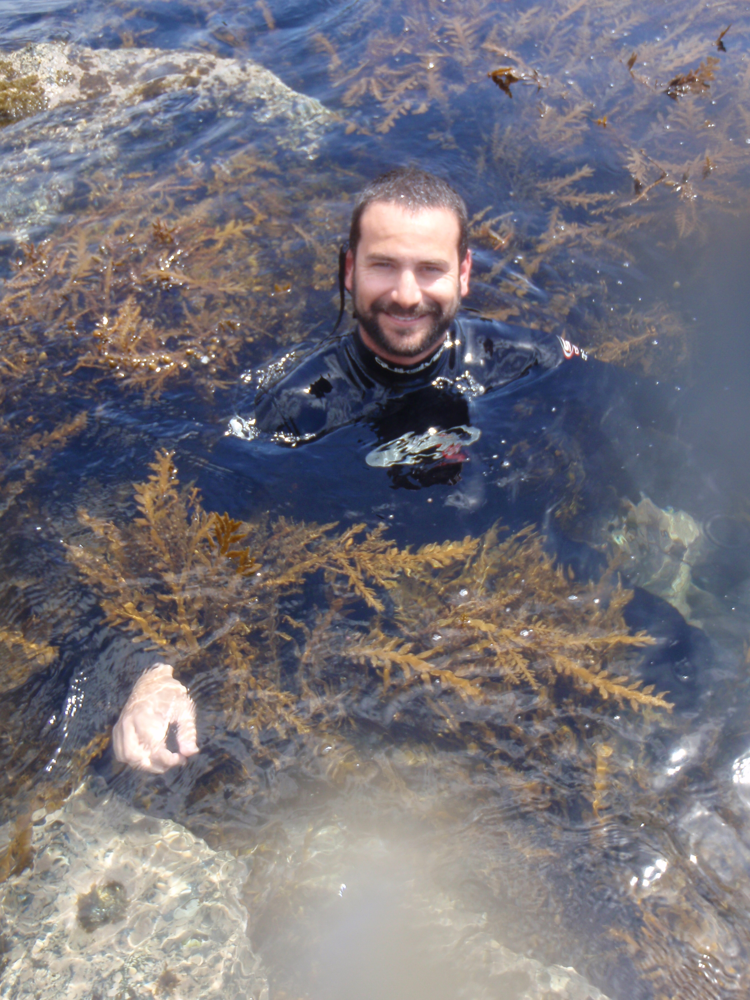
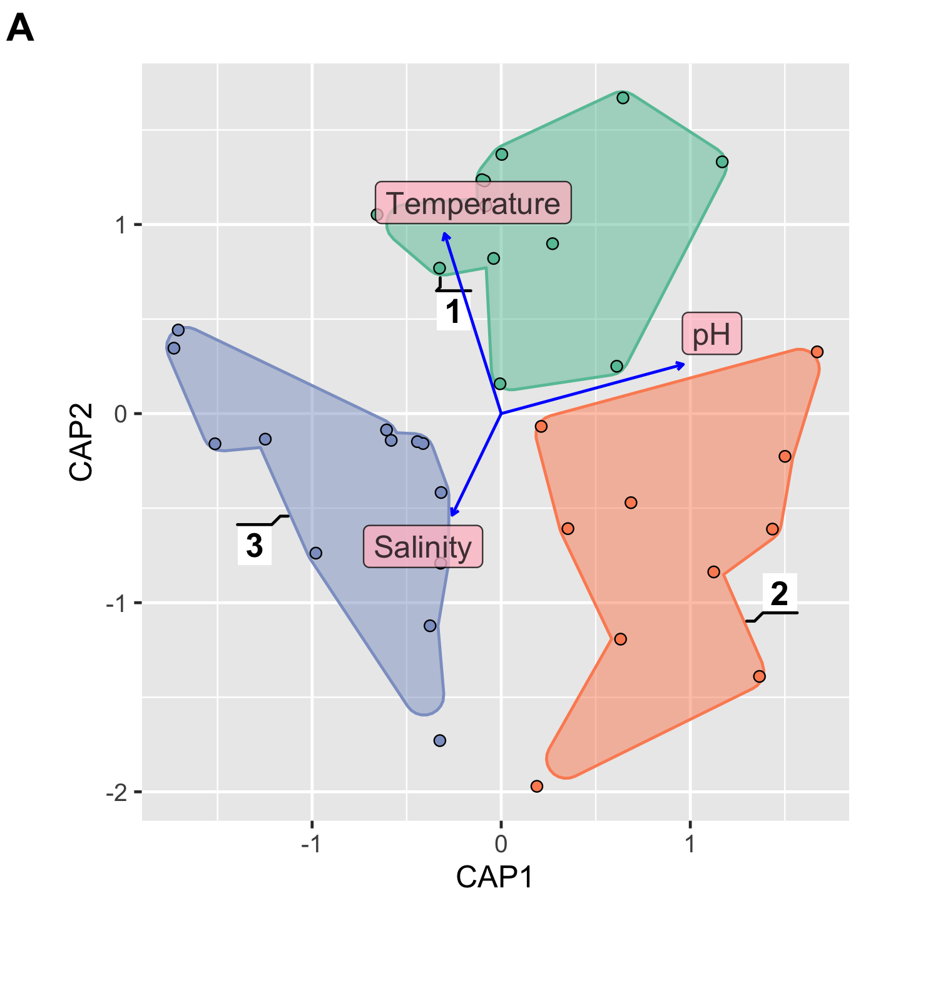

name:bio
class: nord-dark, center


background-image: linear-gradient(150deg,rgba(46, 52, 64, 10%),rgba(46, 52, 64, 90%),rgba(46, 52, 64, 50%),rgba(46, 52, 64, 10%)), url(images/eDNA_concept.png)

background-size: cover


# .huge[*ADN ambiental (eDNA)*]

## *y sus aplicaciones en ecosistemas marinos*


```{css, echo=F}
.small { font-size: 70% }
.huge  { font-size: 120% }
```

.pull-right[
</br>
```{r, echo = F, out.width ='70%'}

```


.footnote[.huge[

</br>
</br>
</br>
**Ramón Gallego Simón**
]]]

```{r setup, include=FALSE, message=F, echo=FALSE}
options(htmltools.dir.version = FALSE)
library (leaflet)
library(tidyverse)
library(here)
library(kableExtra)
library(DT)
```

```{css echo=FALSE}
.highlight-last-item > ul > li, 
.highlight-last-item > ol > li {
  opacity: 0.5;
}
.highlight-last-item > ul > li:last-of-type,
.highlight-last-item > ol > li:last-of-type {
  opacity: 1;
}

.bold-last-item > ul > li:last-of-type,
.bold-last-item > ol > li:last-of-type {
  font-weight: bold;
}
```


---
layout:true 
background-size: cover
class: nord-dark
background-image: linear-gradient(150deg,rgba(46, 52, 64, 10%),rgba(46, 52, 64, 90%),rgba(46, 52, 64, 50%),rgba(46, 52, 64, 10%)), url(images/eDNA_concept.png)
---

.content-box-yellow[
.center[##.nord1[.center[Menú del día ]]]]
</br>


.content-box-purple[

 * .huge[.nord1[.bold[eDNA]]]

]

--
.content-box-purple[

 * .huge[.nord1[.bold[Cambios ambientales, en las comunidades y eDNA]]]

]

--
.center[

]
---

.content-box-yellow[
.center[##.nord1[.center[Menú del día ]]]]
</br>


.content-box-purple[

 * .huge[.nord1[.bold[eDNA]]]

]

.content-box-purple[

 * .huge[.nord1[.bold[Cambios ambientales, en las comunidades y eDNA]]]

]

.content-box-purple[

 * .huge[.nord1[.bold[eDNA como medida cuantitativa]]]

]

--


.content-box-blue[
```{r dataTABLE12, echo = F, warning=FALSE ,message=FALSE, out.height='70%', out.width='70%'}
convert.names<- function(x){paste0("Sample", 1:length(x))}
read_csv(here("Data", "ASV_table_all_together.csv")) %>%  
  left_join(read_csv(here("Data", "Annotated.hashes.csv"))) %>% 
  unite(family, genus, species, sep = "|", col = "taxa") %>% 
  filter(taxa !="NA|NA|NA") %>% 
 
  group_by(taxa) %>% tally %>% arrange(desc(n)) %>% slice(1:10) %>% 
  pull(taxa) -> keepers 
  read_csv(here("Data", "ASV_table_all_together.csv")) %>%  
  left_join(read_csv(here("Data", "Annotated.hashes.csv"))) %>% 
   unite(family, genus, species, sep = "|", col = "taxa", remove = F) %>%
    mutate(label = case_when(is.na(species) ~  paste0(genus, " sp."),
                                                   TRUE            ~ species)) %>% 
  
    filter(Miseq_run ==1,  taxa %in% keepers) %>% 
    mutate(sample = fct_relabel(sample, convert.names)) %>% 
    arrange(sample) %>% 
    pivot_wider(id_cols = label, names_from = sample, values_from = nReads, values_fill = list (nReads = 0), values_fn = list(nReads= sum)) %>% 
    rename (Taxa = label) %>%
    select(1:7) %>% 
    kable() %>% 
    kable_styling(full_width = T) %>% 
       column_spec(1, italic  = T) %>% 
       column_spec(2:6, width = '1in') -> nice.table
   

nice.table
```
]

---

.content-box-yellow[
.center[##.nord1[.center[Menú del día ]]]]
</br>


.content-box-purple[

 * .huge[.nord1[.bold[eDNA]]]

]

.content-box-purple[

 * .huge[.nord1[.bold[Cambios ambientales, en las comunidades y eDNA]]]

]

.content-box-purple[

 * .huge[.nord1[.bold[eDNA como medida cuantitativa]]]

]


.content-box-blue[
```{r, echo = F, warning=FALSE ,message=FALSE, out.height='70%', out.width='70%'}
nice.table %>% 
  column_spec(2, width = '1in', background = "yellow") %>% 
  row_spec(1,background = "yellow") 
```

]

---

.content-box-yellow[
.center[##.nord1[.center[Menú del día ]]]]
</br>


.content-box-purple[

 * .huge[.nord1[.bold[eDNA]]]

]

.content-box-purple[

 * .huge[.nord1[.bold[Cambios ambientales, en las comunidades y eDNA]]]

]

.content-box-purple[

 * .huge[.nord1[.bold[eDNA como medida cuantitativa]]]

]


.content-box-purple[

 * .huge[.nord1[.bold[Mitogenomas como barcodes]]]

]

--

.content-box-purple[

 * .huge[.nord1[.bold[Analisis de dieta]]]

]


