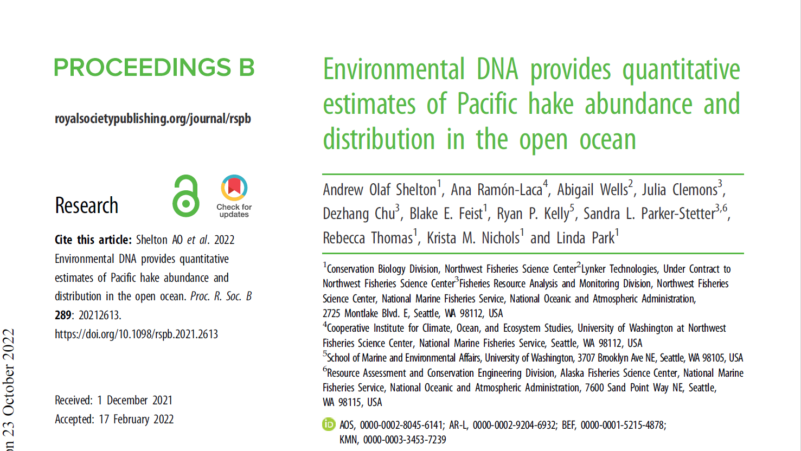
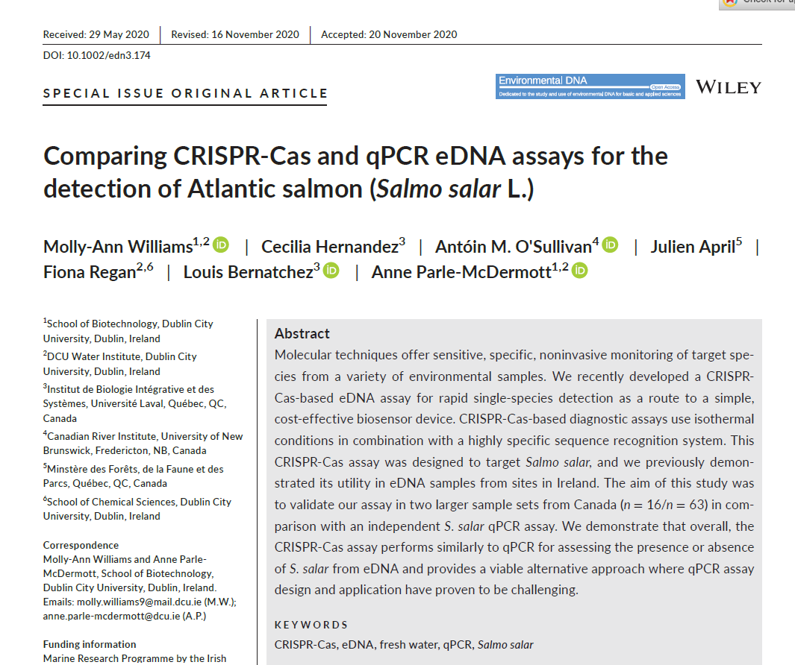
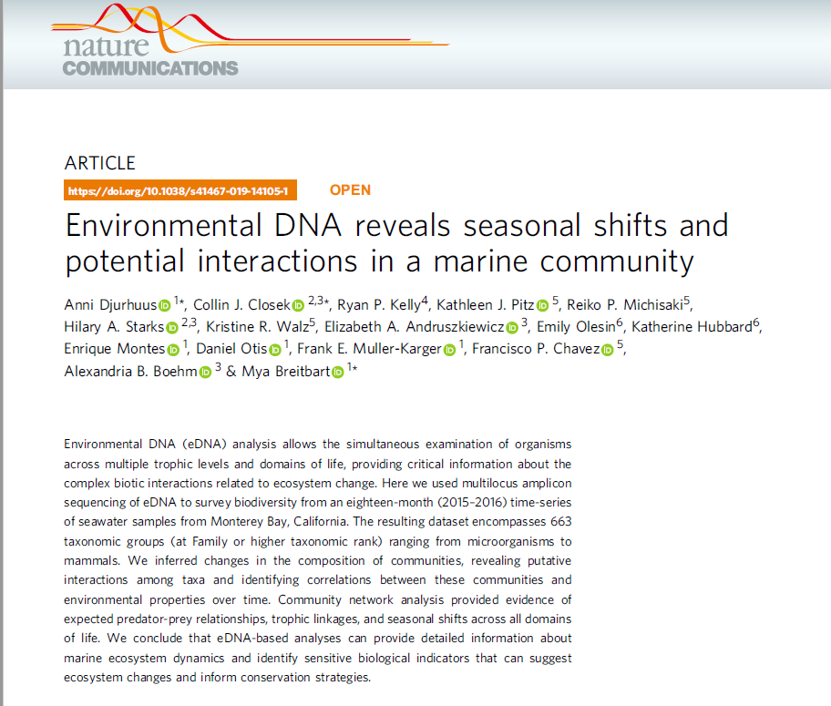

name:bio
class: nord-dark, center


background-image: linear-gradient(150deg,rgba(46, 52, 64, 10%),rgba(46, 52, 64, 90%),rgba(46, 52, 64, 50%),rgba(46, 52, 64, 10%)), url(images/eDNA_concept.png)

background-size: cover


# .huge[*Algunas sugerencias de papers*]

## *de  aplicaciones de eDNA en estudios de Biodiversidad*

## *(y más alla)*

```{css, echo=F}
.small { font-size: 70% }
.huge  { font-size: 150% }
```


.footnote[.huge[

</br>
</br>
</br>
**Ramón Gallego Simón**


**David Buckley Iglesias**
]]

```{r setup, include=FALSE, message=F, echo=FALSE}
options(htmltools.dir.version = FALSE)
 library (leaflet)
library(tidyverse)
library(here)
 library(kableExtra)
library(DT)
```

```{css echo=FALSE}
.highlight-last-item > ul > li, 
.highlight-last-item > ol > li {
  opacity: 0.5;
}
.highlight-last-item > ul > li:last-of-type,
.highlight-last-item > ol > li:last-of-type {
  opacity: 1;
}

.bold-last-item > ul > li:last-of-type,
.bold-last-item > ol > li:last-of-type {
  font-weight: bold;
}
```

---
layout:true 
background-size: cover
class: nord-dark
background-image: linear-gradient(150deg,rgba(46, 52, 64, 10%),rgba(46, 52, 64, 90%),rgba(46, 52, 64, 50%),rgba(46, 52, 64, 10%)), url(images/eDNA_concept.png)
## .center[eDNA]

---

name: Intro 
class: nord-light


</br>
.left-column[
.content-box-yellow[
.center[##.nord1[qPCR ]]]
]

.right-column[
```{r, echo = F}

```
]

---

name: Intro 
class: nord-light


</br>
.left-column[
.content-box-yellow[
.center[##.nord1[qPCR ]]]
]

.right-column[
```{r, echo = F}

```
]

---

name: Intro 
class: nord-light


</br>

.content-box-yellow[
.center[##.nord1[metabarcoding ]]]


```{r, echo = F}

```

---

name: Intro 
class: nord-light


</br>

.content-box-yellow[
.center[##.nord1[metabarcoding ]]]


```{r, echo = F}

```
