name:bio
class: nord-dark, center


background-image: linear-gradient(150deg,rgba(46, 52, 64, 10%),rgba(46, 52, 64, 90%),rgba(46, 52, 64, 50%),rgba(46, 52, 64, 10%)), url(images/eDNA_concept.png)

background-size: cover


# .huge[*eDNA metabarcoding*]

## *and its application for marine ecology*

```{css, echo=F}
.small { font-size: 70% }
.huge  { font-size: 120% }
```


.footnote[.huge[

</br>
</br>
</br>
**Ramón Gallego Simón**
]]

```{r setup, include=FALSE, message=F, echo=FALSE}
options(htmltools.dir.version = FALSE)
library (leaflet)
library(tidyverse)
library(here)
library(kableExtra)
library(DT)
```

```{css echo=FALSE}
.highlight-last-item > ul > li, 
.highlight-last-item > ol > li {
  opacity: 0.5;
}
.highlight-last-item > ul > li:last-of-type,
.highlight-last-item > ol > li:last-of-type {
  opacity: 1;
}

.bold-last-item > ul > li:last-of-type,
.bold-last-item > ol > li:last-of-type {
  font-weight: bold;
}
```

---
name: Intro 
class: nord-light
layout: true
## .center[Introductions]

---

### .fancy[Ramón Gallego]
</br>
.pull-left[
```{r, echo = F}
knitr::include_graphics("images/PNW.jpg")
```
]

.pull-right[
```{r, echo = F}
knitr::include_graphics("images/RGS.JPG")
```
]


---
layout:true 
background-size: cover
class: nord-dark
background-image: linear-gradient(150deg,rgba(46, 52, 64, 10%),rgba(46, 52, 64, 90%),rgba(46, 52, 64, 50%),rgba(46, 52, 64, 10%)), url(images/eDNA_concept.png)
---

class: center, middle

### .fancy[*environmental DNA*]


.huge[ *DNA that can be extracted from environmental samples (such as soil, water or air), without first isolating any target organisms*, Taberlet et al. 2012]


---

name: How to sample
class: nord-dark, center, middle
layout: false


## .nord4[**How to sample eDNA?**]


---

name: Soil
class: nord-light
layout: true

### .nord1[Sampling methods]

---

name: Soil

.center[ # Soil]

.content-box-purple[
```{r,echo=F, out.width='80%',out.height='80%', fig.align='center'}
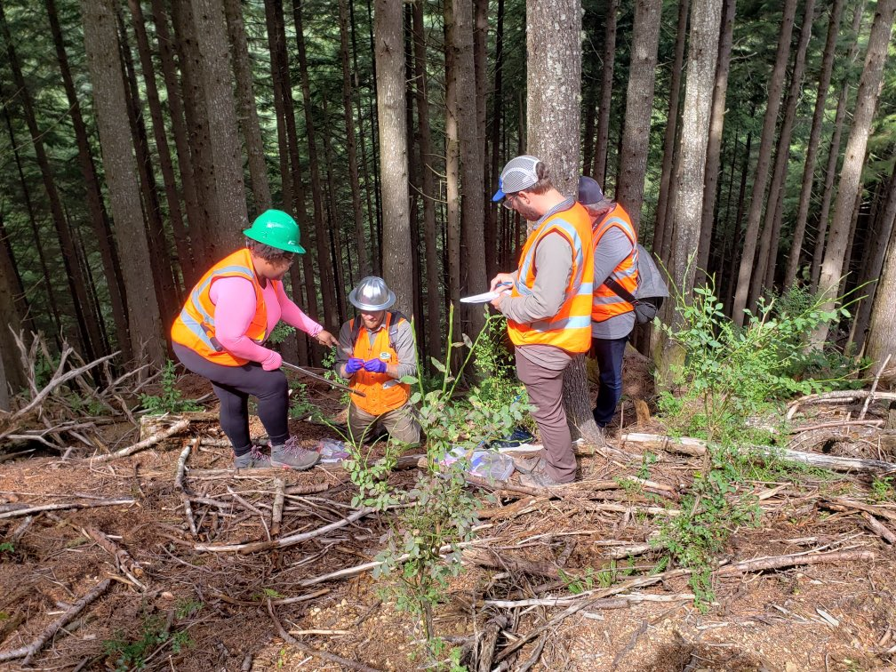
```

]

---

.center[ # Soil]

.content-box-purple[
```{r,echo=F, out.width='80%',out.height='80%', fig.align='center'}
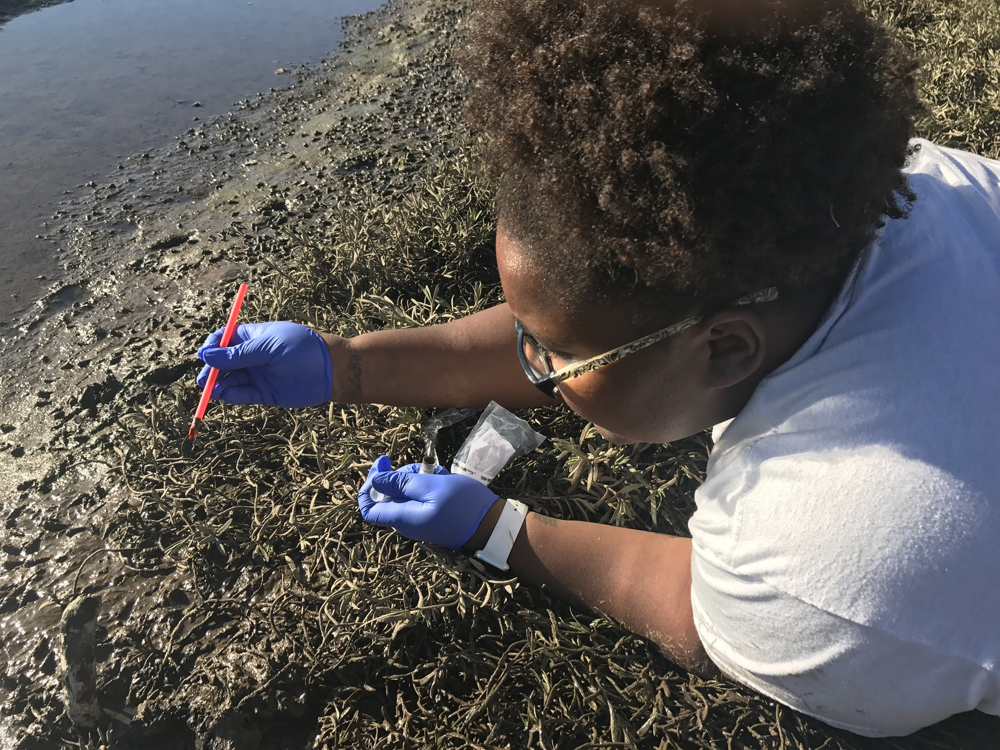
```

]

---

name: Freshwater

.center[ # Rivers]

.content-box-purple[
```{r,echo=F, out.width='80%',out.height='80%', fig.align='center'}
knitr::include_graphics("images/Freshwater.jpeg")
```

]

---

name: Freshwater

.center[ # Coastal waters]

.content-box-purple[
```{r,echo=F, out.width='80%',out.height='80%', fig.align='center'}
knitr::include_graphics("images/eDNA_16x9.jpg")
knitr::include_graphics("images/procB2.png")
```

]

---

name: Freshwater

.center[ ## Open Ocean]

.content-box-purple[
```{r,echo=F, out.width='80%',out.height='80%', fig.align='center'}
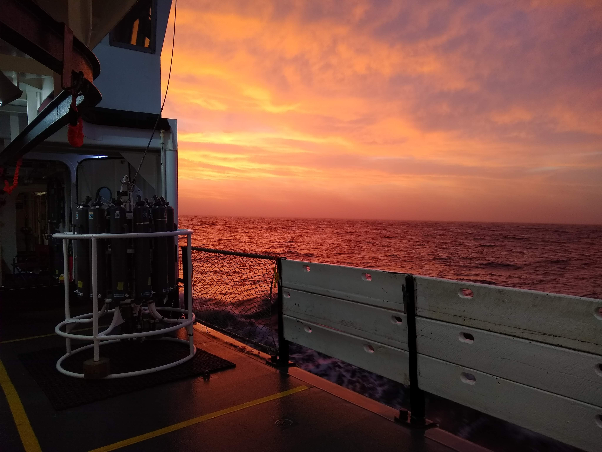
knitr::include_graphics("images/ProcB_hake.png")

```

]

---

name: Freshwater

.center[ # Air]

.content-box-purple[
```{r,echo=F, out.width='80%',out.height='80%', fig.align='center'}
knitr::include_graphics("images/eDNA_air.jpg")
knitr::include_graphics("images/air.eDNA.png")
```

]
---

name: How to sample
class: nord-dark, center, middle
layout: false


## .nord4[**What information can we get from eDNA?**]


---
name: tipos de informacion
class: nord-dark
### .fancy[*environmental DNA*]

.content-box-yellow[
.center[##.nord1[Quantification ]]]

.content-box-purple[
```{r,echo=F, out.width='80%',out.height='80%', fig.align='center'}
knitr::include_graphics("images/pone.0122763.g003.png")
```

]
---
name: tipos de informacion
class: nord-dark
### .fancy[*environmental DNA*]

.content-box-yellow[
.center[##.nord1[Composition] ]]

.content-box-purple[

```{r dataTABLE, echo = F, warning=FALSE ,message=FALSE}

convert.names<- function(x){paste0("Sample", 1:length(x))}
read_csv(here("Data", "ASV_table_all_together.csv")) %>%  
  left_join(read_csv(here("Data", "Annotated.hashes.csv"))) %>% 
  unite(family, genus, species, sep = "|", col = "taxa") %>% 
  filter(taxa !="NA|NA|NA") %>% 
 
  group_by(taxa) %>% tally %>% arrange(desc(n)) %>% slice(1:10) %>% 
  pull(taxa) -> keepers 
  read_csv(here("Data", "ASV_table_all_together.csv")) %>%  
  left_join(read_csv(here("Data", "Annotated.hashes.csv"))) %>% 
   unite(family, genus, species, sep = "|", col = "taxa", remove = F) %>%
    mutate(label = case_when(is.na(species) ~  paste0(genus, " sp."),
                                                   TRUE            ~ species)) %>% 
  
    filter(Miseq_run ==1,  taxa %in% keepers) %>% 
    mutate(sample = fct_relabel(sample, convert.names)) %>% 
    arrange(sample) %>% 
    pivot_wider(id_cols = label, names_from = sample, values_from = nReads, values_fill = list (nReads = 0), values_fn = list(nReads= sum)) %>% 
    rename (Taxa = label) -> data
  data %>% 
    select(1:7) %>% 
    kable() %>% 
    kable_styling(full_width = T, 
                  bootstrap_options = "hover") %>% 
       column_spec(1, italic  = T) %>% 
       column_spec(2:6, width = '1in') -> nice.table
   

nice.table %>% 
 scroll_box( height = "600px")
```

]

---
name: modos de obtenerla
class: nord-dark
### .fancy[*environmental DNA*]


.content-box-purple[
.nord1[
## Single-species assays

  -   ### *qPCR*
  -   ### *ddPCR* 
]]

--


.content-box-purple[
.nord1[

## Multi-species assays

  - ###*metabarcoding*
]]

---
class: middle, center

.content-box-white[

]

---
class: middle, center

.content-box-white[

]
---


class: middle, center

.pull-left[
.bold[ribosomal RNA]
 
 1. bridges are conserved
 2. Loops mutate freely
 3. Eg. 16SrRNA, 18SrRNA 
 


]
.pull-right[
.bold[Transmembrane Protein Genes]

   1. AA must be hygrophob
   2. Third base on each codon can mutate 
   3. Better to use mitochondrial
   4. Examples: COI, Cytb


]
---
class: middle, center

.content-box-white[
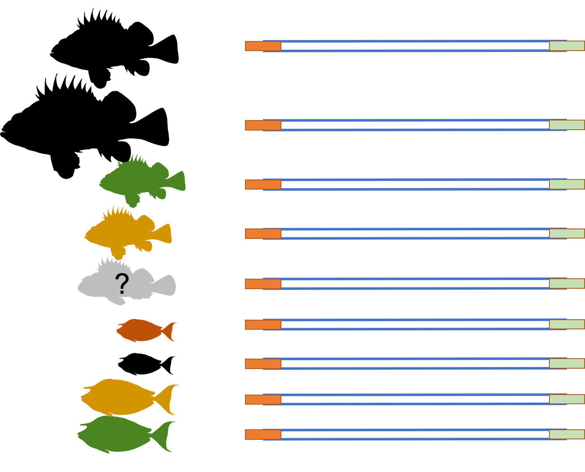
]
---

</br>


.huge[##**Sequencing by Synthesis**]

</br>

 .center[

```{r, out.width='75%', echo=F }
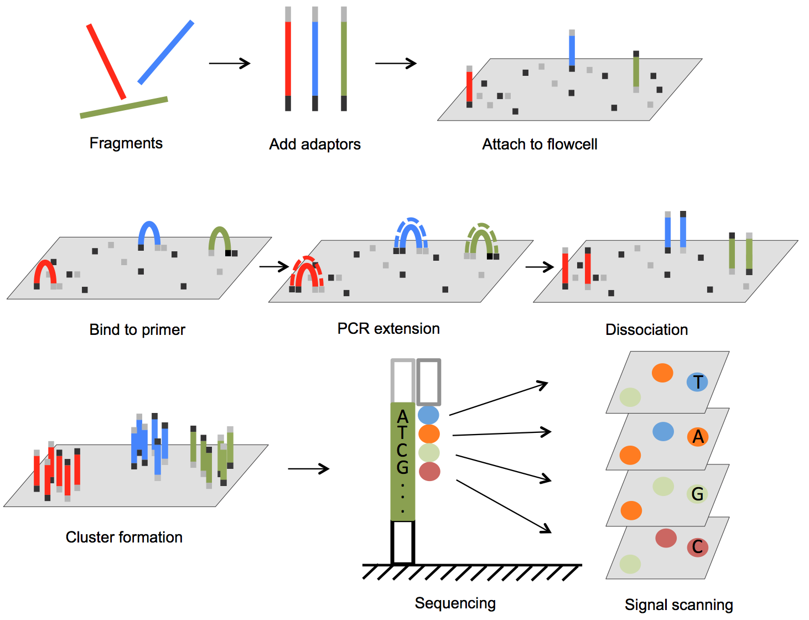
```
]

---


name: What for
class: nord-dark, center, middle
layout: false


## .nord4[**eDNA and marine ecology**]


---

name: Template
layout: true
class: inverse, center, middle
background-image: linear-gradient(150deg, rgba(0, 0, 0, 100%), rgba(0, 0, 0, 50%), rgba(0, 0, 0, 20%)), url(images/OA_fondo.JPG)
background-size: cover

---
name: Gaining popularity
.center[ ## eDNA is gaining popularity]

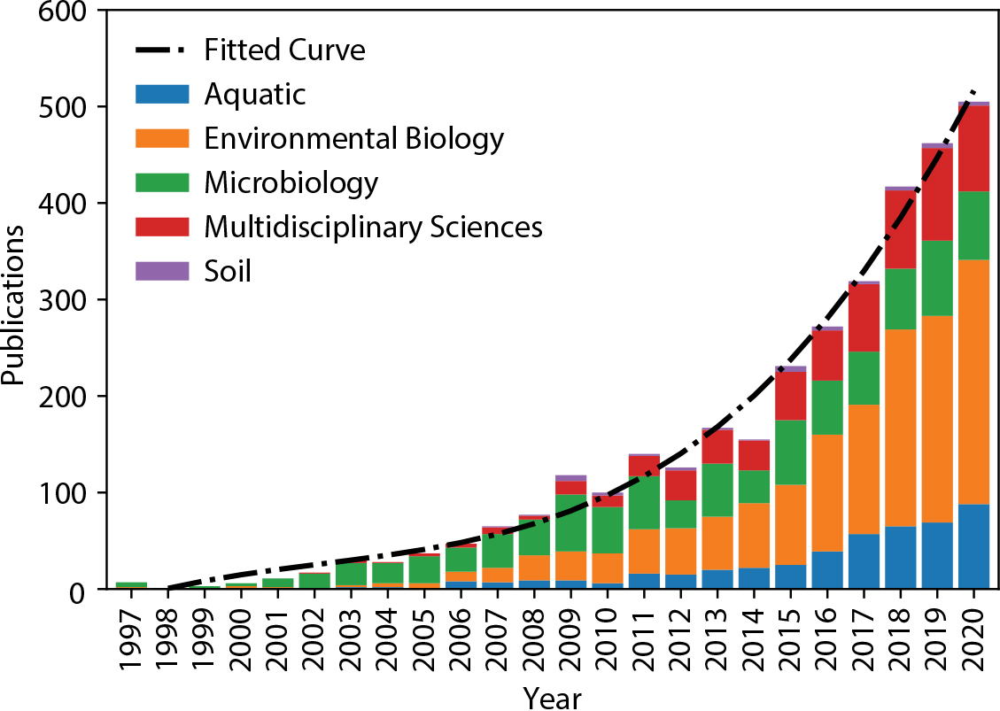

---

name: Types of publications I

     ### It works!                    


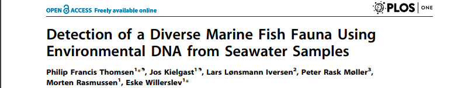
</br>
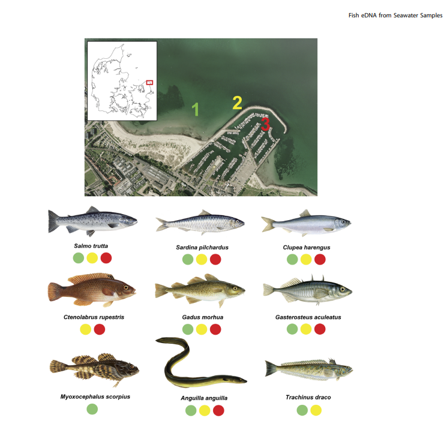

---

name: Types of publications II
 
### Different views


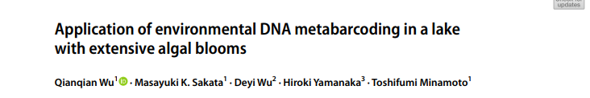
</br>
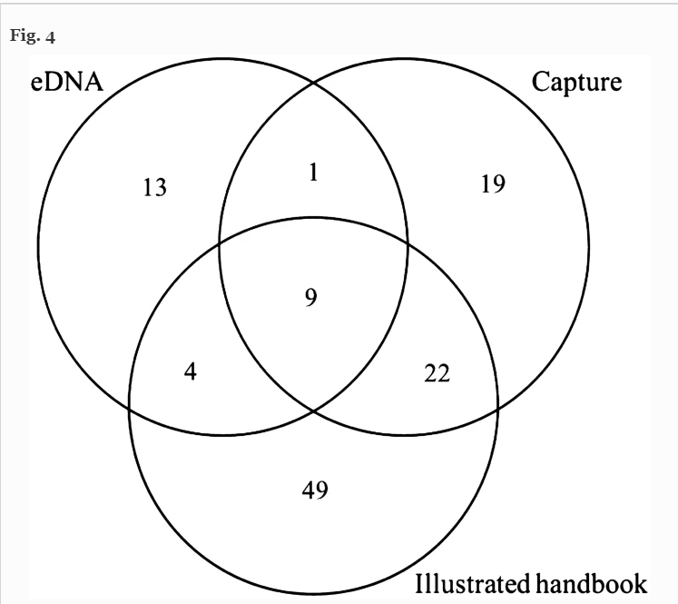

---

name: Types of publications III

### Ecological research


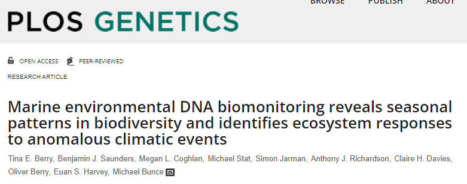
</br>
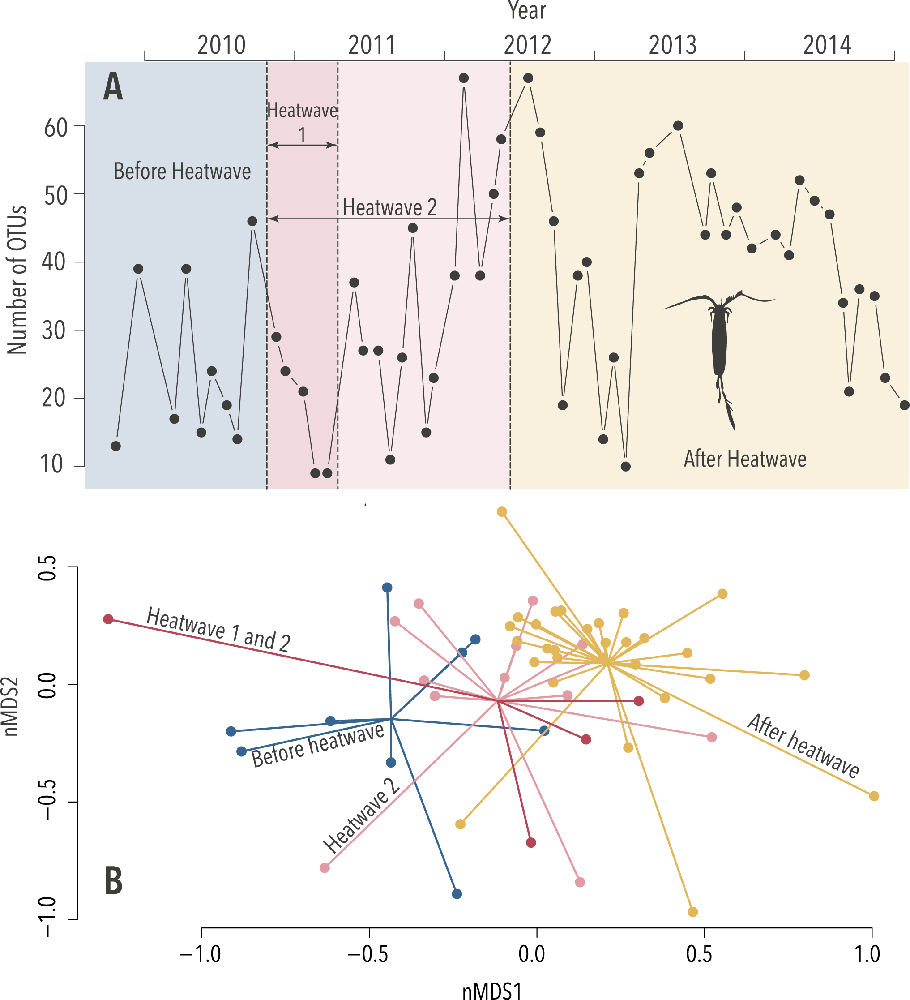


---
name: eDNA_ecology
class: nord-dark, center, middle
layout: false


## .nord4[**What affects eDNA presence in your sample?**]

---
name: Template again
layout: true
class: inverse, center, middle
background-image: linear-gradient(150deg, rgba(0, 0, 0, 100%), rgba(0, 0, 0, 50%), rgba(0, 0, 0, 20%)), url(images/OA_fondo.JPG)
background-size: cover
---

name: ecology1

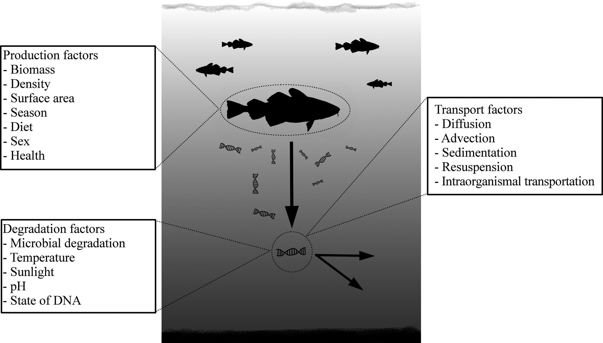

.footnote[.bold[Hansen et al., 2018]]

---
name: ecology2

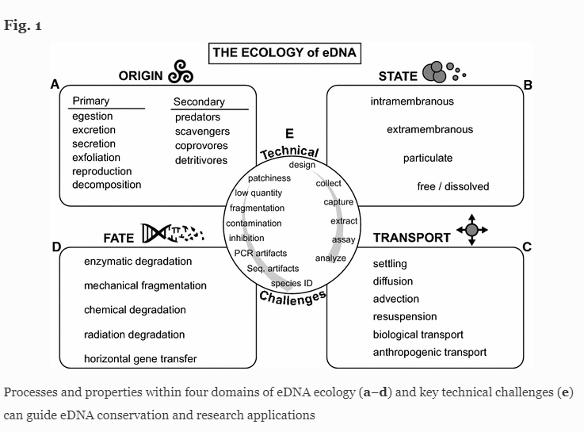

.footnote[.bold[Barnes & Turner, 2018]]

---

name: ecology3

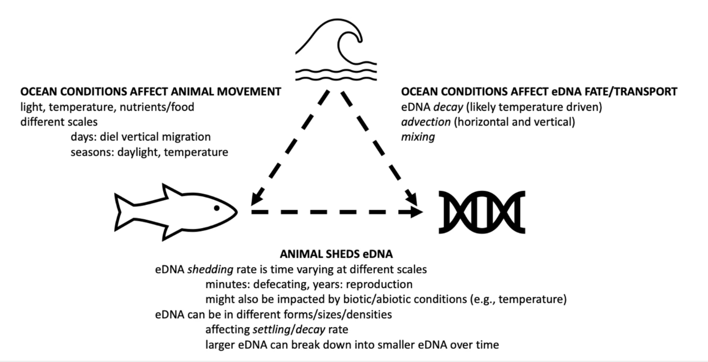

.footnote[.bold[Andruszkiewicz Alan et al., 2021]]


---
name: Intro to OA_eDNA
class: inverse, center, middle
layout: false

# .nord4[Change in marine communities, global warming and ocean acidification]

---

name: template_OA
class: nord-light, typo-selection
background-image: linear-gradient(150deg, rgba(0, 0, 0, 100%), rgba(0, 0, 0, 50%), rgba(0, 0, 0, 20%)), url(images/OA_fondo.JPG)
background-size: cover
layout: true

### .center.nord9.bold[Ocean acidification and Warming]

---
</br>


.center[]


---
</br>
</br>
.center[]
---
class: nord-dark
## .center[.fancy[Afects many especies ]
</br>

.pull-left[

]


.pull-right[
]
]


???
With global warming and increased pCO2 levels, there is little doubt that future marine communities will have to face a warmer, more acidic ocean
---
class: nord-dark
name: A lot of info on many spp

 

--


--


--


???

Those effects are not happenning in a vacuum, but likely with Temp
And in different directions
---
class: nord-dark
Name: Ecosystem-wide: not so much


.pull-left[

]
---
name: WHy Hood Canal
class: middle, nord-dark
###.center[.fancy[.title[Why the Puget Sound?]]]

Naturally occuring High *p*CO<sub>2</sub>  levels offer a view of not far-fetched conditions


---
class: nord-dark
name: Research plan

##.center[.fancy[.title[Experimental design]]]

.pull-left[

```{r, message = F, echo = F, out.width= '90%'}


leaflet(data = read_csv(here("Data","site.info.csv"))) %>% 
  addTiles() %>% 
  setView(lat = 47.5, lng = -122.5, zoom = 7) %>% 
  addMarkers(label = ~Site, 
             labelOptions = labelOptions(interactive = FALSE, clickable = NULL, noHide = NULL,
  permanent = FALSE, className = "", direction = "auto",
  offset = c(1, 1), opacity = 1, textsize = "20px",
  textOnly = FALSE, style = NULL, 
  sticky = TRUE)
  )
```
]

--

.pull-right[
.content-box-yellow[
.nord9[
- *Seasonal and temporal scale*

- *Add Biological replication*

- *Add technical replication*
]]
.center[

]


]

---


class: nord-light
name: Pipelines

</br> 
.center.nord9.bold[Processing of sequence data]
</br> 
.pull-left.oc-bg-black.opacity-40.nord-light.bold[

* ####  .bold[A demultiplexing and clustering pipeline]

.center[]

.center[[github.com/ramongallego](https://github.com/ramongallego?tab=repositories) 
]
 
 * A locus-specific classification tree with curated sequences 
 


]


.pull-right.oc-bg-black.opacity-10.nord-light.bold[
 * QC and decontamination steps
 

 .center[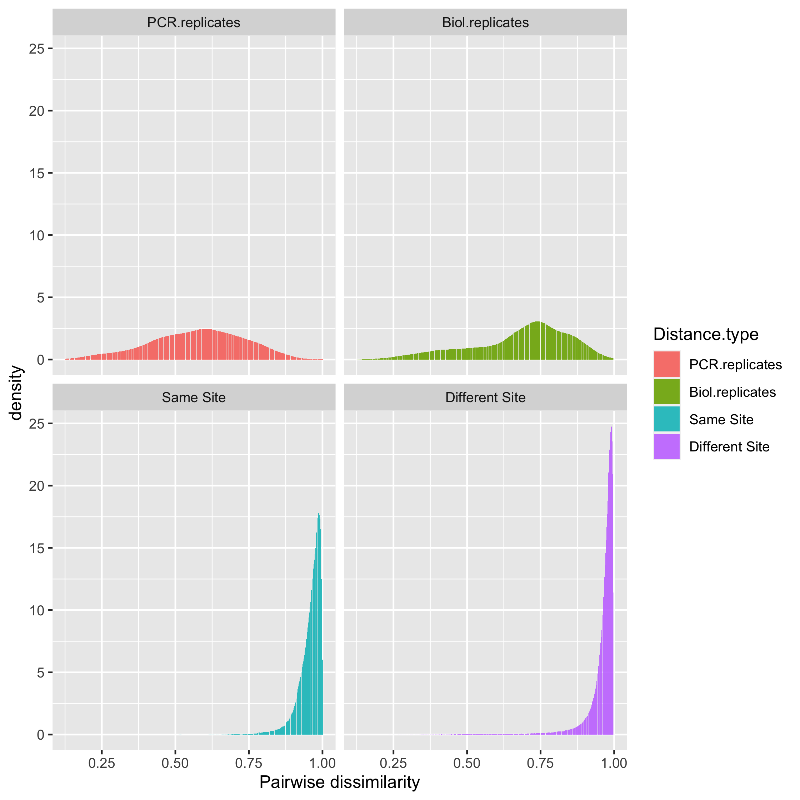]
 
 

 
* High confidence in presence and identity 
 
 
 
 ]


---

.content-box-blue[
```{r dataTABLE1, echo = F, warning=FALSE ,message=FALSE, out.height='70%', out.width='70%'}
convert.names<- function(x){paste0("Sample", 1:length(x))}
read_csv(here("Data", "ASV_table_all_together.csv")) %>%  
  left_join(read_csv(here("Data", "Annotated.hashes.csv"))) %>% 
  unite(family, genus, species, sep = "|", col = "taxa") %>% 
  filter(taxa !="NA|NA|NA") %>% 
 
  group_by(taxa) %>% tally %>% arrange(desc(n)) %>% slice(1:10) %>% 
  pull(taxa) -> keepers 
  read_csv(here("Data", "ASV_table_all_together.csv")) %>%  
  left_join(read_csv(here("Data", "Annotated.hashes.csv"))) %>% 
   unite(family, genus, species, sep = "|", col = "taxa", remove = F) %>%
    mutate(label = case_when(is.na(species) ~  paste0(genus, " sp."),
                                                   TRUE            ~ species)) %>% 
  
    filter(Miseq_run ==1,  taxa %in% keepers) %>% 
    mutate(sample = fct_relabel(sample, convert.names)) %>% 
    arrange(sample) %>% 
    pivot_wider(id_cols = label, names_from = sample, values_from = nReads, values_fill = list (nReads = 0), values_fn = list(nReads= sum)) %>% 
    rename (Taxa = label) %>%
    select(1:7) -> ugly.table
  ugly.table %>% 
    kable() %>% 
    kable_styling(full_width = T) %>% 
       column_spec(1, italic  = T) %>% 
       column_spec(2:6, width = '1in') -> nice.table
   

nice.table
```
]
---


name: template_OA
class: nord-light, typo-selection
background-image: linear-gradient(150deg, rgba(0, 0, 0, 100%), rgba(0, 0, 0, 50%), rgba(0, 0, 0, 20%)), url(images/OA_fondo.JPG)
background-size: cover
layout: true

### .center.nord9.bold[What does it tell us about the world?]

---


.content-box-blue[
```{r, echo = F, warning=FALSE ,message=FALSE, out.height='70%', out.width='70%'}
nice.table %>% 
  column_spec(2, width = '1in', background = "yellow") %>% 
  row_spec(1,background = "yellow") 
```

]


---
class: nord-dark,  typo-selection
background-image: linear-gradient(150deg, rgba(0, 0, 0, 100%), rgba(0, 0, 0, 50%), rgba(0, 0, 0, 20%)),url(images/eDNA_concept.png)
background-size: cover
layout: true
### .center[eDNA metabarcoding and quantification]

---

class: nord-dark, middle, center
name: PCR paper front


???

How to interpret the number of occurrences of a sequence in a sample?  

---

class: nord-dark, middle, center
name: PCR paper2 front


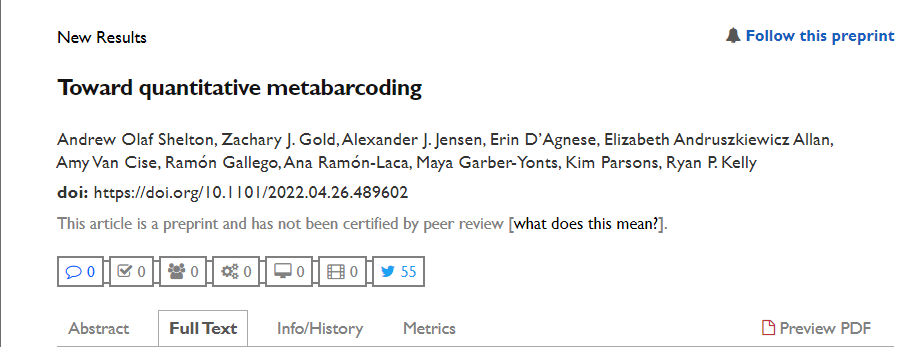

???

How to interpret the number of occurrences of a sequence in a sample?  

---
class: nord-dark, typo, typo-selection


.left-column[


 ### .nord4.bold[Differential Primer Affinity]

 ### .nord4.bold[Strong effect on] .nord13.bold[diversity]
]

--

.right-column[ 
 
```{r,echo=F, fig.align='right'}
knitr::include_graphics("images/PCR_div.png")

```


]
---


 ### .nord4.bold[It affects ] .nord13.bold[proportions of reads]


 
```{r,echo=F, fig.align='right'}
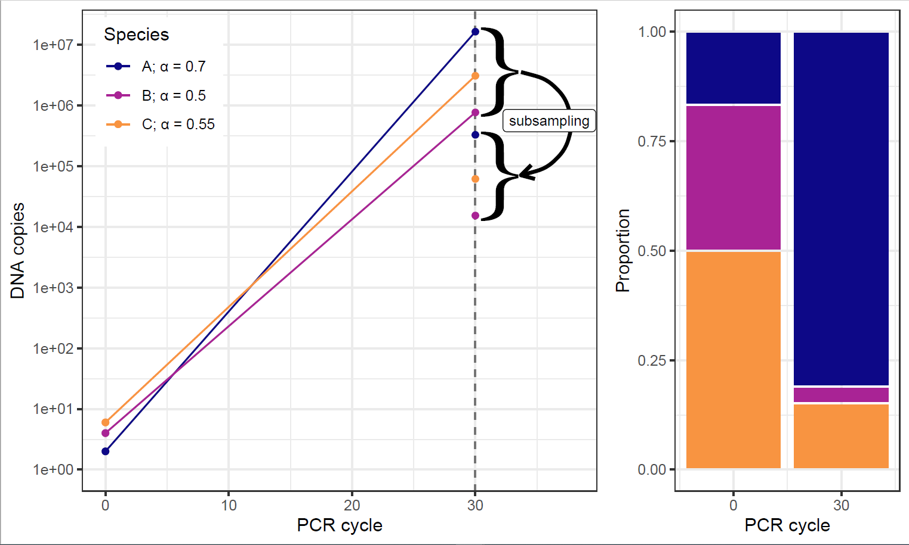

```


---

class: nord-light


### .center[ Can we get .nord13.bold[quantitative] information from metabarcoding by transforming the data?]

--
.huge[
\begin{align}
 Prop A_ij = \dfrac{A_ij}{\sum{A_j}}
\end{align}
]


.content-box-white[
```{r, echo = F, warning=FALSE ,message=FALSE, out.height='70%', out.width='70%'}
read_csv(here("Data", "ASV_table_all_together.csv")) %>%  
  left_join(read_csv(here("Data", "Annotated.hashes.csv"))) %>% 
   unite(family, genus, species, sep = "|", col = "taxa", remove = F) %>%
    mutate(label = case_when(is.na(species) ~  paste0(genus, " sp."),
                                                   TRUE            ~ species)) %>% 
  
    filter(Miseq_run ==1,  taxa %in% keepers) %>% 
    mutate(sample = fct_relabel(sample, convert.names)) %>% 
    arrange(sample) %>% 
    select(sample, Taxa = label, nReads) %>% 
  group_by(sample) %>% # Filter samples with only one species
  add_tally(name = "rich") %>% 
  filter (rich >1) %>% 
  select(-rich) %>% 
  mutate(tot = sum(nReads)) %>% 
  mutate(nReads = round(nReads / tot, 3))  %>% 
  select(-tot) %>% 
  pivot_wider(id_cols = Taxa, names_from = sample, values_from = nReads, values_fill = list (nReads = 0), values_fn = list(nReads= sum)) %>% 
  select(1:7) %>% 
  kable() %>% 
    kable_styling(full_width = T) %>% 
       column_spec(1, italic  = T) %>% 
       column_spec(2:6, width = '1in')
  
```

]
---

.huge[
\begin{align}
 Prop A_ij = \dfrac{A_ij}{\sum{A_j}}
\end{align}

\begin{align}
 eDNAindex A_ij = \dfrac{PropA_ij}{\max{Prop A_i}}
\end{align}
]


.content-box-blue[
```{r, echo = F, warning=FALSE ,message=FALSE, out.height='70%', out.width='70%'}
read_csv(here("Data", "ASV_table_all_together.csv")) %>%  
  left_join(read_csv(here("Data", "Annotated.hashes.csv"))) %>% 
   unite(family, genus, species, sep = "|", col = "taxa", remove = F) %>%
    mutate(label = case_when(is.na(species) ~  paste0(genus, " sp."),
                                                   TRUE            ~ species)) %>% 
  
    filter(Miseq_run ==1,  taxa %in% keepers) %>% 
    mutate(sample = fct_relabel(sample, convert.names)) %>% 
    arrange(sample) %>% 
    select(sample, Taxa = label, nReads) %>% 
  group_by(sample) %>% # Filter samples with only one species
  add_tally(name = "rich") %>% 
  filter (rich >1) %>% 
  select(-rich) %>% 
  mutate(tot = sum(nReads)) %>% 
  mutate(nReads = round(nReads / tot, 3))  %>% 
  group_by(Taxa) %>% 
  mutate(nReads = round(nReads / max(nReads), 3)) %>% 
  select(-tot) %>% 
  pivot_wider(id_cols = Taxa, names_from = sample, values_from = nReads, values_fill = list (nReads = 0), values_fn = list(nReads= sum)) %>% 
  select(1:7) %>% 
  kable() %>% 
    kable_styling(full_width = T) %>% 
       column_spec(1, italic  = T) %>% 
       column_spec(2:6, width = '1in')
  # column_spec(2, width = '1in', background = "yellow") %>% 
  # row_spec(1,background = "yellow") 
```

]

---

.center[
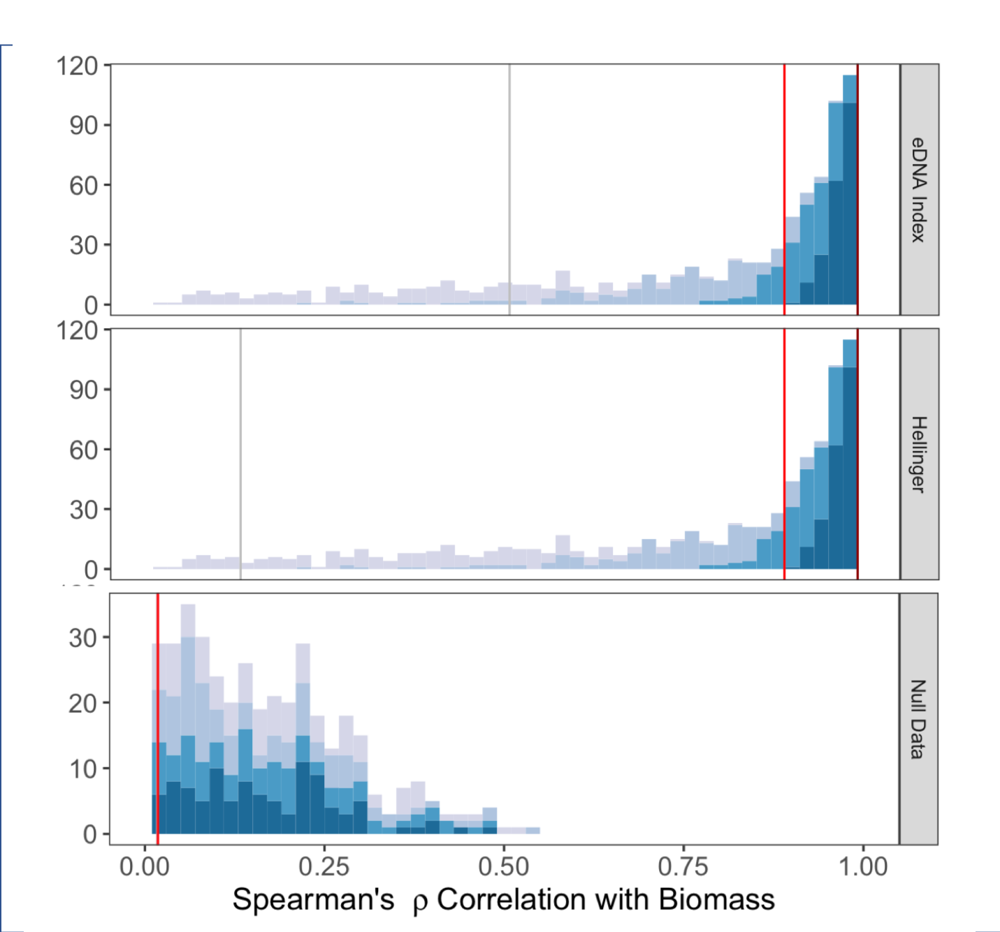
]

---
class: nord-dark

</br>
.content-box-blue[
.nord1[
.center[
### But applying the same threshold across 


### the board does not solve the problem
]]]

--

</br>

.content-box-blue[
.nord1[
.center[
### We need to estimate the Amplification efficiency of each taxa
]]]

--

</br>

.content-box-blue[
.nord1[
.center[
.huge[
$$A_i = c_i(1 + a_i)^{N_{PCR}}$$


]]]]

---
### Various approaches

* .bold[Mock community]

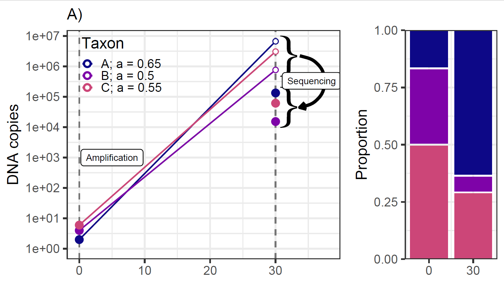

---

### Various approaches

* .bold[Mock community]

* .bold[Variable cycle PCR]


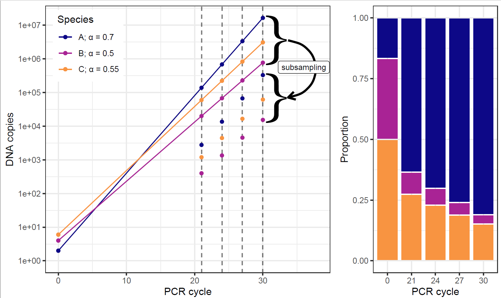


---
.pull-left[

*Sets of estimations* 

and

*Confidence intervals*
]

.pull-right[

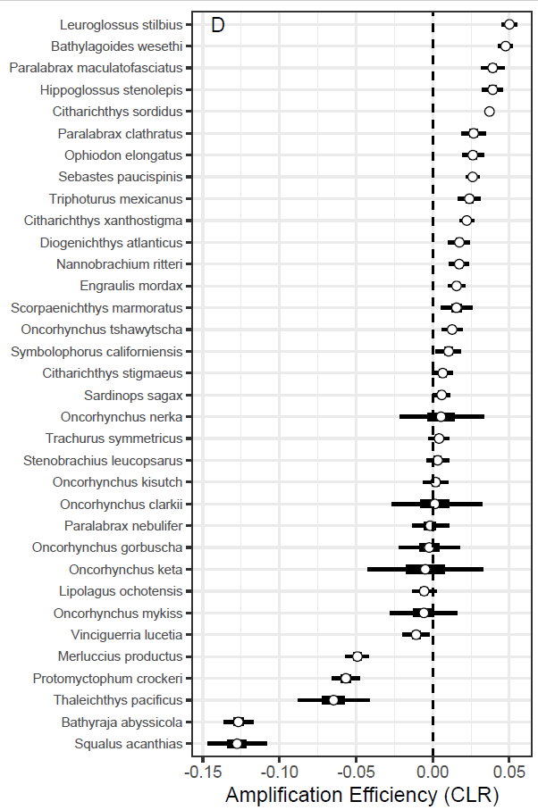

]

---
```{r,echo=F, fig.align='right'}
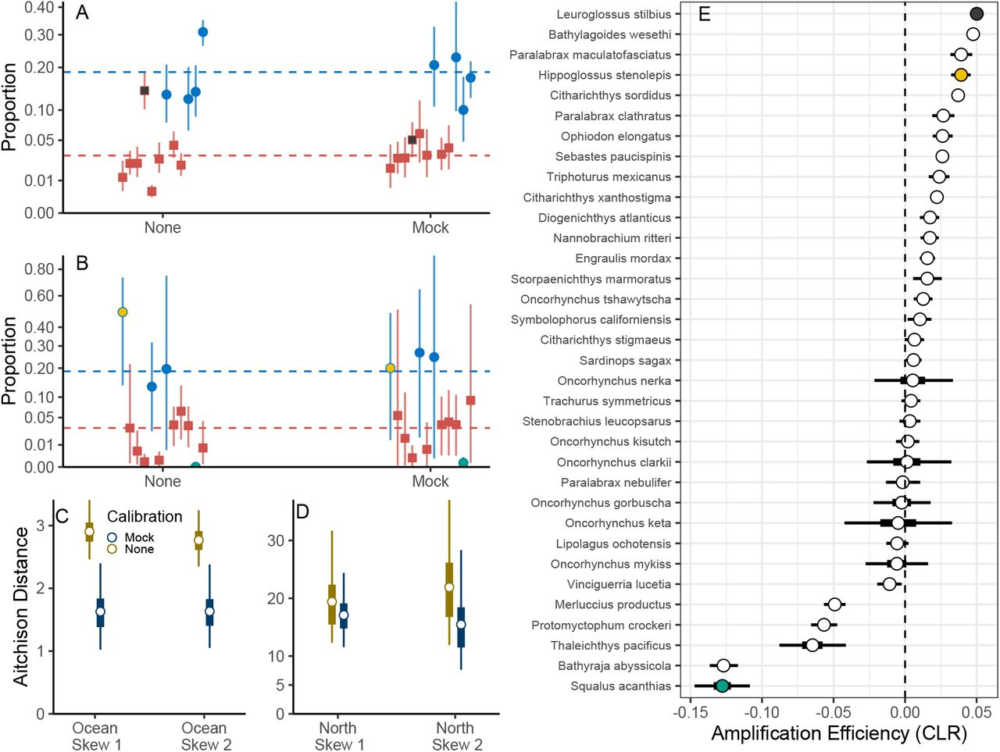
```

---
</br>

### .nord4[A full model for observed counts for all .nord13.bold[*I*] taxa is]


.content-box-blue[
.nord1[
$$Y  \sim Multinomial (\mu,N)$$

 
$$\mu_i = \dfrac{e^{\nu_i}}{\sum_{i=1}^I e^\nu_i}$$ 


 

  $$\nu_i = \beta_i + N_{PCR} \alpha_i + \epsilon_i$$ 


 
 
  $$\epsilon_i \sim N(0,\tau_i)$$
]]

---

name: template_OA
class: nord-light, typo-selection
background-image: linear-gradient(150deg, rgba(0, 0, 0, 100%), rgba(0, 0, 0, 50%), rgba(0, 0, 0, 20%)), url(images/OA_fondo.JPG)
background-size: cover
layout: true

### .center.nord9.bold[Ocean acidification and Warming]

---
name: Shiny app
class: nord-dark


### .center[.nord12[Question 1]: Can we detect the fluctuations in presence and dominance of taxa of interest? ]

</br>


<video width="640" height="480" controls>
<source src="images/Shiny.mov" type="video/mp4">
</video>


---
class: nord-dark
name: using both PA and eDNAindex
layout: true
background-image: linear-gradient(150deg, rgba(0, 0, 0, 100%), rgba(0, 0, 0, 50%), rgba(0, 0, 0, 20%)),url(images/OA_fondo.jpg)
background-size: cover
---

### .center[.nord12[Question 2]: Are there distinct communities associated with <br> Temperature and pH?]

---
class: nord-light
### .nord12[Question 2]: Community changes

.center.huge[*Sample similarity based in their composition*]

---
class: nord-light
layout: false
### .nord12[Question 2]: Community changes

.center.huge[Sample similarity based in their composition]

```{r, echo = F, warning=FALSE ,message=FALSE, out.height='70%', out.width='70%'}
t(data[,2:11]) %>%
  vegan::vegdist(upper = F, diag = T) %>%
  round(digits = 3) %>%
  as.matrix()-> dist.table
dist.table[upper.tri(dist.table)] <- ""
dist.table %>% 
  as.data.frame() %>% 
  kable() %>% 
    kable_paper(full_width = T) %>% 
  kable_styling(bootstrap_options = "striped") %>% 
       column_spec(1, italic  = T) %>% 
       column_spec(2:6, width = '1in') %>% 
  column_spec(2, width = '1in', background = "yellow") 
```

---

### .nord12[Question 2]: Community changes
.center[

]
---
### .nord12[Question 2]: Community changes
.center[

]
---
### .nord12[Question 2]: Community changes
.center[

]
---

class: nord-dark
name: layout2
layout: true
background-image: linear-gradient(150deg, rgba(0, 0, 0, 100%), rgba(0, 0, 0, 50%), rgba(0, 0, 0, 20%)),url(images/OA_fondo.jpg)
background-size: cover

---
### .nord12[Question 3]: How does the Future Puget Sound looks like for the taxa of interest?

</br>
##.fancy[Presence-absence modelling:]
</br>
* .huge.bold[Using a logistic regression]
</br>

* .huge.bold[Independent fit for .nord13[Area and season]]
</br>
* .huge.bold[with temperature and pH as explanatory variables]
</br>
---

name: Projections to 2095
### .nord12.bold[Q3] - Estimating Puget Sound scenarios (RCP8.5)


.left-column[

*  .bold[Using Khangaonkar et al, 2019]

*  .bold[Some  .nord13[ extreme] values ]

* .bold[But most of the values .nord13[already present]]

]

.right-column[
</br>
]

???

Taking advantage from recently published models for the inner sea
---


## Species - level responses


---


## Diversity changes across major taxa

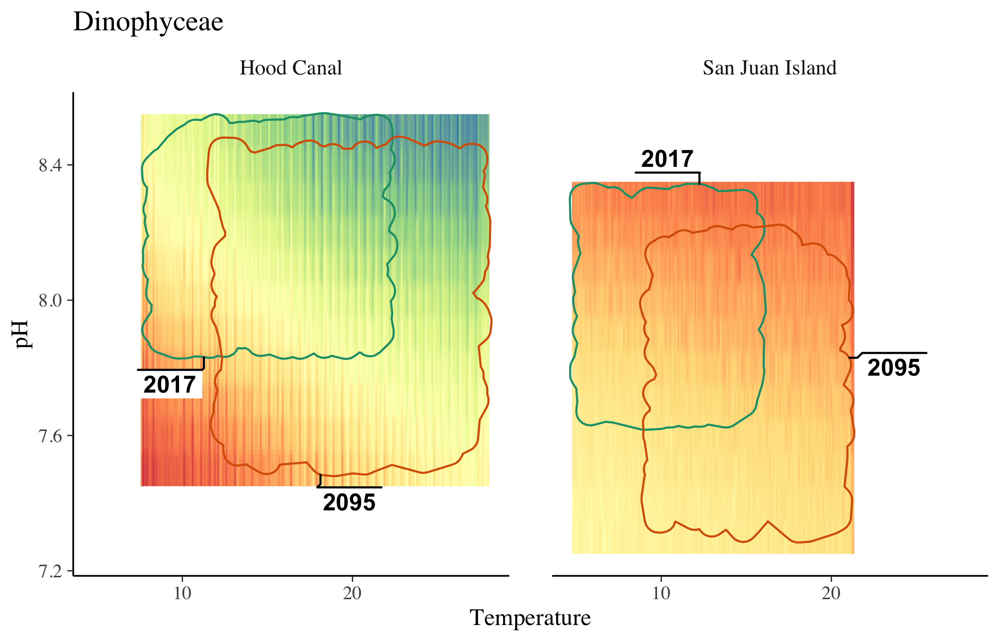

---

<!-- --- -->
<!-- name: Intro to OA_eDNA -->
<!-- class: inverse, center, middle -->
<!-- layout: false -->

<!-- # .nord4[Oceanography and its effects on eDNA ] -->


<!-- --- -->

<!-- name: template_Hake -->
<!-- class: nord-light, typo-selection -->
<!-- background-image: linear-gradient(150deg, rgba(0, 0, 0, 100%), rgba(0, 0, 0, 50%), rgba(0, 0, 0, 20%)), url(images/OA_fondo.JPG) -->
<!-- background-size: cover -->
<!-- layout: true -->

<!-- ### .center.nord9.bold[Upwelling and eDNA] -->


<!-- --- -->


<!-- name: OA_eDNA_template -->
<!-- class: nord-light -->


<!-- ### .fancy[ *Coastal Upwelling*] -->

<!-- .left-column[ -->
<!-- .content-box-yellow[ -->
<!-- - Prevailing winds displace surface waters -->

<!-- - Deep water comes to surface -->
<!-- - Brings up nutrient rich, low oxygen water] -->
<!-- ] -->

<!-- .right-column[ -->
<!-- ```{r,echo=F, out.width='80%', fig.align='center'} -->
<!-- knitr::include_graphics("images/coast_upwelling.png") -->
<!-- ``` -->

<!-- ] -->
<!-- --- -->
<!-- layout: false -->
<!-- name: Hake survey  -->
<!-- class: nord-dark, center, middle -->

<!-- # *Hake survey* -->

<!-- -- -->

<!-- ### Integrated ecosystem acoustic and trawl survey -->


<!-- --- -->
<!-- name: Hake -->
<!-- class: nord-light -->
<!-- background-image: url(images/900x600-pacific-whiting-noaa.jpeg) -->
<!-- background-position: right -->
<!-- background-size: 50% 50% -->


<!-- # .huge.center[*Hake*] -->
<!--  .center[_Merluccius productus_] -->
<!-- </br> -->
<!-- .pull-left[  -->

<!--  - *semi-pelagic fish* -->

<!--   - bottom during the day, up the water column during the day -->

<!-- - *Largest fishery on the West Coast by volume* -->

<!--   -  440,942 t in 2017 -->

<!-- ] -->


<!-- --- -->

<!-- name: Hake survey 1 -->
<!-- class: nord-light -->
<!-- background-image: url(images/station.plot.png) -->
<!-- background-position: 0% 0% -->
<!-- background-size: 30% 100% -->

<!-- # .right[*Hake survey*] -->


<!-- .pull-right[ -->
<!-- .center-right[ -->
<!-- - Run every two years -->

<!-- - Covers onshore/offshore transects -->

<!-- - Estimates Hake abundance, age classes, maturity -->

<!-- - Uses acoustic signal  + trawl -->

<!-- - In 2019 started an eDNA program -->

<!-- - Sampling spans ~ 2 months -->
<!-- ]] -->
<!-- --- -->
<!-- name: Acoustivs -->
<!-- class: nord-light -->
<!-- background-image: url(images/station.plot.png) -->
<!-- background-position: 0% 0% -->
<!-- background-size: 30% 100% -->

<!-- ## .right[*Acoustics Component*] -->


<!-- .pull-right[ -->

<!-- - Distinct backscatter pattern -->

<!-- - Fish ID corroborated with trawls -->

<!-- - Stock biomass -->

<!-- - Age-class & maturity information -->

<!-- ```{r,echo=F,  out.width = '100%',fig.align='center'} -->
<!-- knitr::include_graphics("images/Hake_scatter.jpg") -->
<!-- ``` -->


<!-- ] -->
<!-- --- -->
<!-- name: eDNA sampling -->
<!-- class: nord-light -->
<!-- background-image: url(images/station.plot.png) -->
<!-- background-position: 0% 0% -->
<!-- background-size: 25% 100% -->

<!-- # .right[*eDNA Component*] -->

<!-- .leftmost-column[] -->
<!-- .center-column[ -->

<!-- - 1930 eDNA samples  -->

<!-- - From 36 longitudinal transects -->

<!-- - ~ 6 stops per transect -->

<!-- - ~ 5 depths per stop -->
<!-- ] -->

<!-- .rightmost-column[ -->
<!-- - 2 Niskins bottles per depth (2.5L per Niskin = 1 eDNA sample) -->

<!-- - \>350 samples from Flow-through system -->

<!-- - All working from sunset to sunrise -->

<!-- ] -->
<!-- ```{r,echo=F,  out.width = '70%',fig.align='right'} -->
<!-- knitr::include_graphics("images/filter_crew2.png") -->
<!-- ``` -->

<!-- --- -->
<!-- name: paper out -->

<!-- class:nord-light -->


<!-- ## *eDNA can be used for stock assessment* -->

<!-- ```{r,echo=F,  out.width = '100%',fig.align='center'} -->
<!-- knitr::include_graphics("images/ProcB_hake.png") -->
<!-- ``` -->


<!-- --- -->
<!-- name: qPCR results1 -->
<!-- class: nord-light -->


<!-- ## *eDNA variance is similar to that of Acoustics* -->

<!-- ```{r,echo=F,  out.width = '70%',fig.align='center'} -->
<!-- knitr::include_graphics("images/ProcB_fig2c.png") -->
<!-- ``` -->


<!-- --- -->
<!-- name: qPCR results2 -->
<!-- class: nord-light -->


<!-- ## *eDNA offers comparable results to those of Acoustics* -->

<!-- ```{r,echo=F,  out.width = '90%',fig.align='center'} -->
<!-- knitr::include_graphics("images/ProcB_fig3a.png") -->
<!-- ``` -->


<!-- --- -->
<!-- name: eDNA sampling -->
<!-- class: nord-light -->
<!-- background-image: url(images/depth.profile.png) -->
<!-- background-position: 50% 80% -->
<!-- background-size: contain -->
<!-- ## *Where do we sample?* -->


<!-- - Near the surface -->
<!-- - Mid water  -->
<!-- - Up to 500m depth -->

<!-- - So in some stations surface-midwater-near bottom -->
<!-- - in others quite far from there -->


<!-- --- -->
<!-- name: Where is the eDNA coming -->
<!-- class: nord-dark, center, middle -->


<!-- # .huge[*But where is this eDNA coming from?*] -->


<!-- --- -->
<!-- class: inverse, middle, center -->
<!-- class: nord-light -->

<!-- ## Where is eDNA coming from -->

<!--  Two interconnected questions: -->
<!-- .pull-left[ -->
<!-- - .huge[*Does upwelling bring eDNA from deeper water?*] -->

<!-- - .huge[*Does an established Thermocline function as a barrier for eDNA flow?* ] -->
<!-- ] -->

<!-- .pull-right[ -->
<!-- ```{r,echo=F,  out.width = '80%',fig.align='center'} -->
<!-- knitr::include_graphics("images/coast_upwelling.png") -->
<!-- ``` -->
<!-- ] -->


<!-- ```{r,echo=F,  out.width = '90%',fig.align='center'} -->
<!-- knitr::include_graphics("images/CTD.plot.png") -->
<!-- ``` -->

<!-- --- -->

<!-- name: Experimental design -->
<!-- class: nord-dark, center, middle -->

<!-- # .huge[*Experimental design*] -->

<!-- --- -->
<!-- name: Experimental design 1 -->
<!-- class: nord-light -->
<!-- layout: true -->

<!-- # Experimental design -->

<!-- --- -->
<!-- name: Exp design2 -->


<!-- name: Exp design3 -->

<!-- - *Choosing Transects with / without established Thermocline* -->


<!-- ```{r,echo=F,  out.width = '65%', out.height="75%" , fig.align='center'} -->
<!-- 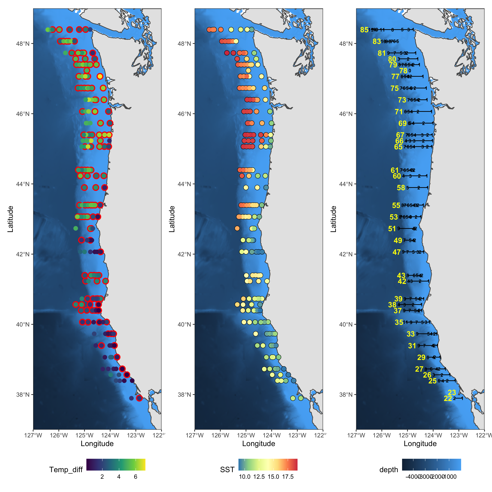 -->
<!-- ``` -->

<!-- --- -->

<!-- name: Exp design4 -->

<!-- - *Choosing Transects with / without established Thermocline* -->


<!-- ```{r,echo=F,  out.width = '60%', out.height="50%" , fig.align='center'} -->
<!-- 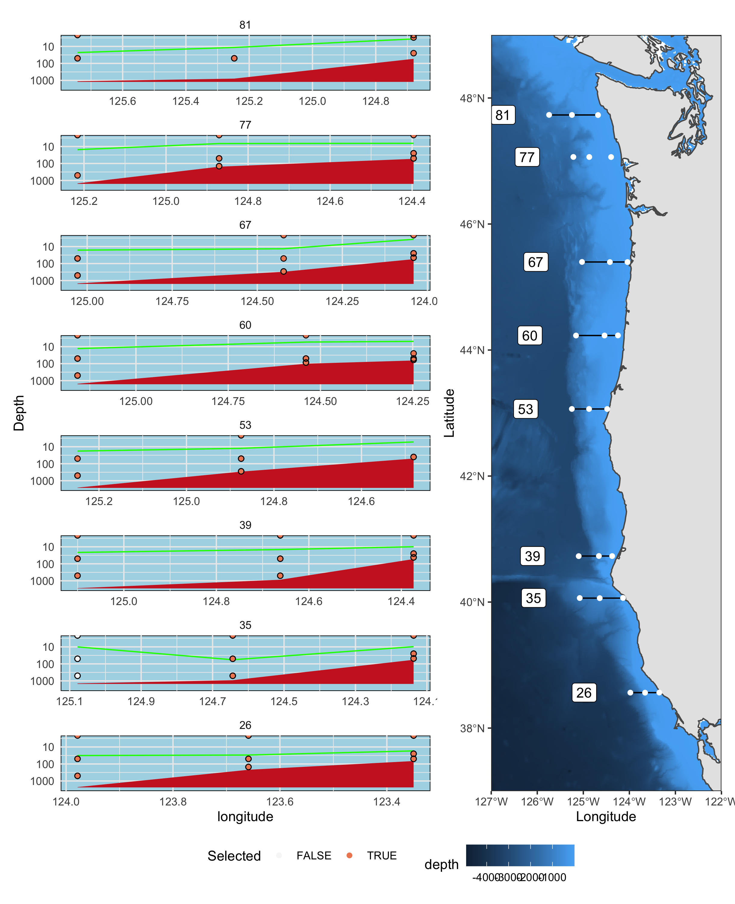 -->
<!-- ``` -->
<!-- --- -->

<!-- - Choosing Transects with / without established Thermocline -->

<!-- - *Metabarcoding of eDNA targetting Fishes with 16S* -->
<!-- </br> -->
<!-- .push-right[ -->
<!-- </br> -->
<!-- - Potentitally amplifying cartilaginous and bony fishes -->
<!-- - Target fragment ~ 350 bp  -->
<!-- - Sequencing on an Illumina MiSeq -->

<!-- ] -->

<!-- --- -->

<!-- name: Exp design4.5 -->

<!-- - Choosing Transects with / without established Thermocline -->
<!-- - Metabarcoding of eDNA targetting Fishes with 16S -->
<!-- - *Decontamination, denoising and taxonomical assignment* -->
<!--     - cutadapt -> DADA2 -> Decontamination script -> insect  -->


<!-- --- -->
<!-- name: Exp design5 -->

<!-- - Choosing Transects with / without established Thermocline -->
<!-- - Metabarcoding of eDNA targetting Fishes with 16S -->
<!-- - Decontamination, denoising and taxonomical assignment -->
<!-- - *Statistical framework* -->

<!--  </br> -->

<!--    - _Community analysis_: -->

<!-- $$\bar{Comm}\sim Transect + Depth + Upwelling$$ -->
<!-- -- -->

<!--    - _Individual species analysis_: -->

<!-- $$\bar{X}_i \sim Transect + Depth + Upwelling$$  -->


<!-- --- -->

<!-- name: Results -->
<!-- layout: false -->
<!-- class: nord-dark, middle -->

<!-- # .huge[*Results*] -->

<!-- --- -->

<!-- name: Results -->
<!-- layout: true -->
<!-- class: nord-light -->

<!-- # Results -->

<!-- --- -->
<!-- ### The numbers -->

<!-- - We sequenced 115 biological samples, 215 technical replicates -->

<!-- -- -->
<!-- - After QC and taxonomical assignment: 16M reads from 138 taxa -->

<!-- -- -->
<!-- - Identified 4 species of sharks, 4 Rays, 1 Chimaera -->
<!-- - 84 species of bony fishes, including 16 _Sebastes_ spp. -->

<!-- --- -->

<!-- ```{r, echo = F, message = F, warning=FALSE} -->


<!-- By.taxa.dataset <-  read_csv(here("Data", "by.taxa.dataset.metadata.csv")) %>% mutate (Transect = as.character(Transect)) -->
<!-- metadata  <- read_csv(here("Data", "Final_metadata.csv")) -->

<!-- #### Join it together through eDNA sample -->

<!-- By.taxa.dataset %>%  -->
<!--   filter (!str_detect(taxa, "Cichlidae")) %>% -->
<!--   select(eDNA.sample, rep, taxa, nReads) %>%  -->
<!--   left_join(metadata) -> Joined.dataset -->

<!-- By.taxa.dataset %>%  -->
<!--   filter (!str_detect(taxa, "Cichlidae")) %>%  -->
<!--   group_by(taxa) %>%  -->
<!--   summarise (`#Sequences` = sum(nReads), -->
<!--              `#samples found` = n_distinct(eDNA.sample)) %>% -->
<!--   arrange((taxa)) %>%  -->
<!--   separate(taxa, into = c("Family", NA, "Species"), sep = "%")  %>%  -->
<!-- DT::datatable(class = "compact", rownames = F,  -->
<!--              # extensions = "Buttons", -->
<!--              options = list(dom = 'fpt', -->
<!--                             pagelenght = 8))  -->
<!-- # kable(align = "c", format = "html") %>% -->
<!-- # kable_styling(full_width = F) %>% -->
<!-- # column_spec(1, bold = T) %>% -->
<!-- # collapse_rows(columns = 1, valign = "top") -->
<!-- ``` -->


<!-- --- -->

<!-- ## Species by species exploration -->

<!-- .left-column[ -->
<!-- - Based on each species life-history, we can trace changes in *relative abundance* and *prevalence* -->
<!-- ] -->

<!-- .right-column[   -->
<!-- ```{r,echo=F,  out.width='90%', fig.align='center'} -->
<!-- 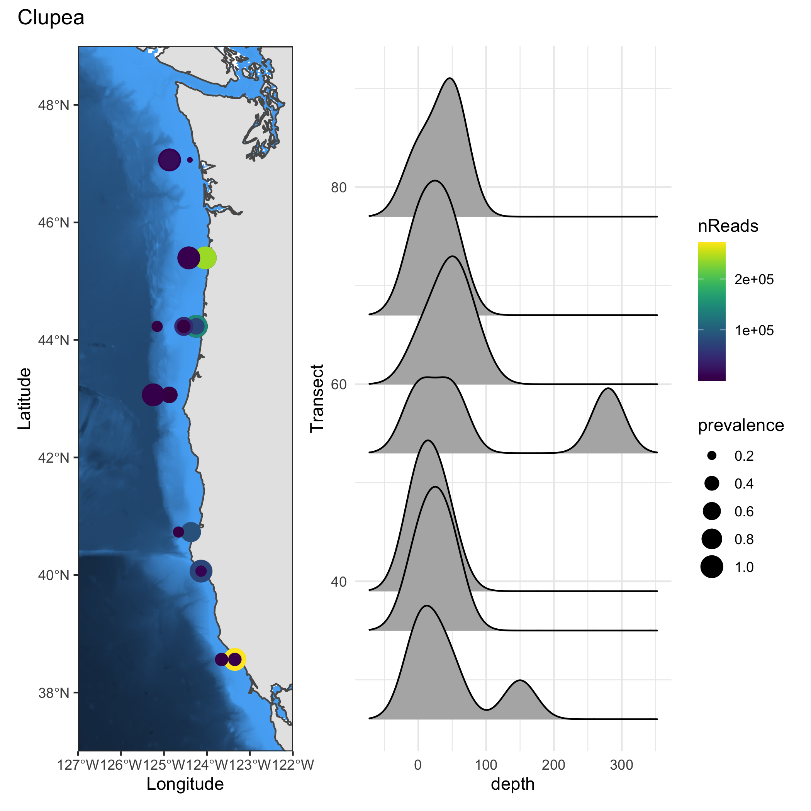 -->
<!-- ``` -->
<!-- ] -->
<!-- --- -->

<!-- ## Species by species exploration -->

<!-- .left-column[ -->
<!--   - Deep water species are close to the bottom, but also show up near surface -->
<!-- ] -->

<!-- .right-column[   -->
<!-- ```{r,echo=F,  out.width = '90%',  fig.align='center'} -->
<!-- 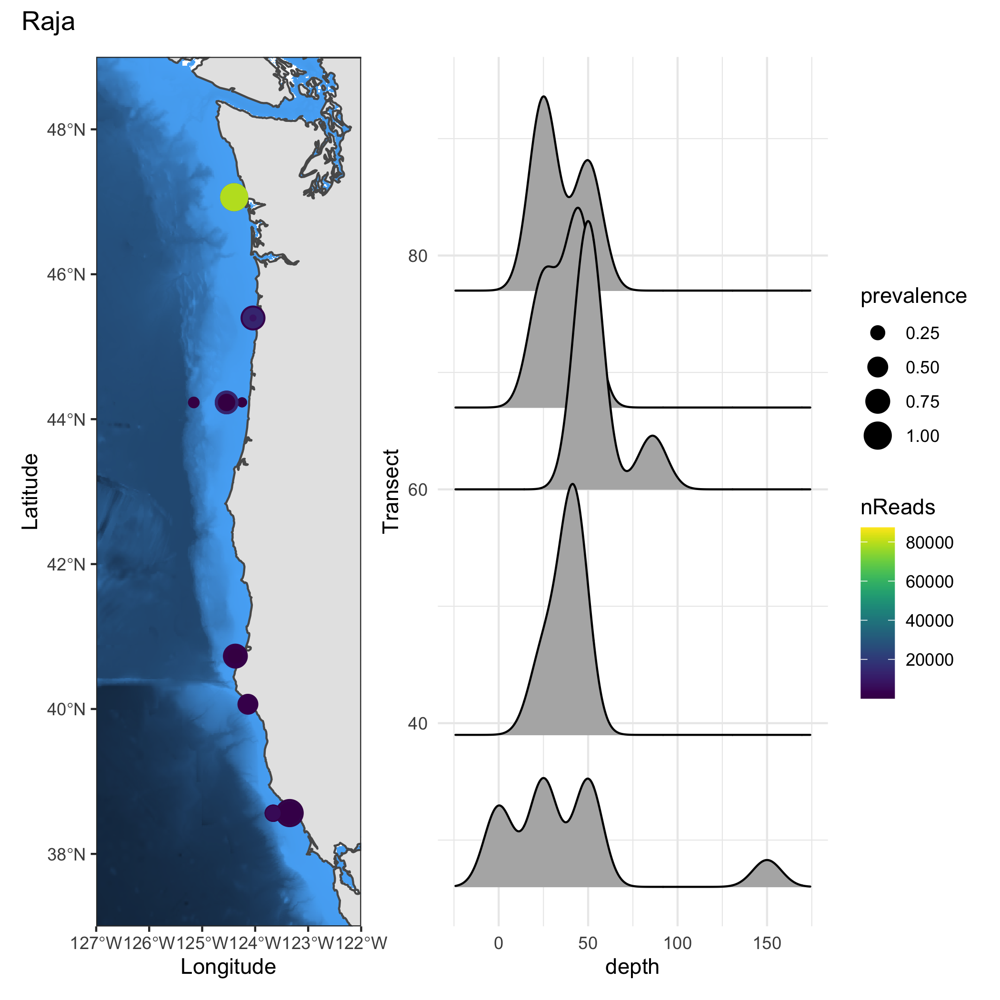 -->
<!-- ``` -->

<!-- ] -->

<!-- --- -->

<!-- .left-column[ -->
<!-- ## Alpha diversity -->

<!--   - Not clear patterns -->
<!-- ] -->

<!-- .right-column[ -->
<!-- ```{r alpha, echo = F, warning=F, message=F} -->
<!-- Joined.dataset %>%  -->
<!--   group_by(eDNA.sample, Transect, Station, depth,position, groups) %>%  -->
<!--   summarise(n.taxa = n_distinct(taxa)) %>%  -->
<!--   ggplot(aes(y = n.taxa, x = position, fill = groups)) + -->
<!--   geom_boxplot() -->
<!-- ``` -->
<!-- ] -->

<!-- --- -->

<!-- ### Community Composition Analysis -->

<!--   - *The building block is a calculation of sample dissimilarity* -->

<!--   - No use of raw number of reads -> usually a transformation -->

<!--       - Balance between importance of rare vs dominant species -->

<!--   - Different algorithms from community ecology -->

<!--       - Ditto plus different algorithms track different changes in community composition -->

<!-- --- -->
<!-- ### Community Composition Analysis -->
<!-- ```{r,echo=F,  out.width = '90%',  fig.align='center'} -->
<!-- 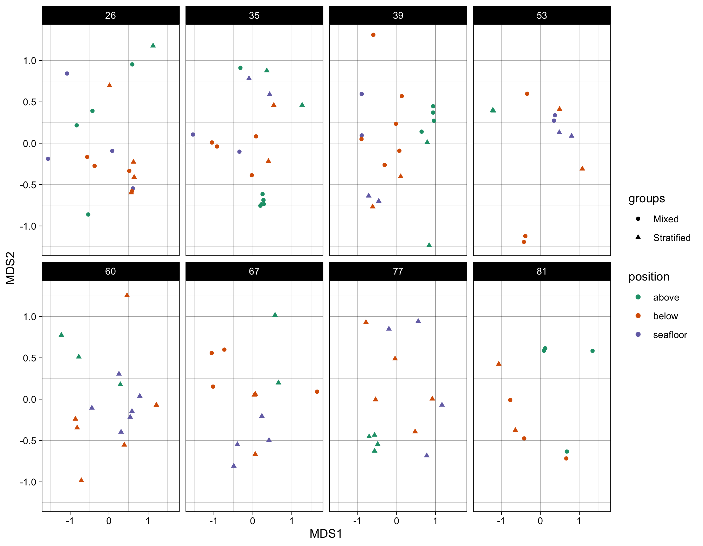 -->
<!-- ``` -->

<!-- --- -->

<!-- ### Community Composition Analysis -->

<!--   - PERMANOVA: Using the Formula  -->
<!-- $$Bray-Curtis\sim Transect + Depth + Upwelling$$ -->


<!-- ```{r, echo = F, warning=F,message=F} -->
<!-- read_csv(here("Output", "permanova.csv")) %>% -->
<!--   datatable(rownames = F, -->
<!--             class = "display", -->
<!--             options = list(info= F, filter =F, paging = F, ordering = F)) %>%  -->
<!--   formatRound(3:5, digits =2) -->
<!-- ``` -->


<!--   - PERMANOVA, and BC use .content-box-yellow[one value] to capture dissimilarity between two samples -->
<!--   - The CAP analyisis tries to *find* discrimination, even when it could be minimal.  -->
<!-- --- -->

<!-- ## Community Analysis - Another way -->

<!--   - Our hypothesis can better be tested using a Dirichelet Regression: -->

<!--   so our Community in the original -->

<!-- $$\bar{Comm}\sim Transect + Depth + Upwelling$$  -->

<!-- is not constrained to one value per sample pair, but a matrix of proportions -->

<!-- ```{r, echo=F, message=FALSE} -->
<!-- tibble(Sample = c("S1", "S2", "...", "Sn"), -->
<!--        Spp1   = c(50, 4000, 0, 0), -->
<!--        Spp2   = c(300, 250, 0, 400), -->
<!--        Spp3  = c(0,0, 0,0), -->
<!--        Sppn   = c(5000, 300, 0,350)) %>%  -->
<!--   rename(`Spp...` = 4) -> abundance.tibble -->

<!-- abundance.tibble %>% mutate(Spp... = "-") %>%  -->


<!-- datatable(rownames = F, -->
<!--             class = "display", -->
<!--             options = list(info= F, filter =F, paging = F, ordering = F,  -->
<!--                            columnDefs = list(list(className = 'dt-center', targets = 0:4)))) -->
<!-- ``` -->
<!-- --- -->

<!-- ## Community Analysis - Another way -->

<!--   - Our hypothesis can better be tested using a Dirichlet Regression: -->

<!--   so our Community in the original -->

<!-- $$\bar{Comm}\sim Transect + Depth + Upwelling$$  -->

<!-- is not constrained to one value per sample pair, but a matrix of proportions -->

<!-- ```{r, echo =  F, message=F} -->
<!-- rowSums(abundance.tibble[,2:5]) -> rwosums -->

<!-- abundance.tibble %>% -->
<!--   mutate(across(.cols = starts_with("Spp"),~.x/rwosums)) %>%  -->
<!--   mutate(across(.cols = starts_with("Spp"),~case_when(.x == NaN~0,TRUE~.x))) %>%  -->
<!--   mutate(Spp... = "-") -> temp -->

<!-- temp[3,c(2,3,5)]<- 0 -->


<!-- datatable(temp,rownames = F, -->
<!--             class = "display", -->
<!--             options = list(info= F, filter =F, paging = F, ordering = F,  -->
<!--                            columnDefs = list(list(className = 'dt-center', targets = 0:4)))) %>%  -->
<!--   DT::formatRound(columns = c(2,3,5)) -->
<!-- ``` -->

<!-- --- -->

<!-- ## Community Analysis - Another way -->

<!--   - Dirichilet does not bode well with many zeroes -->
<!--   - Combining taxa into functional categories -->
<!-- ```{r, echo = F, message=FALSE} -->
<!-- read_csv(here("Data", "unique.sp_collapse.csv")) %>%  -->
<!--   rename (Group = 13) %>%  -->
<!--   group_by(Group) %>%  -->
<!--   summarise('Number of taxa' = n(), -->
<!--              'Number of families' = n_distinct(family)) %>%  -->
<!--   filter(!is.na(Group)) %>%  -->
<!--   slice(1:8) %>%  -->
<!--   datatable(rownames = F, -->
<!--             class = "display", -->
<!--             options = list(info= F, filter =F, paging = F, ordering = F,  -->
<!--                            columnDefs = list(list(className = 'dt-center', targets = 0:2)))) -->

<!-- ``` -->

<!-- -- -->

<!-- .huge[*A work in progress*] -->

<!-- --- -->

<!-- layout: true -->
<!-- class: nord-light,  typo-selection -->
<!-- background-image: linear-gradient(150deg, rgba(0, 0, 0, 100%), rgba(0, 0, 0, 50%), rgba(0, 0, 0, 20%)),url(images/OA_fondo.jpg) -->
<!-- background-size: cover -->
<!-- --- -->

<!-- ## .huge[.nord5[.center[.huge[*Bonus track*]]]] -->

<!-- .center[ -->
<!-- .content-box-blue[ -->

<!-- .huge[.nord1[*Diet composition in the Tufted Puffin*]]   -->
<!-- ]] -->

<!-- .left-column[ -->
<!-- .content-box-yellow[ -->

<!-- - Using longer reads -->
<!-- - Adaptive sampling vs blocker -->
<!-- - Useful when non-target >>> target -->
<!-- ] -->
<!-- ] -->

<!-- .right-column[ -->
<!--  -->

<!-- .footnote[ .nord5[.bold[Credit: @USFWSAlaska ]]] -->
<!-- ] -->

<!-- --- -->

<!-- ## .nord5[.center[*Standard operation*]] -->
<!-- .pull-left[ -->
<!-- .content-box-yellow[ -->
<!--   - Using fecal and soil samples from nests (and zoo) -->
<!--   - Short fragment targets: -->
<!--       - Vertebrates -->
<!--       - Invertebrates -->
<!--       - Crustaceans -->
<!--   - PCR with a Puffin specific blocker -->
<!--   - Sequence on Illumina -->
<!-- ] -->

<!-- ] -->

<!-- -- -->

<!-- .pull-right[ -->
<!-- .content-box-purple[ -->

<!-- - Pooling information from three overlapping primers -->
<!-- - Effect of Puffin blocker on other similar species -->

<!-- ] -->
<!-- ] -->

<!-- --- -->
<!-- ## .nord5[.center[*Nanopore Approach*]] -->

<!-- .pull-left[ -->
<!-- .content-box-yellow[ -->
<!--   - Using fecal samples the zoo -->
<!--   - PCR 12S - 16S ~ 2000 bp -->
<!--   - Sequence on Nanopore -->
<!--   - Blocking Puffin sequences  -->
<!--   - Adaptive Sampling on a Mk1b + MinIT -->
<!-- ] -->
<!--  -->
<!-- ] -->

<!-- .pull-right[ -->

<!--  -->

<!-- ] -->
<!-- --- -->
<!-- ## .nord5[.center[*Nanopore Approach*]] -->

<!-- .pull-left[ -->
<!-- .content-box-yellow[ -->
<!--   - Using fecal samples from the zoo -->
<!--   - PCR 12S - 16S ~ 2000 bp -->
<!--   - Sequence on Nanopore -->
<!--   - Blocking Puffin sequences  -->
<!--   - Adaptive Sampling on a Mk1b + MinIT -->
<!-- ] -->

<!-- ] -->


<!-- .pull-right[ -->

<!--  -->

<!-- .content-box-purple[ -->

<!-- - Run for ~ 4 hours -->
<!-- - Flowcell 10 -->
<!-- - \> 150k reads -->
<!-- - Run `decona` with Medaka + Racon -->
<!-- ] -->
<!-- ] -->

<!-- --- -->
<!-- ## .nord5[.center[*Preliminary results*]] -->
<!-- .left-column[ -->
<!-- .content-box-yellow[ -->

<!-- Zoo Puffn's diet a healthy mixture of: -->
<!-- - Capelin -->
<!-- - squid -->
<!-- - krill -->
<!-- - herring -->
<!-- - Silverside -->

<!-- ] -->

<!-- ] -->

<!-- -- -->

<!-- .right-column[ -->

<!-- .content-box-purple[ -->

<!-- .huge[`decona` found 4 contigs that we could match to:] -->
<!-- - 97.67% `pident` with *Mallotus villosus* (Capelin) (~2k bp) -->
<!-- - 99.90% `pident` with *Menidia menidia* (Atlantic Silverside)(~ 2k bp) -->
<!-- - 96% `pident` with *Fratercula arctica* (Atlantic Puffin) (~1.3k bp) -->
<!-- - 96% `pident` with *Pinguinus impennis* (Great Auk, extinct) (~1.3k bp) -->
<!-- ] -->

<!-- ] -->
<!-- --- -->

<!-- ## .nord5[.center[*Preliminary results*]] -->

<!-- .left-column[ -->
<!-- .content-box-yellow[ -->

<!-- Zoo Puffn's diet a healthy mixture of: -->
<!-- - Capelin -->
<!-- - squid -->
<!-- - krill -->
<!-- - herring -->
<!-- - Silverside -->

<!-- ] -->

<!-- ] -->


<!-- .right-column[ -->

<!-- .content-box-purple[ -->

<!-- .huge[`decona` found 4 contigs that we could match to:] -->
<!-- - 97.67% `pident` with *Mallotus villosus* (Capelin) (~2k bp) -->
<!-- - 99.90% `pident` with *Menidia menidia* (Atlantic Silverside)(~ 2k bp) -->
<!--  .content-box-red[  -->

<!-- - 96% `pident` with *Fratercula arctica* (Atlantic Puffin) (~1.3k bp) -->
<!-- - 96% `pident` with *Pinguinus impennis* (Great Auk, extinct) (~1.3k bp) -->

<!-- ]] -->

<!-- ] -->

<!-- --- -->

<!-- .content-box-purple[ -->
<!-- .huge[**Both *short* sequences are...**] -->

<!--  -->

<!-- .huge[** Forward and Reverse from the same sequence**] -->
<!-- ] -->

---
layout: false
class: middle, nord-dark
background-image: linear-gradient(150deg, rgba(0, 0, 0, 100%), rgba(0, 0, 0, 50%), rgba(0, 0, 0, 20%)),url(images/OA_fondo.jpg)
background-size: cover

## .center.bold[Agradecimientos]
</br>
.content-box-gray[.nord1[
- ###  **collaboradores**: Krista Nichols, Ana Laca, Tiara Moore, Linda Park, Ole Shelton, Ryan Kelly
- ### **Tripulacion y cientificos del RV Shimada **

- ### **Compañeros de UW, NOAA y UAM**
- ### Los **dineros**: NOAA, UW, Packard Foundation, Ana Laca
- ### **Ana, Julieta y Damián**
]]

Slides created via the R package [**xaringan**](https://github.com/yihui/xaringan).
---
background-image: linear-gradient(150deg, rgba(0, 0, 0, 100%), rgba(0, 0, 0, 50%), rgba(0, 0, 0, 20%)),url(images/OA_fondo.jpg)
background-size: cover
class: middle, nord-dark


# .huge[**Thanks!**]


.footnote[Slides available at .nord8.bold[ramongallego.github.io/Presentation2022/Scripps.html#1]]

