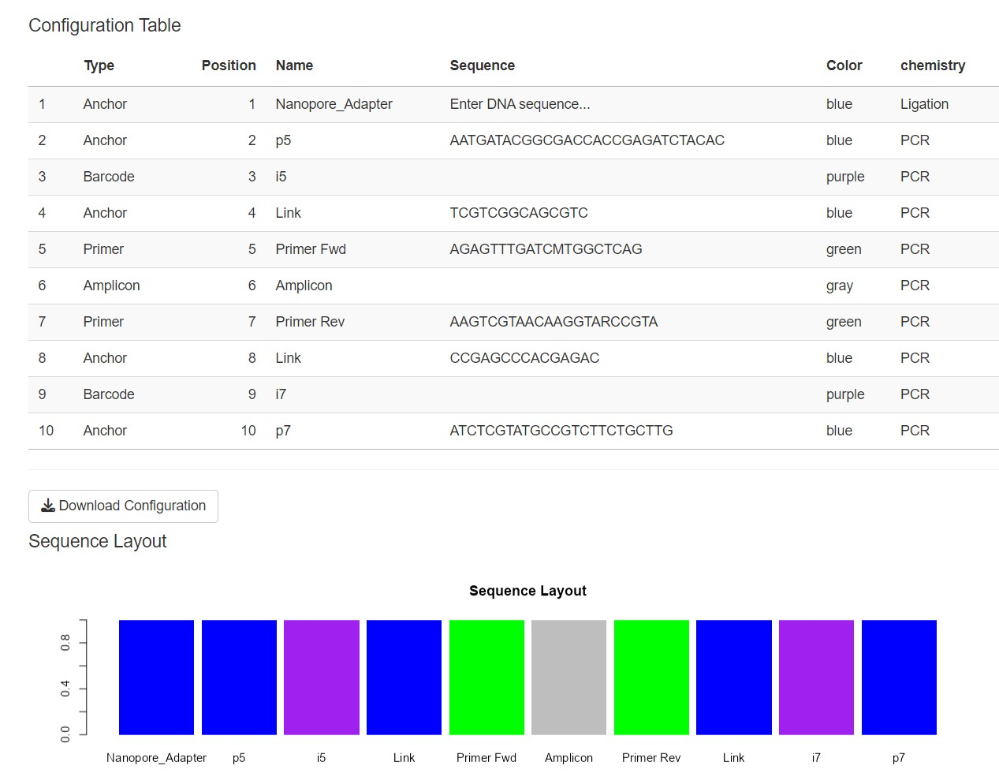

```{r setup, include=FALSE}
knitr::opts_chunk$set(echo = TRUE)
knitr::opts_chunk$set(eval = F)
```

## Introducción

Tengo que dejar de poner títulos en inglés a las cosas. Como habíamos explicado, el multiplexado es el proceso de combinar muchas muestras distintas en una única secuenciación, asignando a cada muestra una secuencia de ADN que usaremos luego para separar el resultado de la secuenciación en las diferentes muestras de origen. 

En nuestro caso, hemos usado un protocolo diseñado originariamente para Illumina, y luego hemos añadido los adaptadores de secuenciación de Nanopore a través de una reacción de Ligación. Este es un detalle importante ya que los adaptadores pueden ligarse a cualquiera de los extremos 5´de las cadenas de ADN a secuenciar, por lo que nos podemos encontrar las secuencias en una dirección o en su reverso complementario.

Este es un diagrama de nuestras secuencias


Como la ligación es el último paso, todo el conjunto puede aparecer de un sentido o el rc, pero las distintas partes tras esa ligación deberían aparecer en la misma dirección.

## ¿Cómo proceder?

Una opción es ir paso a paso: el programa que vamos a usar es cutadapt, en el que hay muchos parámetros que podemos tunear para optimizar nuestro resultado: lo suficientemente flexible para no perder dátos útiles, lo necesariamente sensible para no mover secuencias a la muestra equivocada. Un parámetro importante, particularmente en Nanopore, es la tasa de error `-e` que usaremos de dos modos: flexible para trabajar en la parte de la secuencia que nos interesa, y estricta a la hora de encontrar los barcodes que identifican cada muestra.

```{bash}

cutadapt -j 0 -a "file:"${pcr_primers}";min_overlap=18" \
         -e 0.2 \
         -o "${pipel_output}"/demult_{name}.fq \
         "${INPUT_files}"

```

Aquí el comando usa los siguientes parámetros:

  - `-j 0` usa todos los recursos disponibles (numero de CPUs...)
  - `-e 0.2` permite un 20% de discrepancias entre la secuencia buscada y la que encontramos en las secuencias
  - `-a` una vez encontrada las secuencias en el archivo con los primers de PCR, nos vamos a quedar con los fragmentos anteriores a dichas secuencias. Si volvemos al diagrama de nuestra secuencia, esto incluira desde el p5 o p7, hasta el link. 
  - `-o` dependiendo de que secuencia de ADN encontramos, escribiremos el resultado en un archivo distinto. En nuestro caso, las secuencias que buscamos estan en el archivo `pcr_primers.fasta`
  
```
$ cat pcr_primers.fasta

>Euk_18S_A
AACCTGGTTGATCCTGCCAGT                                                                                    >Euk_1209_R
TCTAAGGGCATCACAGACCTG
```

De este modo, si la secuencia se ha producido con el extremo 5' cerca del Primer Fwd, las secuencias acabaran en el archivo `demult_Euk_18SA.fq` y lo contrario hara que la secuencia acabe en el archivo `demult_Euk_1209_R.fq`. Si no encontramos ninguna de las dos, las secuencias van a un tercer archivo `demult_unknown.fq`. 

Vemos que la busqueda ha sido bastante eficaz, pero hay bastantes secuencias en las que no encontramos las secuencias de los primers

```
$ wc -l pipeline_output/demult_20241209_1113/demult_*fq
5159360 pipeline_output/demult_20241209_1113/demult_Euk_1209_R.fq 
7332792 pipeline_output/demult_20241209_1113/demult_Euk_18S_A.fq
2637012 pipeline_output/demult_20241209_1113/demult_unknown.fq
15129164 total 
```
Ahora usamos la informacion del multiplexado para buscar las secuencias que identifican cada muestra 

```
$ head p5_GTABE.fasta
>H4_P5-UDP0032
CGAACATACGG
>H5_P5-UDP0040
CCGCACTAATG
>A6_P5-UDP0041 
CGACAACTGAA
>B6_P5-UDP0042
CAGTGGTCAGG
>C6_P5-UDP0043
CTTCTATGGTT    
```
Y en el caso de que el adaptador este en la otra cadena, tendremos 
```
$ head p7_GTABE.fasta
>H4_P7-UDP0032
ACAGTGTATG 
>H5_P7-UDP0040
TATGTAGTCA 
>A6_P7-UDP0041 
ACTCGGCAAT 
>B6_P7-UDP0042
GTCTAATGGC 
>C6_P7-UDP0043
CCATCTCGCC 
```

Y se ejecuta asi

```{bash}
cutadapt -j 0 -a file:p5_GTABE.fasta -e 0.1 -o $pipel_output/demult/p5_{name}.fa "${pipel_output}"/demult_Euk_18S_A.fa
cutadapt -j 0 -a file:p7_GTABE.fasta -e 0.1 -o $pipel_output/demult/p7_{name}.fa "${pipel_output}"/demult_Euk_1209_R.fa
```

Por otra parte, lo que queremos dentro de esos archivos son los productos de PCR, lo que en el diagrama llamamos el amplicon, que son copias de las secuencias que habia en nuestra muestra original y que podemos usar para identificar los taxones que habian dejado trazas.

Para eso volvemos a usar cutadapt, pero esta vez para quedarnos las secuencias POSTERIORES a los primers de PCR, o mas exactamente, entre ambos primers de PCR

```{bash}

cutadapt -j 0 -g "file:"${pcr_primers_full}";min_overlap=18" \
         -e 0.2 \
         -o "${pipel_output}"/with_{name}.fq \
         "${INPUT_files}"

```

Cambiamos los parametros y listo. Ahora juntamos ambas fuentes de informacion y generamos todos los archivos finales: un archivo por cada muestra que recogimos. Para ello necesitamos el archivo con los metadatos

```{r, echo = F, message=F, warning=F, eval =TRUE}
library(here)
library(tidyverse)
library(eDNAfuns)
library(kableExtra)

```

```{r, eval=T, message=F, warning=F}
metadata <- read_csv(here("metadata_GTABE.csv")) |> 
  select(Site, everything())

metadata |> 
  kable() |> 
  kable_styling(bootstrap_options =  "basic") |> 
  collapse_rows(columns = 1, valign = "top")
```

Vamos a usar R para combinar toda la informacion

## Bring the demult test

```{r, eval=T, message=F, warning=F }
tibble (files = list.files(here("test_export"), pattern = "*.fa" ,recursive = T)) -> all_demults

all_demults |> 
  mutate (mode = case_when(str_detect(files, "^rc/p7") ~ "i7_rc",
                           str_detect(files, "^rc/p5") ~ "i5_rc",
                           str_detect(files, "^p7") ~ "i7",
                           TRUE                    ~ "i5"),
          barcode = str_remove_all(files, "rc/|p7_|p5_")) |> 
  separate(barcode, into ="barcode") |> 
  mutate(seqs = map(files, ~ fasta_reader (here("test_export",.x)) |> select(header) |> separate(header,into = "header", sep = " "))) |> 
  select(-files) |> 
  pivot_wider(names_from = mode, values_from=seqs) |> 
  mutate (i5_seqs = map_dbl(i5, nrow),
          i7_seqs = map_dbl(i7, nrow),
          i7_rcseqs = map_dbl(i7_rc, nrow),
          i5_i7 = map2_dbl(i5, i7, ~inner_join(.x,.y) |> nrow()),
          i5_i7_rc = map2_dbl(i5, i7_rc, ~inner_join(.x,.y) |> nrow())) -> all_demults

all_demults |> 
  mutate(i5_i7 = map2_dbl(i5_rc, i7, ~inner_join(.x,.y) |> nrow()),) -> all_demults

```

```{r, eval=T, message=F, warning=F}

all_demults |> 
   select(barcode, i5_seqs, i7_seqs) |> 
  kable() |> 
  kable_styling(bootstrap_options = "striped")

```

en estas columnas estan todas las secuencias que pertenecen a esos barcodes, pero no los amplicones. 
Vamos a usar inner_joins en R para hacer esto mucho mas rapidamente de lo que esperamos.

```{r}
all_demults |> 
  mutate(i5_i7 = map2(i5, i7_rc, ~inner_join(.x,.y)),
         i5_i7_rc = map2(i5_rc, i7, inner_join)) |> 
  select(barcode, i5_i7, i5_i7_rc) -> demutlted
```

Nos da igual si las secuencias entraron en el sentido normal o reverso complementario, asi que lo hacemos una sola lista por barcode.

```{r}
demutlted |> 
  mutate(final = map2(i5_i7, i5_i7_rc, bind_rows)) |> 
  select (barcode, final) |> 
  unnest(final) -> demulted
```

## Unimos los amplicones con el header


```{r}
amplicons <- fastq_reader(here("test_export", "full_amplicons_fwd.fq"))

amplicons |> 
  separate(header, into = "header", sep = " ") -> amplicons

amplicons |> 
  inner_join(demulted) -> amplicons

amplicons |> 
  group_by(barcode) |> 
  nest() |> 
  mutate(walk2(barcode, data, ~ fasta_writer(.y,header = header,sequence = seq, file.out = here("demult", paste0("demulted_", .x, ".fa")) )))


```
Tambien guardamos la informacion del demultiplexado en formato tabla, sin secuencias
```{r}
demulted |> 
  semi_join(amplicons) |> 
  write_csv(here("Data", "blast_2024_12_09","demult_info.csv"))
```

Y ya está. Ya tenemos, en nuestra carpeta `demult`, todos  los archivos que necesitamos. 

Ahora tenemos que investigar que especies originaron esas secuencias.
