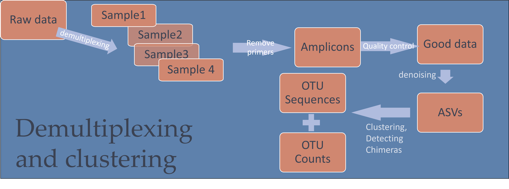
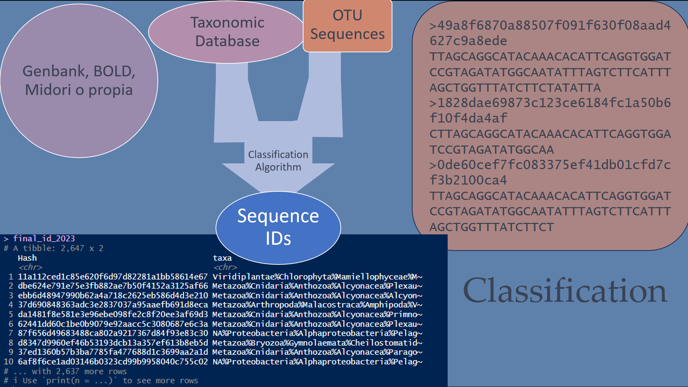
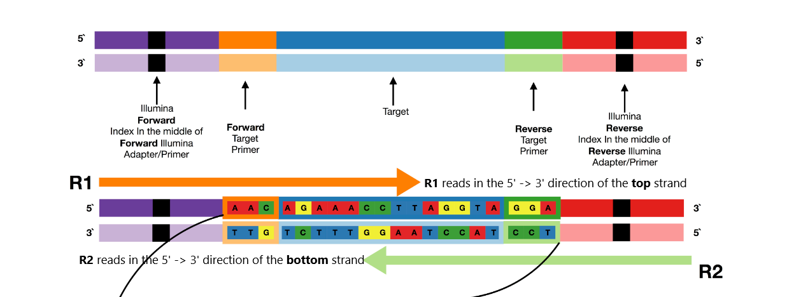
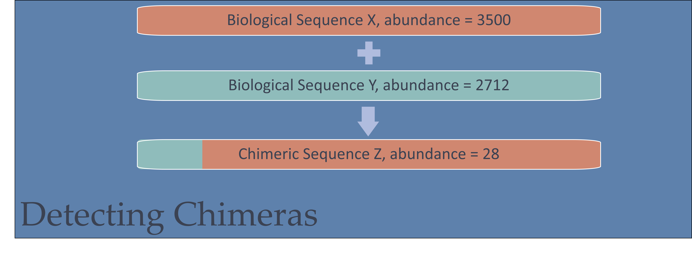

```{r setup, include=FALSE}
knitr::opts_chunk$set(echo = TRUE)
```

```{r libraries, echo=F}

library(insect)
library(tidyverse)
library(here)
library(dada2)
library(Biostrings)

```


## Metabarcoding analisis

Como vimos en clase, uno de los usos más importantes de los estudios de ADN ambiental son los de metabarcoding, en los que a partir de una muestra que contiene ADN de muchas especies se amplifica una parte del ADN que nos permita identificar las especies presentes.

El análisis de estos datos conlleva muchos pasos, en distinto orden, para pasar de las secuencias de ADN que obtenemos (aquí vamos a usar datos de Illumina MiSeq) al objetivo último de nuestro estudio (ya sea variación de las comunidades en el espacio o tiempo, listado de especies...).

Aquí tenemos un diagrama del workflow típico de estos estudios



Por otra parte, lo que nos interesa no es las OTUs (Operational Taxonomical Units) sino la identidad taxonomica de esas secuencias



Empecemos por el formato de los datos en bruto o raw. Estos se generan de modo distinto en Secuenciadores de Illumina y en Nanopore. Veamos primero la estructura de los amplicones para Illumina y cómo se secuencian.

# Secuencias Illumina

Lo que normalmente recibimos es una pareja de archivos por cada experimento de secuencición. Estos archivos (R1 y R2) corresponden a las secuencias estimadas desde el cada uno de sus extremos del las secuencias



### Demultiplexing

El coste de la secuenciación, unido a que estas tecnologías producen más datos de los que se necesitan para caracterizar una muestra, hace que sea práctica común unir muchas muestras en cada experimento. Cada muestra se prepara uniendi unos identificadores o barcodes al principio y final de cada secuencia. Luego usamos un programa para separar los archivos iniciales en varios archivos, una pareja R1 y R2 por cada muestra.

Hay veces que el servicio de secuenciación realiza este paso para nosotros, y otras veces que lo tenemos que hacer.

El programa que usamos es cutadapt, que se usa desde la linea de comandos y que usa la lista de barcodes para buscarlos en las secuencias y dividir los archivos iniciales en varias parejas.

En este ejemplo, ya lo hemos hecho. 

Vamos a ver qué archivos tenemos con el comando `list.files()`, mirando en el directorio en el que tenemos los datos (`/data`)

```{r files}
list.files(path = "Data")
```

Podemos refinar la búsqueda con el argumento `pattern=` y buscar fastq files

```{r fastq files}
list.files(path = "data", pattern = "*fastq*")
```


## Trabajar en serie

A partir de ahora, vamos a realizar la misma operación en cada pareja de archivos. Una de las ventajas de usar herramientas bioinformáticas es que es muy sencillo repetir la misma operación en una serie de escenarios

Empecemos por comparar nuestro archivo de metadatos (que nos da información de las muestras) y el listado de archivos fastq

```{r}
Fwd <- list.files(path = "Data/fastq", pattern = "*1.fastq.gz")
Rev <- list.files(path = "Data/fastq", pattern = "*2.fastq.gz")

samples <- tibble (R1 = Fwd, R2 = Rev)

samples
```

El nombre de la muestra es la primera parte del nombre del archivo, asi que la podemos extraer usando varias herramientas

```{r}
samples |> 
  separate (R1, into = c("sample_name"), sep = "_L001_", remove = F) -> samples
```

Aquí hemos usado ` |>`  para encadenar funciones. Lo usaremos varias veces!

también recuerda asignar el fruto de las operaciones a un objeto (en este caso con `-> samples` ). Si no, pues se pierde lo que hemos hecho.

# El projecto

Son muestras de zooplankton del Pacífico Norte. Las hemos homogeneizado y hemos extraido el ADN de ese batido. Lo hemos amplificado con los primers de Leray, que amplifican un fragmento de 312 pares de bases. Nuestro objetivo es ver qué especies encontramos, dónde aparecen, y si encontramos una diferencia entre muestras costeras y de mar más abierto.


## Empezar por quitar los primers

Sabemos que los primers están rodeando a los amplicones: lo que necesitamos es quitar el Forward primer del principio de una de las secuencias (R1), y el primer Reverse del R2. De este modo tendremos sólo las secuencias que estaban flanqueadas por los primers (y no artefactos de secuenciación)

```{r}
FWD_primer <- "GGWACWGGWTGAACWGTWTAYCCYCC"

REV_primer <- "TANACYTCNGGRTGNCCRAARAAYCA"


```

El mejor medio para quitar los primers es un programa llamado `cutadapt`, que se usa desde la línea de comandos o Terminal, y que no vamos a hacer aquí. El resultado de esta operación es una segunda pareja de archivos fastq. Aquí dejamos el comando que ejecutamos cuando realizamos el proyecto

```{bash, include=F, echo=TRUE}

cutadapt -g FWD=GGWACWGGWTGAACWGTWTAYCCYCC;min_overlap=18 \ 
         -G REV=TANACYTCNGGRTGNCCRAARAAYCA;min_overlap=18 \ 
         --discard-untrimmed \
         -e 0.1 \
         -o noprimers/read1_R1.fastq \
         -p noprimers/read1_R2.fastq \
         rawdata/read1.fastq rawdata/read2.fastq

```

Aqui lo hemos hecho para UNA pareja de archivos: si quisierais hacerlo para todas las muestras, el modo de hacerlo es con un `for`loop: un loop repite la misma operación un número de veces, mientras se cumple la condicion del for loop.

Vamos a rehacer nuestro metadata, apuntando a los archivos sin primers

```{r}
Fwd <- list.files(path = "Data/Run1", pattern = "*R1_001.fastq*", full.names = T)
Rev <- list.files(path = "Data/Run1", pattern = "*R2_001.fastq*", full.names = T)

samples <- tibble (R1 = Fwd, R2 = Rev)|> 
  mutate(sample_name = basename(R1)) |> 
  separate (sample_name, into = c("sample_name"), sep = "_L001", remove = F) 
```


## Control de calidad

No todas las secuencias que nos llegan tienen la calidad necesaria para estimar de qué especie provienen, así que tenemos que usar algun tipo de filtro, para trabajar solo con las secuencias buenas.

Vamos a ver alguna de las secuencias antes 

```{r}
plotQualityProfile(samples$R1[1:2])
```

La calidad de los archivos R2 es mucho menor: estas secuencias se generan 2 díasy medio despúes de que comience la secuenciación

```{r}
plotQualityProfile(samples$R2[1:2])
```

Vemos que la calidad es más o menos buena, pero para poder hacer nuestra estimación necesitamos datos sin ambigüedades. Usaremos la función `filterAndTrim`del paquete DADA2. Sabemos que el fragmento que nos interesa tiene 313 bp, y que la calidad de las secuencias es suficiente para eso: cortaremos las secuencias R1 a una longitud de 190 bp; las R2 a 150bp. de ese modo tenemos un solapamiento de 30 bases.

```{r filter and Trim}
dir.create("Data/nsdna/good_q")
samples |> slice (1:4) |> 
  
  mutate(clean1 = str_replace(R1, "Data/nsdna/", "Data/nsdna/good_q/"), 
         clean2 = str_replace(R2, "Data/nsdna/", "Data/nsdna/good_q/") ,
         f_t   = filterAndTrim(fwd = R1,rev = R2, filt =clean1 ,filt.rev = clean2, compress = T, truncLen =  c(190, 150))) -> samples


```

```{r}
plotQualityProfile("Data/nsdna/good_q/Lib01_NNACACGCGA_FWD.1.fastq.gz")
```
Ahora vemos que hay unas pocas secuencias menos, todas son de una calidad excelente

A ver que pasa con las Reverse

```{r}
plotQualityProfile("Data/nsdna/good_q/Lib01_NNACACGCGA_FWD.2.fastq.gz")
```
Excelente. Más cortas, pero de calidad excelente. 

### Denoising

#### Primero: Calcular tasa de error

Ahora viene la parte importante: estimar la composición inicial de las secuencias, limitando los errores de secuenciación. Para ello, DADA2 necesita estimar la tasa de error en la secuenciación. Podemos hacerlo muestra por muestra, pero la tasa de error debería ser constante en las R1, y en las R2

```{r}
dada2::learnErrors(samples$clean1) -> error_R1

dada2::learnErrors(samples$clean2) -> error_R2
```
*Extra: ver las graficas de los errores*

```{r}
plotErrors(error_R1)
```

#### Segundo: Dereplicate sequences

No necesitamos repetir todas las operaciones si dos secuencias son identicas: obtendriamos el mismo resultado y gastaríamos recursos. Además, el algoritmo necesita saber si una variedad detectada es más común que otra (asumir que el error es menos común que el acierto).

```{r}
samples |> 
  mutate(derep1 = derepFastq(clean1),
         derep2 = derepFastq(clean2)) -> samples
```

### Tercero: Denoising con Dada2

Ahora tenemos todos las piezas necesarias para estimar la composicion de las muestras: secuencias de buena calidad, la tasa de error y la frecuencia de cada secuencia única.

```{r dada2}

samples |> 
  mutate(dada1 = dada(derep1,error_R1),
         dada2 = dada(derep2, error_R2)) -> samples

```
El mensaje que nos muestra es sobre el input (de las secuencias que pasaron filtro en la muestra 1, algunas eran únicas). Podemos inspeccionar el resultado de `dada`para ver que ahora hemos estimado menos variantes: estamos consiguiendo paliar el error
```{r}
samples$dada1
```
Podemos ahora pasar a la siguiente fase, y combinar los dos archivos R1 y R2

### Merging 

Como el comando `dada`se ha realizado sobre las secuencias dereplicadas pero queremos reflejar la abundancia inicial, el comando necesita unir dada1, dada2, filt1 y filt2

```{r}
samples |> 
  mutate (merger = mergePairs(dadaF= dada1, derepF = derep1, dadaR= dada2, derepR = derep2)) -> samples
```
Aquí tenemos que hacer una pequeña parada: todas (o casi todas) las secuencias deberían unirse.

```{r}
samples |> 
  select(sample_name, f_t, merger) |> 
  unnest(merger) |> 
  group_by(sample_name) |> 
  summarise(n_uniq = n(),
            n_reads= sum(abundance),
            starting = max(f_t[,1]),
            goodq    = max (f_t[,2]))
```

Hemos perdido entre un 20% y un 30% por cada muestra. Habrá que revisar con otros parámetros (lo haremos si tenemos tiempo)


### Unir las secuencias de ambas direcciones

Os habréis fijado que por cada muestra teniamos archivos _FWD y _REV. Esto se debe a que el modo en el que se añaden los adaptadores de secuenciación es "aleatorio": no controlamos si el primer Fwd acaba en el archivo R1 o si es al revés. Así que ahora vamos a unir ambas secuencias.

DADA2 trae una función (`makeSequenceTable`) que crea una tabla de ocurrencia de las secuencias, pero en un formato bastante incómodo. Vamos a crear una función que nos ayude

```{r una funcion nueva}
Make_seq_table_long <- function (merger) { 
  
  as_tibble (merger) |> 
    select(sequence, abundance)
  } 
```

Usamos la funcion para reducirlo todo a una tabla de 3 columnas: muestra, Fwd y Rev
```{r reducirlo todo a dos tablas}
samples |> 
  mutate ( direction = case_when(str_detect(sample_name, "_REV.1.fastq.gz") ~ "Rev",
                                 TRUE                                       ~ "Fwd"), # Aqui creamos una nueva columna, identificando F y R
           sample_name = str_remove(sample_name, "_REV.1.fastq.gz")  ) |> # Aquí renombramos las R, para que sean iguales
  select(sample_name, direction, merger) |> 
  mutate(seq_table = map(merger, Make_seq_table_long)) |> # Usamos nuestra propia funcion
  select(-merger) |> 
  pivot_wider(names_from = direction, values_from = seq_table) -> samples
```

El contenido de Fwd y Rev es de hecho una tabla, que tiene dos columnas: secuencia y abundancia. Lo que tenemos que hacer es calcular el reverso complementario de las secuencias reverse

```{r RC el Rev}

samples |> 
  mutate (RC_Rev = map (Rev, function (.x) {
    .x |> 
      mutate (sequence = as.character(reverseComplement(DNAStringSet(sequence))))
    
    
  })) -> samples

```

Ahora vamos a comprobar que lo hemos hecho bien: en la tabla rev original, no debería haber secuencias identicas a las de la tabla fwd original, ya que estaban en el sentido opuesto

```{r}
samples |> 
  mutate (check_before = map2_dbl(Fwd, Rev, ~ inner_join(.x, .y, by= "sequence") |> nrow()),
          check_after = map2_dbl(Fwd, RC_Rev, ~ inner_join(.x, .y, by= "sequence") |> nrow()))
```
Estamos haciendolo bastante bien

Ahora uniermos FWD y RC_REV

```{r}
samples |> 
  select(sample_name, Fwd, RC_Rev) |> 
  mutate (all_together = map2(Fwd,RC_Rev, bind_rows)) |> 
  select(sample_name, all_together) |> 
  unnest(all_together) |> 
  group_by(sample_name, sequence) |> summarise(abundance = sum(abundance)) -> samples
```
### Chimeras

Secuencias quiméricas son aquellas secuencias artificiales que se forman como union de dos o más secuencias reales. No hay nada en la calidad de las secuencias que nos indique que son de mentira, las detectamos porque en las secuencias poco abundantes encontramos partes repetidas de dos secuencias bien numerosas. Lo malo es que para encontrarlas tenemos que poner los datos como le gustan a DADA2 (y a mi no, y así nos va)



```{r reformat for Chimeras}

samples |> 
  group_by(sample_name) |> 
  nest() |> 
  mutate (uniques = map (data, getUniques),
          nochum = map(uniques, removeBimeraDenovo),
          nochumtable = map(nochum, ~ tibble (abundance = .x, 
                                              sequence = names(.x)))) |> 
  select(sample_name,nochumtable ) |> 
  unnest(nochumtable) -> samples
  


```

### Bonus track: sequences hashes

la table que hemos hecho es una torura para el ojo humano: la columna sequence tiene 313 caracteres y es imposible de leer. Otro modo de hacerlo sería numerar a cada OTU (OTU_1, OTU_2, ...) pero eso haría comparar datos entre proyuectos otra pesadilla (la OTU1 de mi proyecto es la OTU2 de la segunda secuenciación...).

Nuestra apuesta aquí es usar Hashing: generar un código único en base a la secuencia de la OTU, y que es el mismo cada vez que me encuentre esa secuencia. (es un modo parecido al que se guardan las contraseñas en las webs: cada vez que introduces tu contraseña, se traduce a un código único que es el que se guardó en el servidor, y no la contraseña en sí).

```{r}
samples |> 
  mutate (Hash = map_chr(sequence, ~digest::sha1(.x ))) -> samples

# Save our work in disk

samples |> 
  select (sample_name, Hash, abundance) |> 
  write_csv("ASV_table.csv")

samples |> 
  distinct(Hash, sequence) |> 
  write_csv("hash_key.csv")

# Y usando otro paquete, hacer un fasta

samples |> 
  distinct(Hash, sequence) |>
  fasta.writer()
```


## Identidad de las secuencias

Esto está muy bien, pero en realidad nos interesa la composición de las muestras: qué especies aparecen en cada muestra.

El marcador que hemos utilizado, el fragmento de Leray de la citocromo oxidasa I, ofrece varias opciones para obtener esta identidad:

 * BLAST: podemos crear un archivo FASTA con todas las secuencias de interés y usarlo en NCBI. El output nos devuelve bastantes secuencias a las que se alinea cada una de nuestras secuencias problema y tenemos que usar un algoritmo para procesar estos resultados de un modo consistente
 
 * BOLD: El barcode of Life adoptó la CItocromo oxidasa I como el fragmente de referencia para identificar metazoos. Podemos usar el mismo FASTA e identificar las muestras en su web
 
 * Programas de asignación taxonómica: Hay varios programas que nos ayudan a clasificar las secuencias. Podemos usar `insect`para obtener esta ID. `Insect`necesita un árbol de clasificación y la tabla de conexiones taxonomicas
 
```{r download insect classifier}
download.file("https://www.dropbox.com/s/dvnrhnfmo727774/classifier.rds?dl=1", 
              destfile = "classifier.rds", mode = "wb")
classifier <- readRDS("classifier.rds")
```
 

## Nanopore

